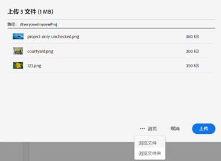
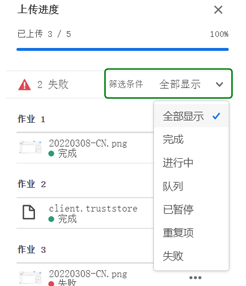
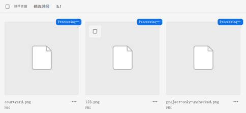
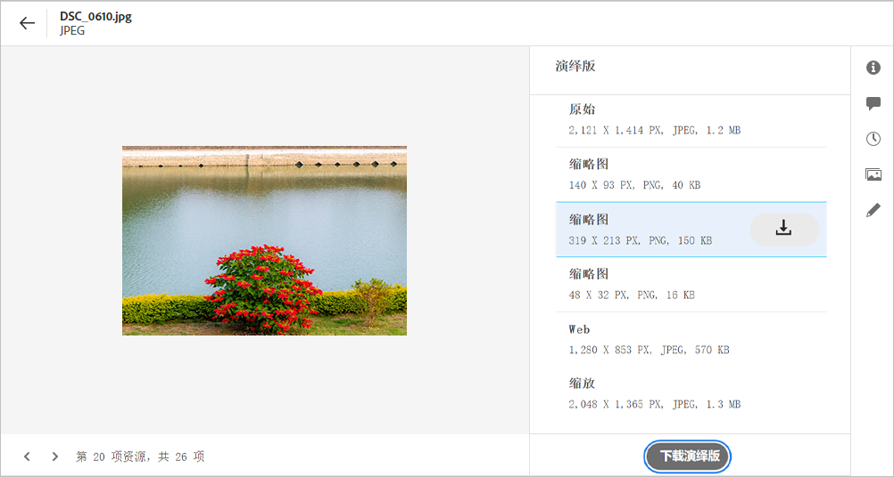
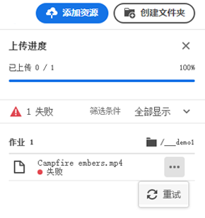
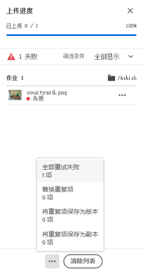

# 上传资产 {#add-assets}

要添加新资产以使用，请从本地文件系统上传一些资产。 <!-- TBD: Many of the [common file formats are supported](/help/supported-file-formats.md). -->

您可以使用以下方法上传一个或多个资产或包含资产的文件夹：

* 在用户界面上拖动资产或文件夹，然后按照屏幕上的说明操作。
* 单击 **[!UICONTROL 添加资产]** 选项，并将一些文件添加到“上传”对话框。

<!-- TBD: Update this GIF
 -->

创建文件夹后，您可以使用以下任一方法上传资产。 要创建空文件夹，请单击 **[!UICONTROL 创建文件夹]** 中。 While [!DNL Assets Essentials] 提供了功能强大的全文搜索功能，您还可以使用文件夹更好地组织资产。

选择文件后，将显示一个确认对话框，用于添加更多文件或删除已选择的文件。 要向所选内容添加更多文件，请单击 **[!UICONTROL 浏览]** 和选择 **[!UICONTROL 浏览文件]** 或 **[!UICONTROL 浏览文件夹]**. 从同一文件夹或从其他文件夹添加更多文件或文件夹。

所有文件排入队列后，单击 **[!UICONTROL 上传]**.

*图：在上传选定的资产之前，您可以在队列中添加或删除资产。*

>[!CAUTION]
>
>使用文件名中没有空格的资产。 对评论的回复不适用于此类资产。

## 查看上传进度和状态 {#upload-progress}

将许多资产或嵌套文件夹上传到 [!DNL Assets Essentials]，某些资产可能因重复资产和网络问题等各种原因而无法上传。

要跟踪上传进度，请单击 **[!UICONTROL 上传进度]** 的双曲余切值。 面板会显示所有资产的上传进度。

要根据上传进度或状态查看资产的子集，请在 **[!UICONTROL 上传进度]** 侧栏。 各种筛选器可显示所有资产、已完成上传、进行中上传、要上传的已排队资产、暂停上传、重复资产以及上传失败的资产。

*图：根据资产的上传状态或上传进度筛选您尝试上传的资产。*

资产上传后， [!DNL Assets Essentials] 会处理资产以生成缩略图并处理元数据。 对于许多资产，处理需要一些时间。 如果看不到缩略图，并且在占位符缩略图上看到处理消息，请在几分钟后再次检查文件夹。 在处理期间， [!DNL Assets Essentials] 生成演绎版、添加智能标记并为资产详细信息编制索引以进行搜索。

*图：上传的资产会在拼贴上显示处理过程，并且这些资产会得到处理。*

## 资产演绎版 {#renditions}

[!DNL Assets Essentials] 会近乎实时地处理上传的资产，并且对于许多受支持的文件类型，会生成演绎版。 为图像创建的演绎版，会调整上传图像的大小版本。 您不仅可以下载资产，还可以下载演绎版，以使用相应的版本。 您可以在 [预览资产](/help/navigate-view.md#preview-assets).

*图：查看和下载演绎版。*

## 管理失败的上载 {#resolve-upload-fails}

如果受支持资产上传因某些原因失败，请单击 **[!UICONTROL 重试]** 从 [!UICONTROL 上传进度] 中。

*图：如果受支持的文件由于某些原因上传失败，请重试。*

如果您尝试上传重复的资产，则在明确确认上传之前，不会上传这些资产。 首先，重复的资产会标记为上传失败。 要解决此问题，您只需创建一个版本、删除和替换现有资产，或通过重命名资产来创建重复的副本即可。 您可以一次解决一个资产失败的问题，也可以批量处理所有失败的重复项。

*图：对于默认情况下无法上传的重复资产，请解决一次只上传一个资产的问题。*

*图：对于默认情况下无法上传的重复资产，请同时解决所有资产的问题。*

>[!TIP]
>
>您可以直接从 [!DNL Creative Cloud] 桌面应用程序。 了解操作方法 [[!DNL Assets Essentials] 集成 [!DNL Adobe Asset Link]](/help/integration.md).

## 删除资产或文件夹 {#delete-assets}

用户可以删除不再需要的单个资产或文件夹。 要删除资产或文件夹，请执行以下操作之一：

* 使用资产或文件夹缩略图中提供的选项。

   

   *图：文件和文件夹的操作可在资产或文件夹拼贴中执行。*

* 选择一个资产或文件夹，然后单击 **[!UICONTROL 删除]**  中。
