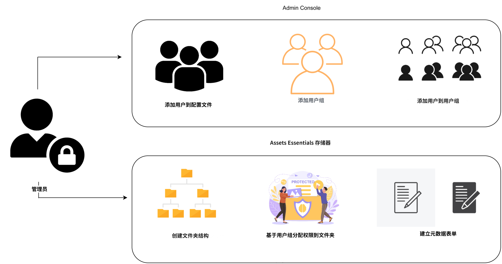
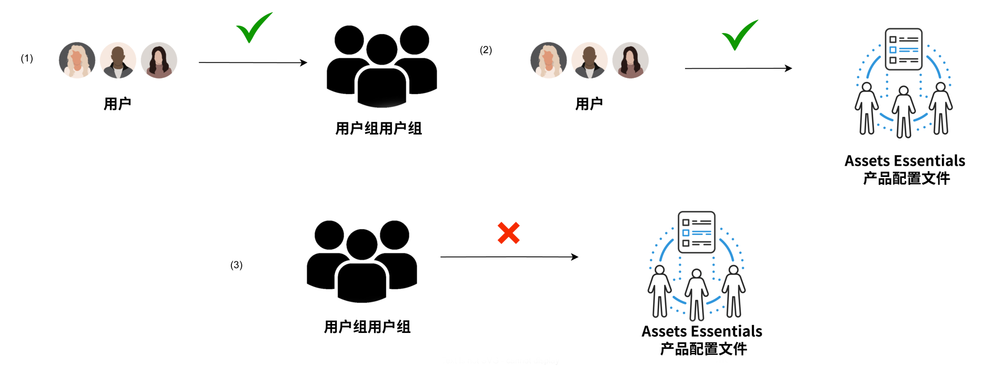

# 管理Experience Manager Assets Essentials {#administer-assets-essentials}

## 目标

* **受众**:Assets Essentials管理员

* **目标**:使用Admin Console配置对Assets Essentials应用程序的访问权限，然后管理在登录到Assets Essentials应用程序后可以执行的任务。

## 概述 {#overview}

[!DNL Adobe Experience Manager Assets Essentials] 由 Adobe 为其客户配置。作为配置过程的一部分，[!DNL Assets Essentials] 添加到客户组织的 [!DNL Adobe Admin Console] 中。管理员使用 [!DNL Admin Console] 管理用户权限 [!DNL Assets Essentials] 解决方案，并分配应用程序管理员，以在 [!DNL Assets Essentials].

以下数据流图说明了管理员配置和管理Assets Essentials时必须执行的任务顺序：

## 访问Admin Console {#access-admin-console}

配置 Assets Essentials 解决方案之后，管理员会收到来自 Adobe 的电子邮件。该电子邮件包含欢迎消息以及开始使用链接。此外，Adobe 启动流程来自动部署 Assets Essentials。部署流程需要一个小时来完成。

通过电子邮件中的链接，访问并登录 [Admin Console](https://adminconsole.adobe.com)。如果您拥有对多个组织帐户的管理员访问权限，请选择相应的组织，或使用 [组织选择器](https://helpx.adobe.com/cn/enterprise/using/admin-console.html). 自动部署流程完成后，[!DNL AEM Assets Essentials] 的产品卡在 [!DNL Admin Console] 中可见。

## 管理Admin Console任务 {#manage-admin-console-tasks}

在Admin Console中执行以下任务：

* [将用户添加到产品配置文件](#add-users-to-product-profiles)

* [添加用户组](#add-user-groups)

* [将用户添加到组](#add-users-to-user-groups)

### 将用户添加到产品配置文件 {#add-users-to-product-profiles}

将用户添加到产品配置文件，以便他们有权访问Assets Essentials应用程序。

要将用户添加到产品配置文件，请执行以下操作：

1. 访问 [Admin Console](https://adminconsole.adobe.com) 对于贵组织，单击 **[!UICONTROL 产品]** 在顶部栏中，单击 **[!UICONTROL AEM Assets Essentials]**，然后单击的实例 [!DNL Assets Essentials]. 实例的名称可能与下面屏幕截图中的名称不同。
   >[!NOTE]
   >
   >[!DNL Cloud Manager] 实例仅用于特殊管理员用途，如检查服务状态和获取对服务日志的访问权限，不能用于将用户添加到产品中。 有关更多信息，请参阅 [管理指南](deploy-administer.md#view-service-status-and-access-logs-view-logs).

   

   [!DNL Assets Essentials] 有三个产品配置文件，分别代表管理员、常规和消费者用户的访问权限。

   

1. 要将用户添加到产品，请单击三个Assets Essentials产品配置文件之一，选择 **[!UICONTROL 添加用户]**，提供用户详细信息，然后单击 **[!UICONTROL 保存]**.

   

   添加用户时，用户将收到电子邮件邀请以开始使用。您可以在 [!DNL Admin Console] 的产品配置文件设置中关闭电子邮件邀请。

1. 要从组中删除某个用户，请单击改组，选择现有用户，然后选择&#x200B;**[!UICONTROL 删除用户]**。

   >[!NOTE]
   >
   >您必须将用户添加到Admin Console的管理员Assets Essentials产品配置文件中，以便用户在Assets Essentials应用程序中执行管理任务。 这些任务包括 [创建文件夹结构](#create-folder-structure), [管理文件夹的权限](#manage-permissions-for-folders)和 [设置元数据Forms](#metadata-forms).

### 添加用户组 {#add-user-groups}

创建用户群组，然后将用户分配给用户群组。 这些用户组将在Assets Essentials应用程序中可用，用于设置文件夹的权限。

您可以将用户添加到用户组 (1) 并[将用户添加到 Assets Essentials 产品配置文件 (2)](#add-admin-users)。但是，您不能将用户组直接添加到 Assets Essentials 产品配置文件 (3)。

有关如何管理用户组的信息，请参阅[管理用户组](https://helpx.adobe.com/cn/enterprise/using/user-groups.html)中的 `Create user groups` 和 `Edit user groups`。

>[!NOTE]
>
>如果您的 Admin Console 设置为利用外部系统来管理用户/组分配，例如 Azure 或 Google 连接器、用户同步工具或 User Management Rest API，则您的组和用户分配会自动配置。有关更多信息，请参阅 [Adobe Admin Console 用户](https://helpx.adobe.com/cn/enterprise/using/users.html)。

### 将用户添加到组 {#add-users-to-user-groups}

创建用户组后，您可以开始将用户添加到用户组。

有关如何管理将用户添加到用户组的信息，请参阅[管理用户组](https://helpx.adobe.com/cn/enterprise/using/user-groups.html#add-users-to-groups)中的 `Add users to groups`。

## 管理Assets Essentials管理任务 {#manage-assets-essentials-tasks}

执行Admin Console任务后，您现在可以在Assets Essentials应用程序中执行以下管理任务：

* [创建文件夹结构](#create-folder-structure)

* [管理文件夹的权限](#manage-permissions-for-folders)

* [设置元数据Forms](#metadata-forms)

>[!NOTE]
>
>要管理这些任务，特别是管理权限，您的用户必须拥有应用程序管理权限 — 需要将其添加到 [管理员Assets Essentials产品配置文件](#add-users-to-product-profiles).

### 创建文件夹结构 {#create-folder-structure}

您可以使用以下方法在 Assets Essentials 存储库中创建文件夹结构：

* 单击工具栏中可用的&#x200B;**[!UICONTROL 创建文件夹]**&#x200B;选项以创建一个空文件夹。

* 单击工具栏中可用的&#x200B;**[!UICONTROL 添加资产]**&#x200B;选项以[上传本地计算机上可用的文件夹结构](add-delete.md)。

创建一个适合组织业务目标的文件夹结构。如果要将现有文件夹结构上传到 Assets Essentials 存储库，则应审查该结构。有关详细信息，请参阅[有效权限管理的最佳实践](permission-management-best-practices.md)。

当您开始计划在 Assets Essentials 存储库中创建文件夹结构时，请考虑以下几点：

* 未来管理：由管理员管理的文件夹和被[委派所有者权限给其他用户](manage-permissions.md##manage-permissions-folders)的文件夹。

* 可扩展：文件夹结构应符合您组织的未来需求，并且应易于扩展。

* 大小：一个文件夹不能包含太多资产。它可能会导致可用性问题并且可能变得难以管理。

* 直观：文件夹结构应该易于浏览，并且对于最终用户来说是直观的。用户应该能够轻松识别在文件夹结构中上传新资产的位置。

您可以为您的组织使用多种可能的文件夹结构类型。以下是一些典型文件夹结构的示例：

### 管理文件夹的权限 {#manage-permissions-for-folders}

Assets Essentials 允许管理员管理存储库中可用文件夹的访问级别。作为管理员，您可以创建用户组并向这些组分配权限以管理访问级别。您还可以将权限管理权限委派给文件夹级别的用户组。

>[!VIDEO](https://video.tv.adobe.com/v/341104)

有关更多信息，请参阅 [管理文件夹的权限](manage-permissions.md).

### 设置元数据Forms {#metadata-forms}

默认情况下，Assets Essentials 提供了多个标准元数据字段。组织可能会有额外的元数据需求，需要更多元数据字段来添加特定于业务的元数据。企业可以利用元数据表单，将自定义元数据字段添加到资源的[!UICONTROL 详情]页面。特定于业务的元数据可以改进其资源的管理和发现。您可以从头开始创建表单，也可以重新利用现有表单。

您可以为不同的资源类型（不同的 MIME 类型）配置元数据表单。使用与文件的 MIME 类型相同的表单名称。Essentials会自动将上传的资产MIME类型与表单名称匹配，并根据表单字段更新上传资产的元数据。

例如，如果元数据表单的名称为 `PDF` 或 `pdf` 存在，则上传的PDF文档包含在表单中定义的元数据字段。

Assets Essentials会使用以下序列搜索现有元数据表单名称，以将元数据字段应用于特定类型的已上传资产：

MIME子类型> MIME类型> `default` 表单>现成表单

例如，如果存在名为 `PDF` 或 `pdf` 的元数据表单，则上传的 PDF 文档将包含该表单中定义的元数据字段。如果元数据表单的名称为 `PDF` 或 `pdf` 不存在，如果存在名称为的元数据表单，则Assets Essentials匹配 `application`. 如果存在名称为的元数据表单 `application`，则上传的PDF文档包含在表单中定义的元数据字段。 如果Assets Essentials仍未找到匹配的元数据表单，则会搜索 `default` 元数据表单，将表单中定义的元数据字段应用到已上传的PDF文档。 如果这些步骤都不起作用，Assets Essentials会将现成表单中定义的元数据字段应用于所有上传的PDF文档。

>[!IMPORTANT]
>
>针对特定文件类型的新元数据表单将完全替换 [!DNL Assets Essentials] 提供的默认元数据表单。如果您删除或重命名元数据表单，则默认元数据字段将重新对新资源可用。

>[!VIDEO](https://video.tv.adobe.com/v/341275)

有关元数据Forms的更多信息，请参阅 [元数据Forms(Assets Essentials)](metadata.md#metadata-forms).

## 下一步

现在，您已配置并管理Assets Essentials应用程序， [将Creative Cloud应用程序与Experience Manager Assets Essentials应用程序集成](integrate-assets-essentials-creative-cloud.md).

