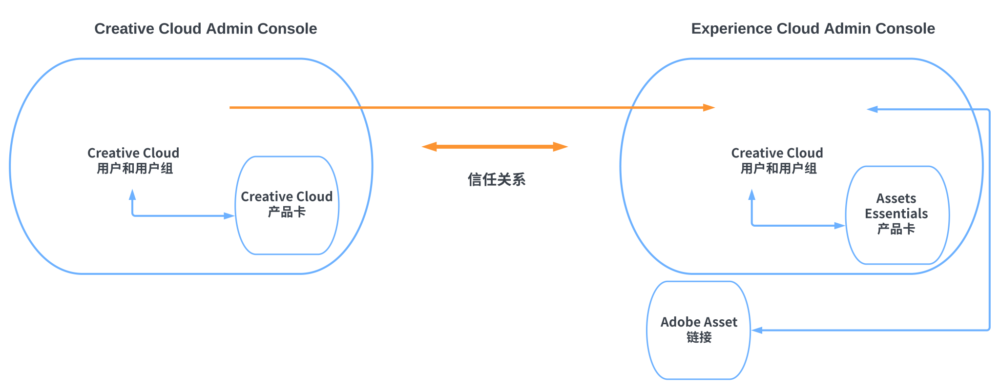

# Assets Essentials for Work Management Pro with Work Management Solutions {#creative-cloud-enterprise-user-journeys}

## 简介 {#introduction}

Creative CloudPro企业版与工作管理解决方案集成了创意、内容和工作管理工具，以提高您制作创意内容和快速实现业务目标的能力。 该解决方案包括以下组件：

* Creative CloudPro

* Adobe Workfront

* Experience Manager Assets Essentials

本教程将介绍一个管理员历程，使Assets Essentials应用程序能够与Creative Cloud桌面应用程序和Adobe Workfront应用程序集成。 Creative Cloud桌面应用程序包括Adobe Photoshop、Adobe Illustrator、Adobe InDesign和Adobe XD。

## 部署类型 {#deployment-types}

由于解决方案包含来自Creative Cloud和Adobe Experience Cloud的应用程序和服务，因此可能会在您公司的一两个AdobeAdmin Console中部署它们。

如果部署到两个Admin Console，则需要额外的配置步骤：

* Creative Cloud服务和应用程序(Creative Cloud企业专业版和可选模块)在 [Adobe Admin Console用于Creative Cloud部署](https://chl-author-preview.corp.adobe.com/content/help/en/enterprise/admin-guide.html).

* Adobe Workfront和Adobe Experience Manager Assets Essentials在 [Adobe Admin Console for Experience Cloud解决方案](https://experienceleague.adobe.com/docs/core-services/interface/administration/admin-getting-started.html).

要集成Creative Cloud和Assets Essentials应用程序，在Admin Console中可用以进行Creative Cloud的用户必须在Admin Console中可用以进行Experience Cloud。 要使用户在Experience CloudAdmin Console中可用，请创建一个目录以建立 [目录信任](https://helpx.adobe.com/enterprise/using/set-up-identity.html#directory-trusting) 在两个管理控制台之间。

如图所示，根据两个控制台之间的信任关系，Creative Cloud用户会在Experience CloudAdmin Console中自动可用。 然后，可以将用户添加到Assets Essentials产品配置文件。 因此，Creative Cloud用户可以访问Adobe资产链接应用程序，该应用程序可以与Assets Essentials存储库进行交互。 有关更多信息，请参阅 [将Assets Essentials与Creative Cloud应用程序集成](integrate-assets-essentials-creative-cloud.md).

## Experience Manager文档历程 {#documentation-journeys}

文档历程将许多不同且可能复杂的主题和功能联系起来，提供了一种说明来帮助读者(对于Assets Essentials来说，他们是新人)从头到尾理解和解决业务问题，同时假定最少的先前主题或Assets Essentials知识。

文档历程围绕最佳实践原则进行设计，根据Adobe的最新研究、Adobe顾问的成熟实施经验以及客户项目的反馈提供信息。

## 前提条件

* [访问Adobe Admin Console以提供Experience Cloud解决方案](https://experienceleague.adobe.com/docs/core-services/interface/administration/admin-getting-started.html)

* [访问Adobe Admin Console以Creative Cloud企业部署](https://helpx.adobe.com/enterprise/admin-guide.html)

## 管理Experience Manager Assets Essentials {#administer-assets-essentials}

Adobe Experience Manager Assets Essentials是Adobe Experience Manager Assets的一个新的轻量级版本。 Assets Essentials通过简化且一致的用户界面提供统一的资产管理和协作。 其易用性使得更多创意与营销团队可以轻松地存储、发现和分发数字资源。

Adobe Experience Manager Assets Essentials由Adobe为其客户配置。 作为配置的一部分，Assets Essentials将添加到Adobe Admin Console中的客户组织。

管理员可使用Admin Console管理Assets Essentials产品的用户权限：

* 添加用户组

* 将用户添加到用户组

* 将用户添加到Assets Essentials产品配置文件

在Admin Console中管理用户权限后，管理员可以使用Assets Essentials应用程序执行以下操作：

* 创建文件夹结构以最好地支持组织的需求

* 管理文件夹结构的权限

* 设置元数据表单

## 将Creative Cloud应用程序与Experience Manager Assets Essentials集成 {#administer-creative-cloud-applications}

[Adobe资产链接应用程序内面板](https://www.adobe.com/creativecloud/business/enterprise/adobe-asset-link.html) 让创意专业人员能够连接 [!DNL Assets Essentials] 支持 [!DNL Adobe Creative Cloud] 桌面应用程序。 该面板可用于 [!DNL Adobe Photoshop]、[!DNL Adobe Illustrator]、[!DNL Adobe InDesign] 和 [!DNL Adobe XD]。它简化了对资源的访问，随之可以提升内容速度。

本教程将指导您集成 [!DNL Adobe Photoshop], [!DNL Adobe Illustrator], [!DNL Adobe InDesign]和 [!DNL Adobe XD] 应用程序。Experience Manager Assets Essentials

目标：

* 在Creative Cloud和Experience CloudAdmin Console之间创建目录信任

* 将Creative Cloud用户添加到Assets Essentials产品配置文件

* 安装Adobe资产链接

* 使用Adobe资产链接

## 将Adobe Workfront与Experience Manager Assets Essentials集成 {#administer-adobe-workfront}

[[!DNL Adobe Workfront]](https://www.workfront.com/) 是一个工作管理应用程序，可帮助您在一个位置管理工作的整个生命周期。 之间的本机集成 [!DNL Adobe Workfront] 和 [!DNL Assets Essentials] 使组织能够通过将工作与资产管理本质地联系起来，提高内容的投放速度和上市时间。 对于管理工作，用户可以在同一个解决方案中访问所需的文档和图像。

本教程将指导您管理Adobe Workfront，然后将其与Experience Manager Assets Essentials集成。

目标：

* 将用户添加到Workfront产品配置文件

* 将用户添加到Assets Essentials产品配置文件

* 配置Experience Manager Assets Essentials集成

