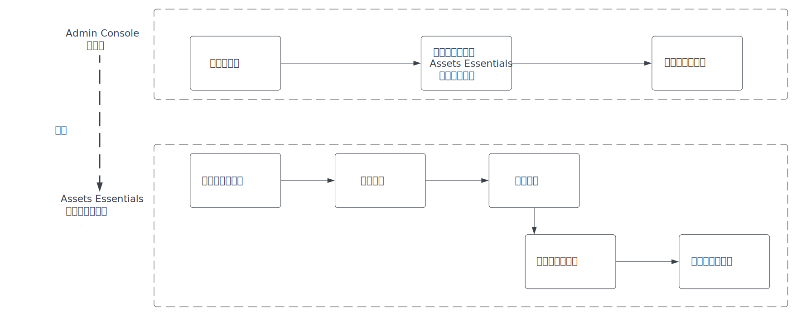
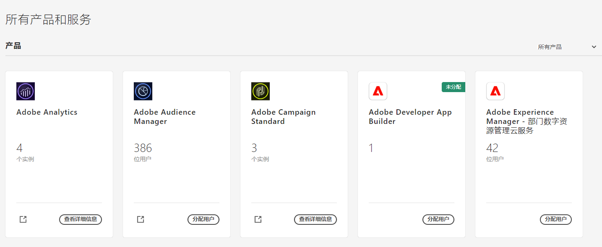
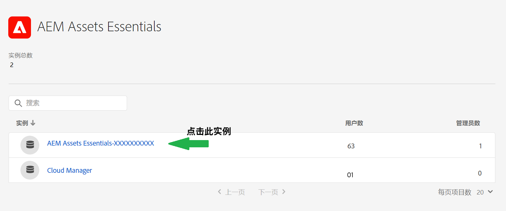
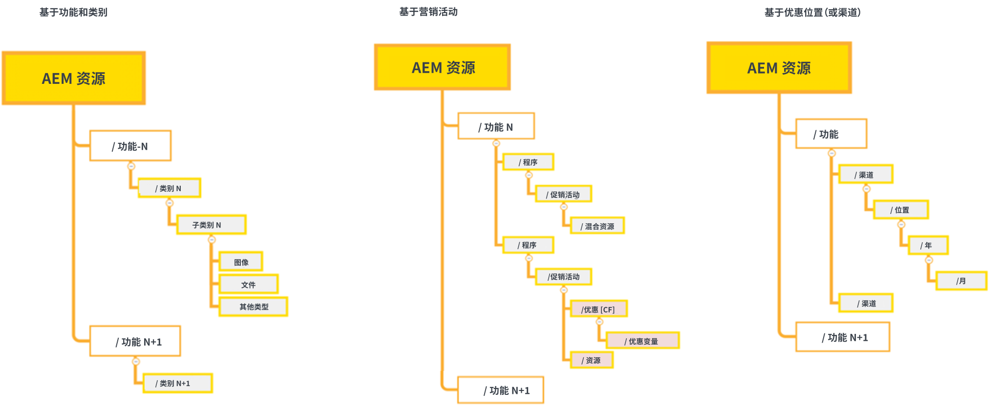
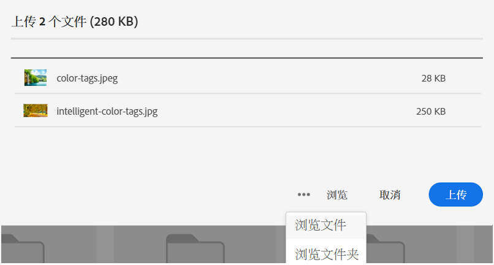

# 管理 [!DNL Assets Essentials] 和添加用户 {#administer}

[!DNL Adobe Experience Manager Assets Essentials] 由 Adobe 为其客户配置。作为配置过程的一部分，[!DNL Assets Essentials] 添加到客户组织的 [!DNL Adobe Admin Console] 中。管理员使用 [!DNL Admin Console] 管理用户对 [!DNL Assets Essentials] 解决方案的权限，并指派应用程序管理员在 [!DNL Assets Essentials] 中设置权限和元数据表单。

以下数据流图说明了管理员必须执行的配置和管理 Assets Essentials 的任务序列：

## 访问 Admin Console {#access-admin-console}

配置 Assets Essentials 解决方案之后，管理员会收到来自 Adobe 的电子邮件。该电子邮件包含欢迎消息以及开始使用链接。此外，Adobe 启动流程来自动部署 Assets Essentials。部署流程需要一个小时来完成。

通过电子邮件中的链接，访问并登录 [Admin Console](https://adminconsole.adobe.com)。如果您有多个组织帐户的管理员访问权限，请使用[组织选择器](https://helpx.adobe.com/cn/enterprise/using/admin-console.html)选择适当的组织或切换到该组织。自动部署过程完毕后，即可在 [!DNL Admin Console] 中看到 [!DNL AEM Assets Essentials] 的产品卡。

使用 Admin Console 执行以下用户授权任务：

* [创建 Assets Essentials 应用程序管理员](#create-assets-essentials-administrator)

* [添加用户组](#add-user-groups)

* [将用户组添加到产品配置文件](#add-users-to-product-profiles)

### 创建 Assets Essentials 应用程序管理员 {#create-assets-essentials-administrator}

Admin Console 管理员必须将 Assets Essentials 管理员产品配置文件添加到用户，不能添加到用户组。然后，Assets Essentials 应用程序管理员可以管理各种任务，例如创建文件夹结构、上传资源、设置权限、设置元数据表单和创建公共收藏集。有关如何将 Assets Essentials 应用程序管理员配置文件分配给用户的信息，请参阅[将产品配置文件添加到用户组](#add-product-profiles-to-user-groups)。

### 添加用户组 {#add-user-groups}

创建用户组，然后将用户分配给用户组。这些用户组将在 Assets Essentials 应用程序中提供，以用于设置文件夹权限。

有关如何管理用户组的信息，请参阅[管理用户组](https://helpx.adobe.com/cn/enterprise/using/user-groups.html)中的 `Create user groups` 和 `Edit user groups`。

>[!NOTE]
>
>如果您的 Admin Console 设置为利用外部系统来管理用户/组分配，例如 Azure 或 Google 连接器、用户同步工具或 User Management Rest API，则您的组和用户分配会自动配置。有关更多信息，请参阅 [Adobe Admin Console 用户](https://helpx.adobe.com/cn/enterprise/using/users.html)。

有关如何管理将用户添加到用户组的信息，请参阅可在[管理用户组](https://helpx.adobe.com/cn/enterprise/using/user-groups.html#add-users-to-groups)中找到的`Add users to groups`。

### 将产品配置文件添加到用户组 {#add-product-profiles-to-user-groups}

将产品配置文件添加到用户组，以使其可访问 Assets Essentials 应用程序。

要将产品配置文件添加到用户组，请执行以下操作：

1. 访问您所在组织的 [Admin Console](https://adminconsole.adobe.com)，单击在顶部栏目中的&#x200B;**[!UICONTROL “产品”]**，单击&#x200B;**[!UICONTROL “AEM Assets Essentials”]**，然后单击 [!DNL Assets Essentials] 的实例。实例的名称可能与下面的屏幕快照中的名称不同。
   >[!NOTE]
   >
   >[!DNL Cloud Manager] 实例仅用于特殊管理用途，如检查服务状态和获取对服务日志的访问权限，无法用于将用户添加到产品。

   

   [!DNL Assets Essentials] 有三个产品配置文件，分别表示管理员访问、定期访问和使用者用户访问。

   * **[!DNL Assets Essentials]管理员**&#x200B;对应用程序具有管理访问权限。除了所有最终用户功能外，该组中的应用程序管理员还可以管理整个应用程序存储库中任何文件夹和组/用户的权限。

   * **[!DNL Assets Essentials]用户**&#x200B;具有完整用户界面的访问权限。这些用户可以上传、组织、标记和查找数字资源。

   * **[!DNL Assets Essentials]消费者用户**可以在 Assets Essentials 中执行查找、预览和下载操作。他们还可以在 Adobe Journey Optimizer 中查找和选择资产，以及查找和选择要在 Workfront 中使用的资产。
有关更多信息，请参阅[与其他解决方案集成](integration.md)。

   

1. 要将用户组添加到产品，请单击三个 Assets Essentials 产品配置文件之一，选择&#x200B;**[!UICONTROL 添加用户]**，提供该用户组的详细信息，然后单击&#x200B;**[!UICONTROL 保存]**。

   

   添加用户时，用户将收到电子邮件邀请以开始使用。您可以在 [!DNL Admin Console] 的产品配置文件设置中关闭电子邮件邀请。

   >[!NOTE]
   >
   >您必须将用户添加到 Admin Console 中的管理员 Assets Essentials 产品配置文件中，以便他们在 Assets Essentials 应用程序中执行管理任务。这些任务包括[创建文件夹结构](#create-folder-structure)、[管理文件夹](#manage-permissions-for-folders)的权限以及[设置元数据表单](#metadata-forms)。

## 访问 Assets Essentials 应用程序 {#access-assets-essentials-application}

在 Admin Console 中执行用户授权后，即可访问 Assets Essentials 应用程序以执行以下管理任务：

* [创建文件夹结构](#create-folder-structure)

* [上传资源](#upload-assets)

* [管理文件夹权限](#manage-permissions-for-folders)

* [设置元数据表单](#metadata-forms)

* [创建公共收藏集](#create-public-collections)

### 创建文件夹结构 {#create-folder-structure}

您可以使用以下方法在 Assets Essentials 存储库中创建文件夹结构：

* 单击工具栏中可用的&#x200B;**[!UICONTROL 创建文件夹]**&#x200B;选项以创建一个空文件夹。

* 单击工具栏中可用的&#x200B;**[!UICONTROL 添加资产]**&#x200B;选项以[上传本地计算机上可用的文件夹结构](add-delete.md)。

创建一个适合组织业务目标的文件夹结构。如果要将现有文件夹结构上传到 Assets Essentials 存储库，则应审查该结构。有关详细信息，请参阅[有效权限管理的最佳文件夹结构实践](permission-management-best-practices.md##folder-structure-assets-essentials)。

您可以为您的组织使用多种可能的文件夹结构类型。以下是一些典型文件夹结构的示例：

>[!NOTE]
>
>为了能够管理这些任务（尤其是管理权限），您的用户必须具有应用程序管理权限 - 需要将该用户添加到 [Administrator Assets Essentials 产品配置文件](#add-users-to-product-profiles)。

### 上传资源 {#upload-assets}

要添加新资源以供使用，请从本地文件系统上传几个资源。可将资源或文件夹拖至用户界面上并按屏幕上的说明操作，或从工具栏中单击&#x200B;**[!UICONTROL 添加资源]**&#x200B;选项并将某些文件添加到上传对话框。虽然 [!DNL Assets Essentials] 提供强大的全文搜索功能，但也可使用文件夹更好地整理您的资源。有关详细信息，请参阅[上传资源](add-delete.md)。

### 管理文件夹的权限 {#manage-permissions-for-folders}

Assets Essentials 允许管理员管理存储库中可用文件夹的访问级别。作为管理员，您可以创建用户组并向这些组分配权限以管理访问级别。您还可以将权限管理权限委派给文件夹级别的用户组。

>[!VIDEO](https://video.tv.adobe.com/v/341104)

有关详细信息，请参阅[管理文件夹权限](manage-permissions.md)。

### 设置元数据表单（可选） {#metadata-forms}

默认情况下，Assets Essentials 提供了多个标准元数据字段。组织有额外的元数据需求，就需要更多元数据字段以添加业务特有的元数据。通过元数据表单，可将自定义元数据字段添加到资源的[!UICONTROL 详细信息]页面。业务特有的元数据改善对其资源的治理和发现。您可以从头开始创建表单，也可以重新利用现有表单。

您可以为不同的资源类型（不同的 MIME 类型）配置元数据表单。使用与文件的 MIME 类型相同的表单名称。Essentials 会自动将上载的资源 MIME 类型与表单名称相匹配，并根据表单字段更新上载资源的元数据。

例如，如果存在名为 `PDF` 或 `pdf` 的元数据表单，则上载的 PDF 文档包含表单中定义的元数据字段。

有关详细信息，请参阅[元数据表单](metadata.md#metadata-forms)。

>[!VIDEO](https://video.tv.adobe.com/v/341275)

有关元数据表单的详细信息，请参阅 [Assets Essentials 中的元数据表单](metadata.md#metadata-forms)。

### 创建公共收藏集（可选） {#create-public-collections}

收藏集是 Experience Manager Assets Essentials 中的一组资源。使用收藏集可在用户之间共享资源。

收藏集与文件夹的不同之处是可包含来自不同位置的资源。您可以与一个用户共享多个收藏集。每个收藏集都包含对资源的引用。在收藏集间保持资源的引用完整性。有关详细信息，请参阅[管理收藏集](manage-collections.md)。

## 后续步骤 {#next-steps}

<!-- THIS URL IS A 404 ERROR; NO REDIRECT WAS PUT IN PLACE * [Watch a video to deploy Assets Essentials](https://experienceleague.adobe.com/docs/experience-manager-learn/assets-essentials/provisioning.html?lang=en) -->

* 利用 Assets Essentials 用户界面上的[!UICONTROL 反馈]选项提供产品反馈

* 通过右侧边栏中的[!UICONTROL 编辑此页面]或[!UICONTROL 记录问题]来提供文档反馈

* 联系[客户关怀团队](https://experienceleague.adobe.com/?support-solution=General#support)

>[!MORELIKETHIS]
>
>* [[!DNL Admin Console] 帮助](https://helpx.adobe.com/cn/enterprise/using/admin-console.html)
>* [[!DNL Cloud Manager] 帮助](https://experienceleague.adobe.com/docs/experience-manager-cloud-manager/using/introduction-to-cloud-manager.html?lang=zh-Hans)
>* [Adobe Journey Optimizer 文档](https://experienceleague.adobe.com/docs/journey-optimizer/using/ajo-home.html?lang=zh-Hans)
>* [发行说明](release-notes.md)
>* [开始使用 [!DNL Assets Essentials]](get-started.md)

