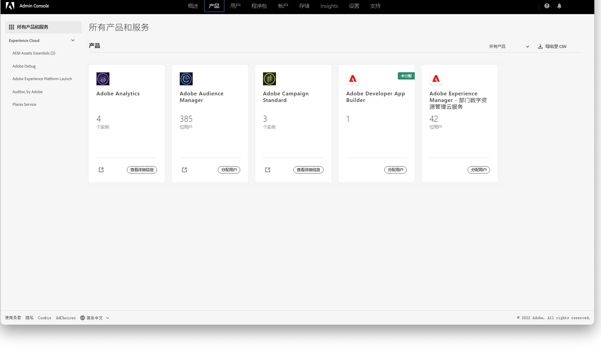

# 管理 [!DNL Assets Essentials] 和添加用户 {#administer}

[!DNL Adobe Experience Manager Assets Essentials] 由 Adobe 为其客户配置。作为配置过程的一部分，[!DNL Assets Essentials] 添加到客户组织的 [!DNL Adobe Admin Console] 中。管理员将使用 [!DNL Admin Console] 管理用户对 [!DNL Assets Essentials] 解决方案的权利，并分配应用程序管理员在 [!DNL Assets Essentials] 中设置权限和元数据表单。

有关管理 Assets Essentials 的历程体验，请单击此[链接](adminster-aem-assets-essentials.md)。

## Assets Essentials 的自动部署 {#automatic-deployment-assets-essentials}

配置 Assets Essentials 解决方案之后，管理员会收到来自 Adobe 的电子邮件。该电子邮件包含欢迎消息以及开始使用链接。此外，Adobe 启动流程来自动部署 Assets Essentials。部署流程需要一个小时来完成。

通过电子邮件中的链接，访问并登录 [Admin Console](https://adminconsole.adobe.com)。如果您有多个组织账户的管理员访问权限，则选择相应的组织，或者使用顶部工具栏中的切换器切换组织。自动部署流程完成后，[!DNL AEM Assets Essentials] 的产品卡在 [!DNL Admin Console] 中可见。

成功部署 Assets Essentials 解决方案之后，管理员需要执行以下任务：

* [设置用户组、文件夹结构并为解决方案分配权限](manage-permissions.md)。遵循[最佳实践](permission-management-best-practices.md)以确保简单有效的权限设置。
* [管理组织成员用户](#add-users-to-essentials)对 [!DNL Assets Essentials] 的访问权限。
* （可选）[查看服务状态和日志](#view-logs)。

>[!NOTE]
>
>如果 Assets Essentials 在 2022 年 1 月 6 日之前配置，请首先执行 [Cloud Manager 中的部署步骤](#deploy-essentials)，然后再管理组织成员的用户访问权限。

## 用户管理 {#add-users-to-essentials}

管理员管理哪些用户可以访问 [!DNL Assets Essentials]。管理员使用 [!DNL Adobe Admin Console] 添加或删除用户访问权限。[!DNL Assets Essentials] 提供了以下两种类型的用户访问权限。

* **[!DNL Assets Essentials]管理员**&#x200B;对应用程序具有管理访问权限。除了所有最终用户功能外，该组中的应用程序管理员还可以管理整个应用程序存储库中任何文件夹和组/用户的权限。
* **[!DNL Assets Essentials]用户**&#x200B;具有完整用户界面的访问权限。这些用户可以上传、组织、标记和查找数字资源。
* **[!DNL Assets Essentials]使用者用户**：可以访问 [!DNL Adobe Journey Optimizer] 电子邮件模板编辑器中的嵌入式资源选择体验。有关更多信息，请参阅[在 [!DNL Journey Optimizer] 中使用 [!DNL Assets Essentials] ](https://experienceleague.adobe.com/docs/journey-optimizer/using/create-messages/assets-essentials.html?lang=zh-Hans)。

在 [!DNL Admin Console] 中，这三种访问类型使用三个[!UICONTROL 产品配置文件]来表示。要在任意这两个配置文件中添加或删除组织的成员，请按照以下步骤操作：

1. 访问组织的 [!DNL Admin Console]，单击顶部工具栏中的&#x200B;**[!UICONTROL 产品]**，单击 **[!UICONTROL AEM Assets Essentials]**，然后单击 [!DNL Assets Essentials] 环境。[!DNL Assets Essentials] 有三个产品配置文件，分别代表管理员、常规和消费者用户的访问权限。

   
   <!-- Need to update screenshot to include 3 profiles -->

   *图：三个配置文件可用于添加三种类型的用户。*

1. 要将用户添加到组，请单击该组，选择&#x200B;**[!UICONTROL 添加用户]**，提供用户详细信息，然后单击&#x200B;**[!UICONTROL 保存]**。添加用户时，用户将收到电子邮件邀请以开始使用。您可以在 [!DNL Admin Console] 的产品配置文件设置中关闭电子邮件邀请。

   ![添加用户到 [!DNL Assets Essentials]](assets/adminconsole-add-user.png)

   *图：将用户从 [!DNL Admin Console] 添加到 [!DNL Assets Essentials]。*

1. 要从组中删除某个用户，请单击改组，选择现有用户，然后选择&#x200B;**[!UICONTROL 删除用户]**。

>[!TIP]
>
>在 [!DNL Admin Console] 中，您可以使用 CSV 文件批量管理用户。如需了解更多信息，请参阅[[!DNL Admin Console] 文档](https://helpx.adobe.com/cn/enterprise/using/accounts.html)。

## 查看服务状态和访问日志 {#view-logs}

配置之后，管理员仅部署一次 [!DNL Assets Essentials]。初始部署之后，Adobe 执行服务维护和更新。管理员可以使用 [!DNL Cloud Manager] 用户界面检查服务状态和下载最近的访问日志。

1. 用户报告问题时，在&#x200B;**[!UICONTROL 程序概述]**&#x200B;界面中检查 [!DNL Assets Essentials] 的服务状态。在解决方案的正常工作期间，状态为 `Running`。如果 [!DNL Cloud Manager] 显示任何其他状态，请在 [!DNL Admin Console] 支持部分中创建支持工单。

   ![[!DNL Cloud Manager]](assets/cloudmanager-manage-access-essentials.png) 中 [!DNL Assets Essentials] 的状态

   *图：[!DNL Assets Essentials] 在 [!DNL Cloud Manager] 中的正常状态为 `Running`。*

1. 要下载最近的访问日志，请单击，选择&#x200B;**[!UICONTROL 下载日志]**，然后按照屏幕上的说明操作。您可以使用日志编辑 HTTPS 访问请求。

   

   *图：下载访问日志的选项。*

## 部署 [!DNL Assets Essentials] {#deploy-essentials}

>[!NOTE]
>
>只有当 Assets Essentials 配置于 2022 年 1 月 6 日之前时才执行这些步骤。

配置之后，[!DNL Assets Essentials] 权利添加到您组织的 [!DNL Admin Console] 中。组织管理员必须先部署该解决方案，然后该解决方案才可供用户使用。管理员使用 [!DNL Cloud Manager] 用户界面执行一次性部署。初始部署之后，Adobe 执行服务维护和更新。配置解决方案之后，管理员会收到来自 Adobe 的电子邮件。该电子邮件包含欢迎消息以及开始使用链接。要开始部署，请按照以下步骤操作：

1. 通过电子邮件中的链接，访问并登录 [Admin Console](https://adminconsole.adobe.com)。如果您有多个组织账户的管理员访问权限，则选择相应的组织，或者使用顶部工具栏中的切换器切换组织。[!DNL Assets Essentials] 的产品卡在 [!DNL Admin Console] 中可见。

   [!DNL Admin Console]](assets/essentials-in-admin-console.png) 中的 ![[!DNL Assets Essentials] 卡

   *图：[!DNL Admin Console] 中的 [!DNL Assets Essentials] 卡。*

   >[!NOTE]
   >
   >如果您在产品部分中可以看到 **[!UICONTROL AEM Assets Essentials]** 卡而非 **[!UICONTROL AEM Assets Essentials - Cloud Manager]** 卡，则 Assets Essentials 的部署已完成。您可以跳过剩余的步骤。

1. 将您自己作为管理员添加到 [!DNL Admin Console] 中的 `AEM Assets Essentials - Cloud Manager` 产品配置文件。您可以添加组织中的其他成员而不是您自己作为管理员，也可以添加多个管理员。

1. 单击可[!UICONTROL 选择产品配置文件]，然后选择 [!UICONTROL Deployment Manager - Assets Essentials] 作为&#x200B;**[!UICONTROL 产品配置文件]**。在此步骤中添加的用户会收到 Adobe 的电子邮件，并且具有对 [!DNL Cloud Manager] 的访问权限，可以执行部署。

   ![添加管理员并在 [!DNL Admin Console]](assets/adminconsole-user1.png) 中选择产品配置文件

   *图：添加管理员并在 [!DNL Admin Console] 中选择产品配置文件。*

1. 要访问 [!DNL Cloud Manager]，请单击电子邮件中用于访问 [!DNL Cloud Manager] 的链接。或者，在浏览器中访问 [https://experience.adobe.com/#/cloud-manager/](https://experience.adobe.com/#/cloud-manager/)。

1. 在 Cloud Manager 用户界面中，单击右上角的&#x200B;**[!UICONTROL 添加程序]**。

1. 提供您选择的名称并（可选）上传图像（用于在 [!DNL Cloud Manager] 中表示该程序），然后单击&#x200B;**[!UICONTROL 创建]**。[!DNL Cloud Manager] 需要几分钟时间来设置程序。

1. 程序就绪后，将光标悬停在图块上，然后单击。

1. 要将 [!DNL Assets Essentials] 添加到您的组织，请单击&#x200B;**[!UICONTROL 添加环境]**，选择名称和部署区域，然后单击&#x200B;**[!UICONTROL 保存]**。您无法在以后更改部署区域。请尝试将 [!DNL Assets Essentials] 的部署区域与您计划与 [!DNL Assets Essentials] 配合使用的其他解决方案的部署区域相匹配。该匹配用于确保对数字资源尽可能最快的网络访问以及尽可能最低的延迟。

   ![在 [!DNL Cloud Manager]](assets/cloudmanager-add-environment-for-essentials.png) 中添加环境

   *图：在 [!DNL Cloud Manager] 中添加环境以开始使用 [!DNL Assets Essentials]。*

1. 几分钟后，当环境成功创建时，您可以访问 [!DNL Admin Console] 并将组织的用户添加到 [!DNL Assets Essentials] 解决方案。单击并选择&#x200B;**[!UICONTROL 管理访问权限]**&#x200B;选项。

   ![[!DNL Cloud Manager]](assets/cloudmanager-manage-access-essentials.png) 中就绪的环境

   *图：[!DNL Cloud Manager] 中已经可以使用的环境。*

## 后续步骤 {#next-steps}

* [观看视频以部署Assets Essentials](https://experienceleague.adobe.com/docs/experience-manager-learn/assets-essentials/provisioning.html?lang=en)

* 使用 [!UICONTROL 反馈] 选项在Assets Essentials用户界面中可用

* 使用提供文档反馈 [!UICONTROL 编辑此页面]  或 [!UICONTROL 记录问题]  在右侧侧栏上提供

* 联系人 [客户关怀](https://experienceleague.adobe.com/?support-solution=General#support)

>[!MORELIKETHIS]
>
>* [[!DNL Admin Console] 帮助](https://helpx.adobe.com/cn/enterprise/using/admin-console.html)
>* [[!DNL Cloud Manager] 帮助](https://experienceleague.adobe.com/docs/experience-manager-cloud-manager/using/introduction-to-cloud-manager.html?lang=zh-Hans)
>* [Adobe Journey Optimizer 文档](https://experienceleague.adobe.com/docs/journey-optimizer/using/ajo-home.html?lang=zh-Hans)
>* [发行说明](release-notes.md)
>* [开始使用 [!DNL Assets Essentials]](get-started.md)

