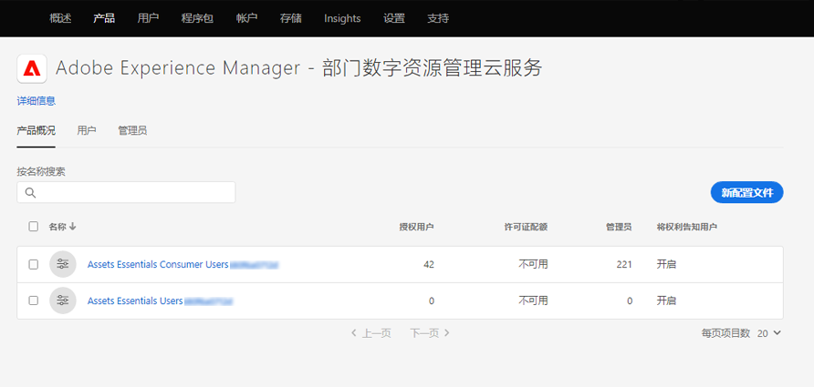

# 部署[!DNL Assets Essentials]并添加用户 {#administer}

[!DNL Adobe Experience Manager Assets Essentials] 由Adobe为其客户配置。在配置中，将[!DNL Assets Essentials]添加到[!DNL Adobe Admin Console]中的客户组织。 客户还可以访问[!DNL Experience Manager Cloud Manager]作为部署工具和[!DNL Admin Console]以管理[!DNL Assets Essentials]解决方案的用户权限。

管理员执行以下任务：

* [ [!DNL Assets Essentials]](#deploy-essentials) 为其组织部署。
* [管理组织成](#add-users-to-essentials) 员对的用户访 [!DNL Assets Essentials]问。
* （可选）[查看服务状态和日志](#view-logs)。

## 部署[!DNL Assets Essentials] {#deploy-essentials}

配置后，将[!DNL Assets Essentials]授权添加到[!DNL Admin Console]中的您的组织。 组织管理员必须先部署该解决方案，然后才能将其提供给用户。 管理员使用[!DNL Cloud Manager]用户界面进行一次性部署。 初始部署后，Adobe会进行服务维护和更新。 配置解决方案后，管理员会收到来自Adobe的电子邮件。 电子邮件包含欢迎消息和要开始使用的链接。 要部署，请执行以下步骤：

1. 从电子邮件中的链接，访问并登录到[Admin Console](https://adminconsole.adobe.com)。 如果您拥有对多个组织帐户的管理员访问权限，请选择相应的组织或使用顶部栏中的切换器切换到该帐户。 [!DNL Assets Essentials]的产品卡显示在[!DNL Admin Console]中。

   ![[!DNL Assets Essentials] 卡入  [!DNL Admin Console]](assets/essentials-in-admin-console.png)

   *图： [!DNL Assets Essentials] 卡 [!DNL Admin Console]。*

1. 将您自己作为管理员添加到[!DNL Admin Console]中的`AEM Assets Essentials - Cloud Manager`产品配置文件。 您可以添加组织的其他成员，也可以添加多个管理员，而不是您自己。

1. 单击添加到[!UICONTROL Select product profiles]，然后选择[!UICONTROL Deployment Manager - Assets Essentials]作为&#x200B;**[!UICONTROL product profile]**。 此步骤中添加的用户会从Adobe收到一封具有[!DNL Cloud Manager]访问权限的电子邮件，该用户可以执行部署。

   ![添加管理员并在  [!DNL Admin Console]](assets/adminconsole-user1.png)

   *图：在中添加管理员并选择产品配置文 [!DNL Admin Console]件。*

1. 要访问[!DNL Cloud Manager]，请单击电子邮件中具有[!DNL Cloud Manager]访问权限的链接。 或者，也可以在浏览器中访问[https://experience.adobe.com/#/cloud-manager/](https://experience.adobe.com/#/cloud-manager/)。

1. 在Cloud Manager用户界面中，单击右上角的&#x200B;**[!UICONTROL Add Program]**。

1. 提供您选择的名称，并（可选）上传图像（它表示[!DNL Cloud Manager]中的程序），然后单击&#x200B;**[!UICONTROL Create]**。 [!DNL Cloud Manager] 设置程序需要几分钟。

1. 当程序准备就绪时，将指针悬停在图块上，然后单击。

1. 要将[!DNL Assets Essentials]服务添加到您的组织，请单击&#x200B;**[!UICONTROL Add Environment]**，选择名称和部署区域，然后单击&#x200B;**[!UICONTROL Save]**。 以后无法更改部署区域。 尝试将[!DNL Assets Essentials]的部署区域与您打算使用[!DNL Assets Essentials]的其他解决方案的部署区域进行匹配。 匹配是确保以最快的速度对数字资产进行网络访问，并确保尽可能最短的延迟。

   ![在  [!DNL Cloud Manager]](assets/cloudmanager-add-environment-for-essentials.png)

   *图：在中添加一个 [!DNL Cloud Manager] 环境以开始使 [!DNL Assets Essentials]用。*

1. 几分钟后，成功创建环境后，您可以访问[!DNL Admin Console]并将贵组织的用户添加到[!DNL Assets Essentials]解决方案。 单击并选择&#x200B;**[!UICONTROL Manage Access]**&#x200B;选项。

   ![中的就绪环境  [!DNL Cloud Manager]](assets/cloudmanager-manage-access-essentials.png)

   *图：已准备好 [!DNL Cloud Manager] 使用的环境。*

## 用户管理 {#add-users-to-essentials}

管理员可管理哪些用户有权访问[!DNL Assets Essentials]。 管理员使用[!DNL Adobe Admin Console]添加或删除用户访问权限。 [!DNL Assets Essentials] 具有以下两种类型的用户访问权限。

* **[!DNL Assets Essentials]** 用户对完整用户界面的访问权限。这些用户可以上传、组织、标记和查找数字资产。
* **[!DNL Assets Essentials]消费者用户**:有权在电子邮件模板编辑器中访问嵌入的 [!DNL Adobe Journey Optimizer] 资产选择体验。有关更多信息，请参阅 [!DNL Journey Optimizer]](https://experienceleague.adobe.com/docs/journey-optimizer/using/create-messages/assets-essentials.html)中的[使用 [!DNL Assets Essentials] 。

在[!DNL Admin Console]中，这两种访问类型由两个[!UICONTROL Product Profiles]表示。 要向两个用户档案中的任意一个添加和删除组织成员，请执行以下步骤：

1. 访问您组织的[!DNL Admin Console] ，单击顶部栏中的&#x200B;**[!UICONTROL Products]** ，单击&#x200B;**[!UICONTROL AEM Assets Essentials]** ，然后单击[!DNL Assets Essentials]环境。 [!DNL Assets Essentials] 具有两个产品配置文件，它们表示常规用户和消费者用户的访问权限。

   

   *图：可使用两个配置文件来添加这两种类型的用户。*

1. 要将用户添加到群组，请单击群组，选择&#x200B;**[!UICONTROL Add User]**，提供用户详细信息，然后单击&#x200B;**[!UICONTROL Save]**。 添加用户时，用户会收到开始使用的电子邮件邀请。 您可以在[!DNL Admin Console]的产品配置文件设置中关闭电子邮件邀请。

   ![将用户添加到  [!DNL Assets Essentials]](assets/adminconsole-add-user.png)

   *图：将用户从添 [!DNL Assets Essentials] 加 [!DNL Admin Console]到。*

1. 要从组中删除用户，请单击该组，选择现有用户，然后选择&#x200B;**[!UICONTROL Remove User]**。

>[!TIP]
>
>在[!DNL Admin Console]中，您可以使用CSV文件批量管理用户。 要了解更多信息，请参阅[[!DNL Admin Console] 文档](https://helpx.adobe.com/enterprise/using/accounts.html)。

## 查看服务状态和访问日志 {#view-logs}

配置后，管理员只部署一次[!DNL Assets Essentials]。 初始部署后，Adobe会进行服务维护和更新。 管理员可以使用[!DNL Cloud Manager]用户界面检查服务状态并下载最近的访问日志。

1. 当用户报告问题时，请在&#x200B;**[!UICONTROL Program Overview]**&#x200B;界面中检查[!DNL Assets Essentials]的服务状态。 在解决方案正常工作期间，状态为`Running`。 如果[!DNL Cloud Manager]显示任何其他状态，请在[!DNL Admin Console]支持部分创建支持票证。

   ![的状 [!DNL Assets Essentials] 态  [!DNL Cloud Manager]](assets/cloudmanager-manage-access-essentials.png)

   *图：中的正常 [!DNL Assets Essentials] 状 [!DNL Cloud Manager] 态 `Running`为。*

1. 要下载最近的访问日志，请单击，选择&#x200B;**[!UICONTROL Download Logs]**，然后按照屏幕上的说明操作。 您可以使用日志审核HTTPS访问请求。

   

   *图：用于下载访问日志的选项。*

>[!MORELIKETHIS]
>
>* [[!DNL Admin Console] 帮助](https://helpx.adobe.com/enterprise/using/admin-console.html)
>* [[!DNL Cloud Manager] 帮助](https://experienceleague.adobe.com/docs/experience-manager-cloud-manager/using/introduction-to-cloud-manager.html?lang=zh-Hans)
>* [Adobe Journey Optimizer文档](https://experienceleague.adobe.com/docs/journey-optimizer/using/ajo-home.html)
>* [发行说明](release-notes.md)
* [开始使用 [!DNL Assets Essentials]](get-started.md)

