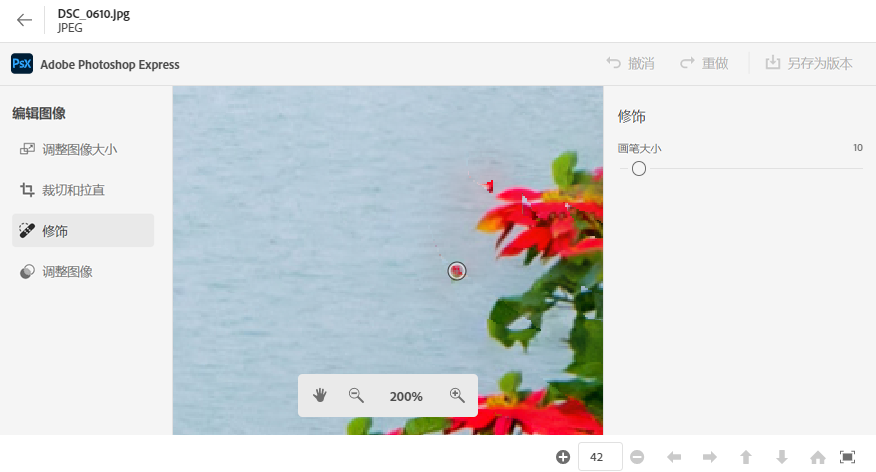
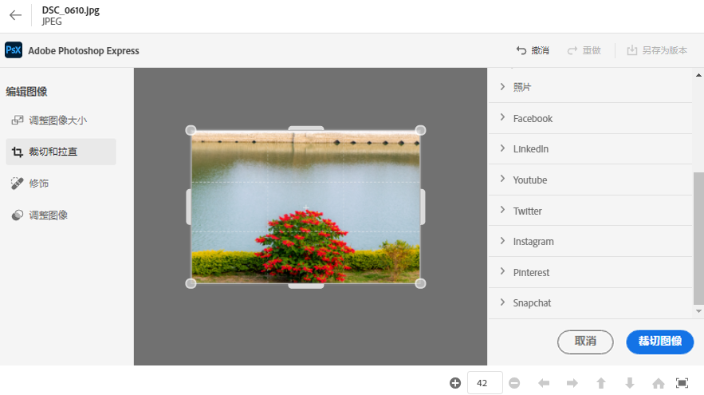
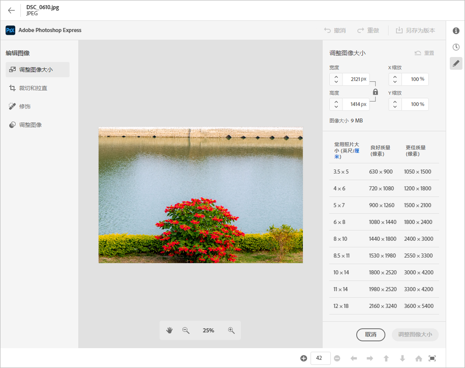
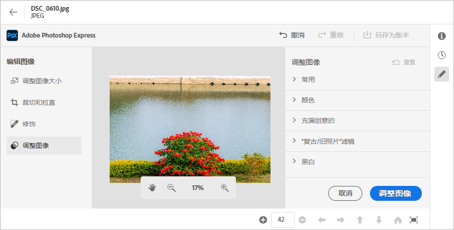

# 在[!DNL Assets Essentials] {#edit-images}中编辑图像

[!DNL Assets Essentials] 提供由提供支持的用户友好编辑选 [!DNL Adobe Photoshop Express]项。可用的编辑操作包括“污点修复”、“裁剪并拉直”、“调整图像大小”和“调整图像”。

编辑图像后，您可以将新图像另存为新版本。 版本控制可帮助您在以后根据需要还原到原始资产。 要编辑图像，请[打开其预览](/help/navigate-view.md#preview-assets)，然后单击右侧边栏中的&#x200B;**[!UICONTROL Edit Image]** 。

*图：编辑图像的选项由提供 [!DNL Adobe Photoshop Express]。*

## 专色修复图像{#spot-heal-images}

如果图像上存在次要点或小对象，则可以使用Adobe Photoshop提供的点修复功能编辑和删除点。

画笔对修饰区域进行采样，并使修复的像素无缝地混合到图像的其余部分中。 使用的画笔大小仅略大于要修复的点。

<!-- TBD: See if we should give backlinks to PS docs for these concepts.
For more information about how Spot Healing works in Photoshop, see [retouching and repairing photos](https://helpx.adobe.com/photoshop/using/retouching-repairing-images.html). -->

## 裁剪并拉直图像{#crop-straighten-images}

使用裁剪和拉直选项，您可以进行基本裁剪、旋转图像、水平或垂直翻转图像，以及将其裁剪到适合常用社交媒体网站的维度。

要保存所做的编辑，请单击&#x200B;**[!UICONTROL Crop Image]**。 编辑后，您可以将新图像另存为版本。

许多默认选项允许您按最适合各种社交媒体用户档案和帖子的比例裁剪图像。

## 调整图像{#resize-image}大小

将图像调整为特定大小是一种常用用例。 [!DNL Assets Essentials] 允许您通过为特定照片大小提供预先计算的新分辨率，快速调整图像大小以适合常见的照片大小。您可以查看常见的照片大小（厘米或英寸）以了解尺寸。 默认情况下，调整大小方法会保留宽高比。 要手动覆盖宽高比，请单击。

输入尺寸并单击&#x200B;**[!UICONTROL Resize Image]**&#x200B;可调整图像大小。 在将更改另存为版本之前，您可以通过单击[!UICONTROL Undo]撤消在保存之前所做的所有更改，也可以通过单击[!UICONTROL Revert]更改编辑过程中的特定步骤。

## 调整图像{#adjust-image}

[!DNL Assets Essentials] 只需单击几下，即可调整颜色、色调、对比度等。在编辑窗口中单击&#x200B;**[!UICONTROL Adjust image]**。 右侧边栏中提供了以下选项：

* **受欢迎**: [!UICONTROL High Contrast & Detail]、  [!UICONTROL Desaturated Contrast]、  [!UICONTROL Aged Photo]、  [!UICONTROL B&W Soft]和 [!UICONTROL B&W Sepia Tone]。
* **颜色**: [!UICONTROL Natural]、  [!UICONTROL Bright]、  [!UICONTROL High Contrast]、  [!UICONTROL High Contrast & Detail]、  [!UICONTROL Vivid]和 [!UICONTROL Matte]。
* **创意**: [!UICONTROL Desaturated Contrast]、  [!UICONTROL Cool Light]、  [!UICONTROL Turquoise & Red]、  [!UICONTROL Soft Mist]、  [!UICONTROL Vintage Instant]、  [!UICONTROL Warm Contrast]、  [!UICONTROL Flat & Green]、  [!UICONTROL Red Lift Matte]、  [!UICONTROL Warm Shadows]和 [!UICONTROL Aged Photo]。
* **B&amp;W**: [!UICONTROL B&W Landscape]、  [!UICONTROL B&W High Contrast]、  [!UICONTROL B&W Punch]、  [!UICONTROL B&W Low Contrast]、  [!UICONTROL B&W Flat]、  [!UICONTROL B&W Soft]、  [!UICONTROL B&W Infrared]、  [!UICONTROL B&W Selenium Tone]、  [!UICONTROL B&W Sepia Tone]和 [!UICONTROL B&W Split Tone]。
* **渐晕**: [!UICONTROL None]、  [!UICONTROL Light]、  [!UICONTROL Medium]和 [!UICONTROL Heavy]。

<!--
TBD: Insert a video of the available social media options.
-->

>[!MORELIKETHIS]
>
>* [查看资产的版本历史记录](/help/navigate-view.md)

