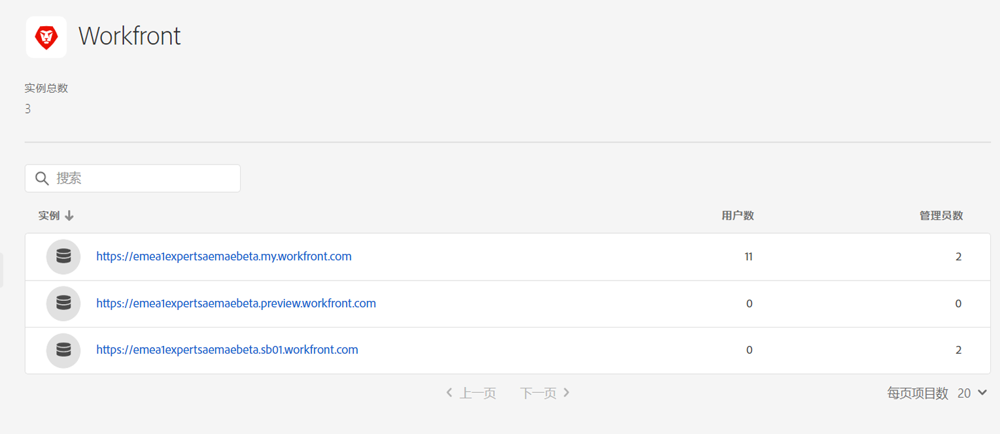
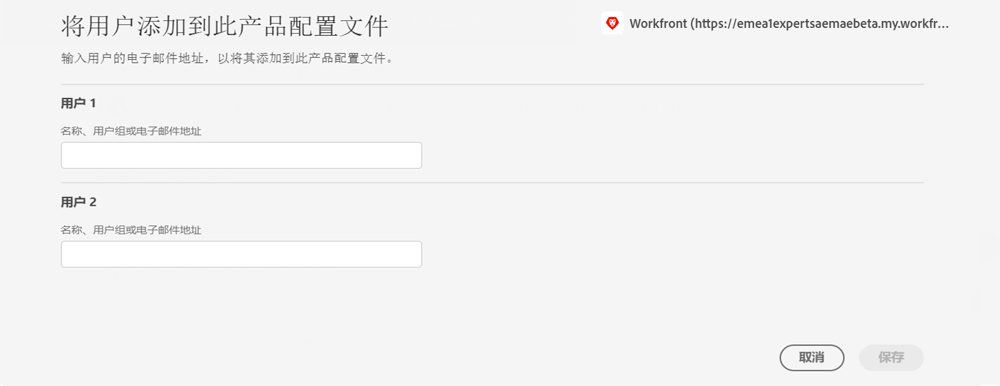

# 将 Assets Essentials 与 Adobe Workfront 集成 {#integrate-assets-essentials-workfront}

[[!DNL Adobe Workfront]](https://www.workfront.com/) 是一个工作管理应用程序，它帮助您集中在一处管理工作的整个生命周期。[!DNL Adobe Workfront] 和 [!DNL Assets Essentials] 之间的本机集成使组织能够通过将工作和资源管理内在地联系起来，提高内容速度和上市时间。在管理其工作的情况下，用户可在同一个解决方案中访问所需的文档和图像。

请执行以下任务以将 Workfront 与 Experience Manager Assets Essentials 集成：

* [将用户添加到 Workfront 产品配置文件](#add-users-to-product-profiles)

* [将用户添加到 Assets Essentials 产品配置文件](#add-workfront-users-assets-essentials-product-profiles)

* [配置 Experience Manager Assets Essentials 集成](#configure-assets-essentials-integration)

## 将用户添加到 Workfront 产品配置文件 {#add-users-to-product-profiles}

要将用户添加到 Workfront 产品配置文件：

1. 访问您所在组织的 [Admin Console](https://adminconsole.adobe.com)，依次单击顶栏中的&#x200B;**[!UICONTROL 产品]**、**[!UICONTROL Workfront]**、列表中的第一个实例。不要单击列表中的第二个和第三个实例。

   

   Admin Console 显示唯一可用的产品配置文件。

1. 要将用户添加到产品配置文件，请单击该配置文件，单击&#x200B;**[!UICONTROL 添加用户]**，提供该用户的详细信息，然后单击&#x200B;**[!UICONTROL 保存]**。

   

   添加用户时，用户将收到电子邮件邀请以开始使用。您可以在 [!DNL Admin Console] 的产品配置文件设置中关闭电子邮件邀请。

1. 要从组中删除某个用户，请单击改组，选择现有用户，然后选择&#x200B;**[!UICONTROL 删除用户]**。

有关如何用 Adobe Admin Console 在 Workfront 中创建用户和系统管理员的详细信息，请参阅[在 Adobe Admin Console 中管理用户](https://one.workfront.com/s/document-item?bundleId=the-new-workfront-experience&amp;topicId=Content%2FAdministration_and_Setup%2FAdd_users%2FCreate_and_manage_users%2Fadmin-console.htm&amp;_LANG=enus)。

## 将用户添加到 Assets Essentials 产品配置文件 {#add-workfront-users-assets-essentials-product-profiles}

将 Workfront 用户分配到以下 Assets Essentials 产品配置文件之一：

* **[!DNL Assets Essentials]用户**&#x200B;有权访问整个 Assets Essentials 用户界面。这些用户可在 Assets Essentials 应用程序中上传、整理、标记和查找数字资源。此外，这些用户还有权访问 [!DNL Adobe Workfront] 应用程序中嵌入的资源选择体验。
* **[!DNL Assets Essentials]使用者用户**：有权访问 [!DNL Adobe Workfront] 应用程序中嵌入的资源选择体验。

此外，还有 **[!DNL Assets Essentials]管理员**&#x200B;产品配置文件，它提供对应用程序的管理访问权限。

有关如何将用户分配给 Assets Essentials 产品配置文件的详细信息，请参阅[将用户分配给 Assets Essentials 产品配置文件](deploy-administer.md#add-users-to-product-profiles)。

## 配置 Experience Manager Assets Essentials 集成 {#configure-assets-essentials-integration}

使用 Admin Console 将用户添加到 Workfront 和 Assets Essentials 产品配置文件后，即可[配置 Experience Manager Assets Essentials 与 Adobe Workfront 的集成](https://one.workfront.com/s/document-item?bundleId=the-new-workfront-experience&amp;topicId=Content%2FDocuments%2FAdobe_Workfront_for_Experience_Manager_Assets_Essentials%2F_workfront-for-aem-asset-essentials.htm)。

设置集成后，您可以：

* [从 Experience Manager Assets Essentials 链接资源和文件夹](https://one.workfront.com/s/document-item?bundleId=the-new-workfront-experience&amp;topicId=Content%2FDocuments%2FAdobe_Workfront_for_Experience_Manager_Assets_Essentials%2Flink-to-aem.htm&amp;_LANG=enus)

* [将文档发送到 Experience Manager Assets Essentials](https://one.workfront.com/s/document-item?bundleId=the-new-workfront-experience&amp;topicId=Content%2FDocuments%2FAdobe_Workfront_for_Experience_Manager_Assets_Essentials%2Fsend-to-aem.htm&amp;_LANG=enus)

* [校对从 Experience Manager Assets Essentials 链接的资源](https://one.workfront.com/s/document-item?bundleId=the-new-workfront-experience&amp;topicId=Content%2FDocuments%2FAdobe_Workfront_for_Experience_Manager_Assets_Essentials%2Fproof-linked-asset-aem.htm)

* [查看或下载从 Experience Manager Assets Essentials 链接的资源](https://one.workfront.com/s/document-item?bundleId=the-new-workfront-experience&amp;topicId=Content%2FDocuments%2FAdobe_Workfront_for_Experience_Manager_Assets_Essentials%2Fview-download-asset.htm)
