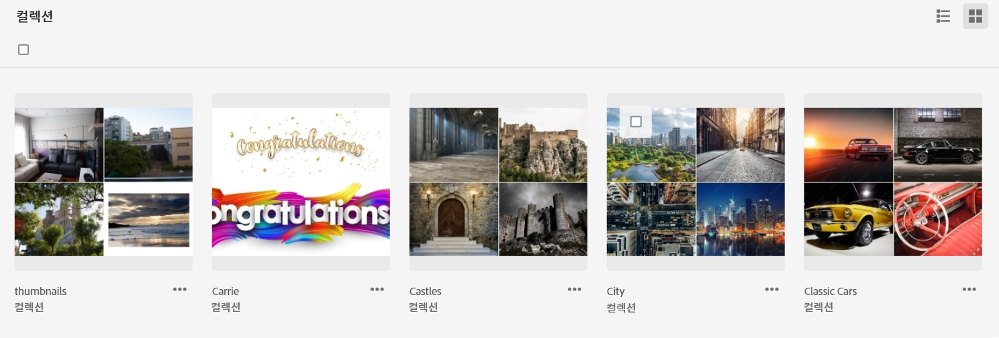
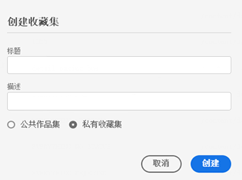
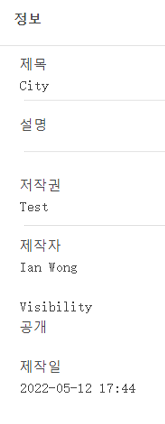
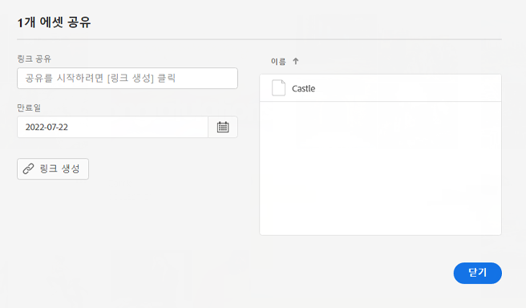

# 管理收藏集 {#manage-collections}

收藏集是 Experience Manager Assets Essentials 中的一组资源。使用收藏集可在用户之间共享资源。

与文件夹不同，一个收藏集可以包含来自不同位置的资源。

<!--
You can share collections with various users that are assigned different levels of privileges, including viewing, editing, and so on.
-->

您可以与一个用户共享多个收藏集。每个收藏集都包含对资源的引用。收藏集中会保持资源的引用完整性。

您可以执行以下任务来管理和使用收藏集：

* [创建收藏集](#create-collection)

* [将资源添加到收藏集](#add-assets-to-collection)

* [从收藏集中移除资源](#remove-assets-from-collection)

* [查看和编辑收藏集元数据](#view-edit-collection-metadata)

* [下载收藏集](#download-collection)

* [删除收藏集](#delete-collection)

## 创建收藏集 {#create-collection}

要创建收藏集，请执行以下操作：

1. 单击左边栏中的&#x200B;**[!UICONTROL 收藏集]**，然后单击&#x200B;**[!UICONTROL 创建收藏集]**。

1. 指定收藏集的标题和可选描述。

1. 单击&#x200B;**[!UICONTROL 保存]**&#x200B;以创建收藏集。

<!--

1. Select if you need to a create a Private collection or a Public collection.

   A Public collection is available for viewing and editing to all users. However, if you are a non-administrator user, a Private collection is available for viewing and editing only to users with the appropriate [permissions](#manage-collection-access). 

-->

## 将资源添加到收藏集 {#add-assets-to-collection}

要将资源添加到收藏集，请执行以下操作：

1. 单击左边栏中的&#x200B;**[!UICONTROL 资源]**，然后选择资源。

1. 单击&#x200B;**[!UICONTROL 添加到收藏集]**。

1. 在[!UICONTROL 收藏集]对话框上，选择要将所选资源添加到的收藏集。

1. 单击&#x200B;**[!UICONTROL 添加]**&#x200B;以将资源添加到所选收藏集。

要将资源添加到收藏集，您也可以单击左边栏中的&#x200B;**[!UICONTROL 收藏集]**，再依次单击要将资源添加到的收藏集和&#x200B;**[!UICONTROL 添加到收藏集]**，选择资源并单击&#x200B;**[!UICONTROL 选择]**。

## 从收藏集中移除资源 {#remove-assets-from-collection}

要从收藏集中移除资源，请执行以下操作：

1. 单击左边栏中的&#x200B;**[!UICONTROL 收藏集]**&#x200B;以查看收藏集列表。

1. 单击收藏集并选择要从收藏集中移除的资源。

1. 单击&#x200B;**[!UICONTROL 移除]**。

<!--

## Manage access to a Private collection {#manage-collection-access}

The permission management for collections function in the same manner as folders in [!DNL Assets Essentials]. Administrators can manage the access levels for collections available in the repository. As an administrator, you can create user groups and assign permissions to those groups to manage access levels. You can also delegate the permission management privileges to user groups at the collection-level.

For more information, see [Manage permissions for folders and collections](manage-permissions.md).

-->

<!--

## Search a collection {#search-collections}

Click **[!UICONTROL Collections]** in the left rail and use the Search box to specify a text as the criteria to search for a collection. [!DNL Assets Essentials] uses the specified text to search collection names, metadata including tags defined for a collection and returns appropriate results.

>[!NOTE]
>
>Assets Essentials performs search in collections available at the root level. It does not perform search in assets and folders available in collections.

-->

## 查看和编辑收藏集元数据 {#view-edit-collection-metadata}

收藏集元数据包括有关收藏集的数据，例如标题和描述。

要查看和编辑收藏集元数据，请执行以下操作：

1. 单击左边栏中的&#x200B;**[!UICONTROL 收藏集]**，选择一个收藏集，然后单击&#x200B;**[!UICONTROL 详细信息]**。
1. 使用&#x200B;**[!UICONTROL 基本]**&#x200B;选项卡查看收藏集元数据。
1. 根据需要修改元数据字段。您可以修改[!UICONTROL 标题]、[!UICONTROL 描述]和[!UICONTROL 作者]字段。

## 共享收藏集的链接 {#share-collection-links}

[!DNL Assets Essentials] 使您能够生成链接并与无权访问 [!DNL Assets Essentials] 应用程序的外部利益相关者共享收藏集及其资源。您可以定义链接的到期日期，然后使用您喜欢的通信方式（如电子邮件或消息服务）与他人共享。链接的接收者可以预览并下载资源。

有关如何与外部利益相关者共享收藏集链接的更多信息，请参阅[共享资源链接](share-links-for-assets.md)。

## 下载收藏集 {#download-collection}

要下载收藏集，请执行以下操作：

1. 单击左边栏中的&#x200B;**[!UICONTROL 收藏集]**。

1. 选择您需要下载的收藏集，然后单击 **[!UICONTROL 下载]**.

1. 在 [!UICONTROL 下载资产] 对话框，单击 **[!UICONTROL 确定]**.

该集合将以.ZIP文件的形式下载到您的本地计算机。

## 删除收藏集 {#delete-collection}

要删除收藏集，请执行以下操作：

1. 单击左边栏中的&#x200B;**[!UICONTROL 收藏集]**。

1. 选择要删除的收藏集。

1. 单击&#x200B;**[!UICONTROL 删除]**。

## 后续步骤 {#next-steps}

* 利用 Assets Essentials 用户界面上的[!UICONTROL 反馈]选项提供产品反馈

* 通过右侧边栏中的[!UICONTROL 编辑此页面]或[!UICONTROL 记录问题]来提供文档反馈

* 联系[客户关怀团队](https://experienceleague.adobe.com/?support-solution=General#support)
