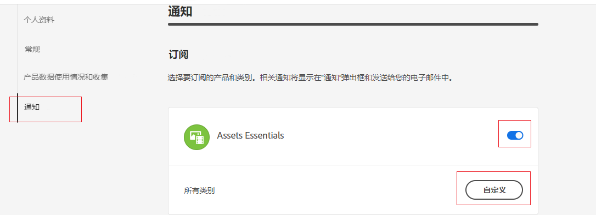
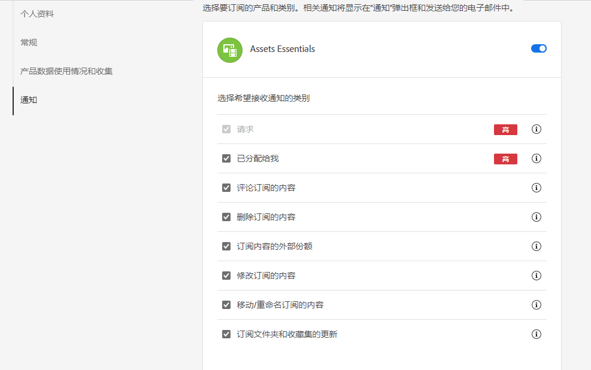
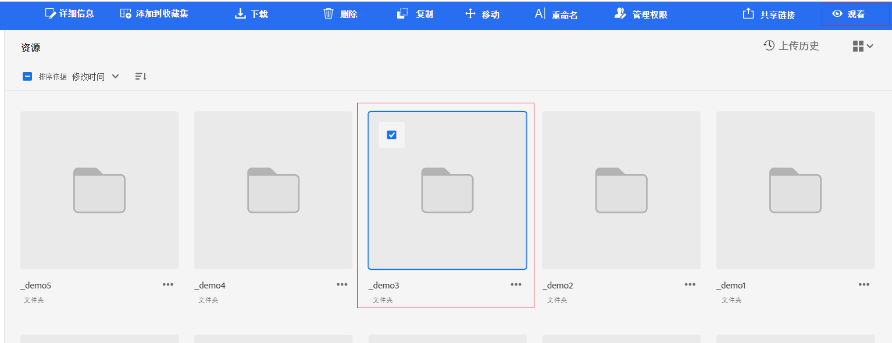

# 管理通知 {#manage-notifications}

Assets Essentials通知允许您监视对存储库中可用的资产、文件夹或收藏集执行的操作。 需要选择并订阅将向您发送其通知的内容。还可配置向您发送其通知的类别。

## 订阅通知类别 {#subscribe-to-notification-categories}

可从要接收通知的类别的列表中选择并订阅。Assets Essentials 仅为从可用选项中选择的类别向您发送通知：

<table>
    <tbody>
     <tr>
      <th><strong>通知类别</strong></th>
      <th><strong>描述</strong></th>
     </tr>
     <tr>
      <td>请求</td>
      <td>将任务分配给用户时，当该用户对该任务执行了操作时，您将收到通知。</td>
     </tr>
     <tr>
      <td>分配给我</td>
      <td>当有任务从另一用户分配给您时，您将收到通知。</td>
     </tr>
     <tr>
      <td>对订阅的内容发表评论</td>
      <td>当用户对您订阅的资源发表评论时，您将收到通知。</td>
     </tr>
     <tr>
      <td>删除订阅的内容</td>
      <td>当用户删除您订阅的资产、文件夹或收藏集时，您会收到通知。</td>
     </tr>
     <tr>
      <td>外部共享订阅的内容</td>
      <td>当用户为您订阅的资产、文件夹或收藏集生成公共链接时，您会收到通知。</td>
     </tr>
     <tr>
      <td>修改订阅的内容</td>
      <td>当用户为您订阅的资源创建新版本时，您将收到通知。</td>
     </tr>
     <tr>
      <td>移动/重命名订阅的内容</td>
      <td>当用户移动或重命名您订阅的资源或文件夹时，您将收到通知。</td>
     </tr>
     <tr>
      <td>更新订阅的文件夹和收藏集</td>
      <td>当用户从订阅的文件夹或收藏集添加或删除资产时，您会收到通知。</td>
     </tr>    
    </tbody>
   </table>

要订阅通知类别，请执行以下操作：

1. 在 Assets Essentials 用户界面上的菜单栏右端单击 。

1. 单击  以查看 [!UICONTROL Experience Cloud 首选项]页面。

1. 单击可在左窗格中找到的&#x200B;**[!UICONTROL 通知]**&#x200B;选项。

1. 在&#x200B;**[!UICONTROL 通知]**&#x200B;部分中导航到 [!UICONTROL Assets Essentials] 部分，并确保已将切换选项切换到“开”状态。

   

1. 单击&#x200B;**[!UICONTROL 自定义]**以查看通知类别。
   

1. 选择需要通知您的通知类别。

## 监视和取消监视文件夹、资产或收藏集 {#watch-unwatch-assets}

在[订阅通知类别](#subscribe-to-notification-categories)之后，必须订阅内容才能开始接收通知。

>[!NOTE]
>
>对于&#x200B;**[!UICONTROL 请求]**&#x200B;和&#x200B;**[!UICONTROL 分配给我]**&#x200B;通知类别，在订阅通知类别之后，无需订阅内容。对于您创建的请求以及在有任务分配给您时，自动向您发送通知。

要订阅内容，请选择您需要订阅的文件夹、资产或收藏集，然后单击 **[!UICONTROL Watch]**.

Assets Essentials 显示一条成功消息。可单击可在成功消息上找到的&#x200B;**[!UICONTROL 转到通知首选项]**&#x200B;以编辑您[对通知类别的订阅](#subscribe-to-notification-categories)。

Assets Essentials 现在为订阅的类别发送通知。您还可以选择多个资产、文件夹或收藏集，然后单击 **[!UICONTROL Watch]** 以节省时间。 但是，如果选择多个实体，并且其中有实体已订阅某些资源或文件夹，则不显示&#x200B;**[!UICONTROL 监视]**&#x200B;选项。

同样，要取消订阅，请选择您订阅的资产、文件夹或收藏集，然后单击 **[!UICONTROL Unwatch]**.

## 查看通知 {#view-notifications}

通知显示在 Assets Essentials 用户界面上的菜单栏右端。

单击通知后，Assets Essentials 为您导航到在该通知中提到的相应资源或文件夹。
