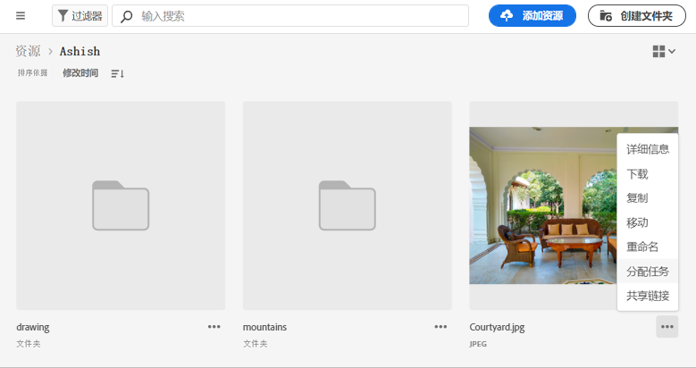
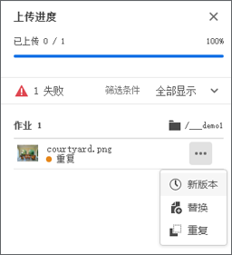
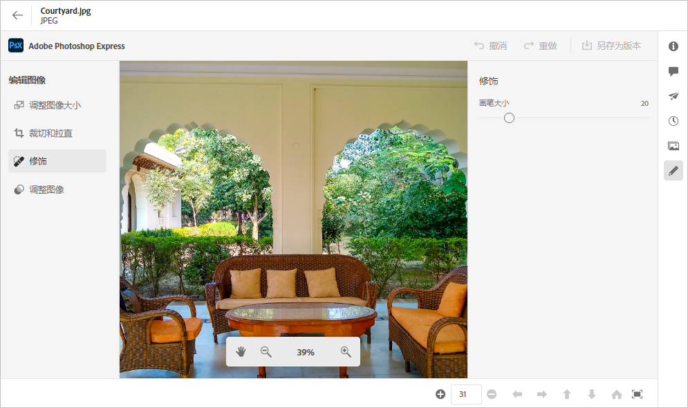
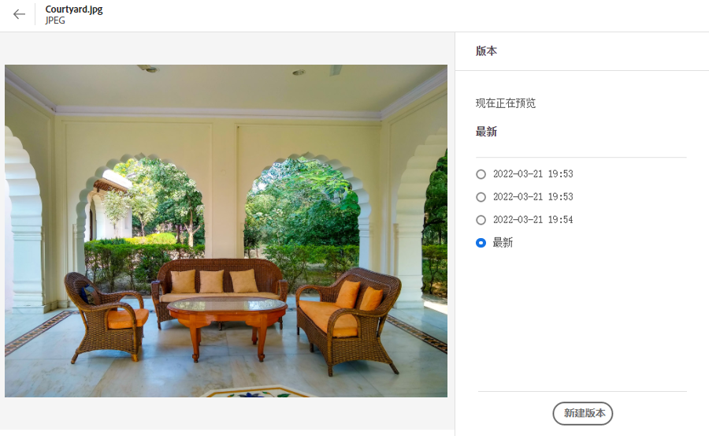
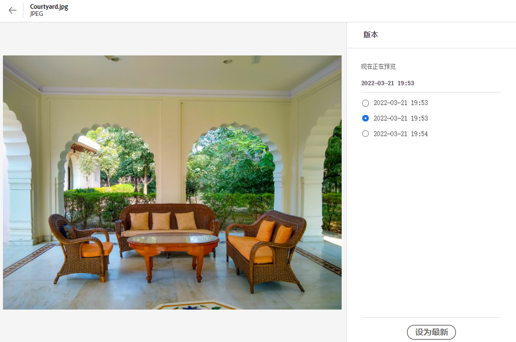

# 管理资源 {#manage-assets}

您可以通过 [!DNL Assets Essentials] 简单易用的用户界面，执行各种数字资源管理 (DAM) 任务。添加资源之后，您可以搜索、下载、移动、复制、重命名、删除、更新和编辑资源。

使用 [!DNL Assets Essentials] 完成以下资源管理任务。选择某个资源时，顶部的工具栏显示以下选项。

*图：所选图像在工具栏中可用的选项。*

*  取消选择选定内容。
*  单击可预览资源并查看详细的元数据。在预览时，您可以查看版本并编辑图像。
*  将所选资源下载到您的本地文件系统。
*  删除选定的资源或文件夹。
*  签出选定的资源。
*  复制选定的文件或文件夹。
*  将选定的资源或文件夹移动到存储库层次结构中的不同位置。
*  重命名选定的资源或文件夹。请使用唯一名称，否则重命名将失败并出现警告。您可以使用新名称重试。
*  分配任务给其他用户来协作处理某个资源。

在资源缩略图上可以查看相同的选项。

根据所选资源的类型，[!DNL Assets Essentials] 在工具栏上仅显示相关的选项。

*图：所选文件夹在工具栏中可用的选项。*

*图：所选 PDF 文件在工具栏中可用的选项。*

## 下载和分发资源 {#download}

您可以选择一个或多个资源或文件夹，或者两者的组合，然后将所选内容下载到本地文件系统。您可在 [!DNL Assets Essentials] 之外编辑资源并重新上传或分发资源。您还可以[下载资源的演绎版](/help/add-delete.md#renditions)。

## 资源版本控制 {#versions-of-assets}

<!-- 
TBD: query for engineering: How many versions are maintained. What happens when we reach that limit? Are old versions automatically removed? -->

在对资源进行更新或编辑后重新上传资源时，[!DNL Assets Essentials] 会对资源进行版本控制。您可以查看版本历史记录和过去的版本，并可将资源过去的某个版本恢复为最新版本，即在需要时还原到以前的版本。在以下场景中会创建资源版本：

* 在与现有资源相同的文件夹中，使用与现有资源相同的文件名上传新资源。[!DNL Assets Essentials] 会提示您选择覆盖以前的资源，或者将新资源另存为一个版本。请参阅[上传重复的资源](/help/add-delete.md#resolve-upload-fails)。

   

   *图：上传与现有资源具有相同名称的资源时，您可以创建资源的版本。*

* 编辑图像并单击&#x200B;**[!UICONTROL 另存为版本]**。请参阅[编辑图像](/help/edit-images.md)。

   

   *图：将编辑后的图像另存为版本。*

* 打开现有资源的版本。单击&#x200B;**[!UICONTROL 新版本]**&#x200B;并将资源的更新版本上传到存储库中。

   

### 查看资源的版本 {#view-versions}

上传资源的重复副本或者修改后的副本时，您可以创建其版本。利用版本控制，您可以查看历史资源，并在需要时还原为以前的版本。

要查看版本，请打开资源的预览并单击右侧边栏中的&#x200B;**[!UICONTROL 版本]** 。要预览特定版本，请选择该版本。要还原到该版本，请单击&#x200B;**[!UICONTROL 设为最新版本]**。

您还可以从版本时间线中创建版本。选择最新的版本，单击&#x200B;**[!UICONTROL 新版本]**，然后从本地文件系统上传资源的新副本。

*图：查看资源的版本，还原到以前的版本，或者上传另一个新版本。*
