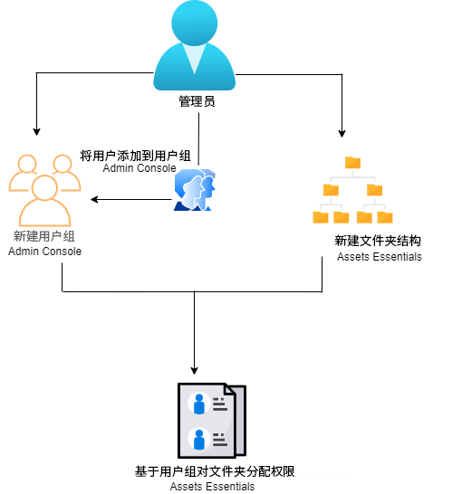
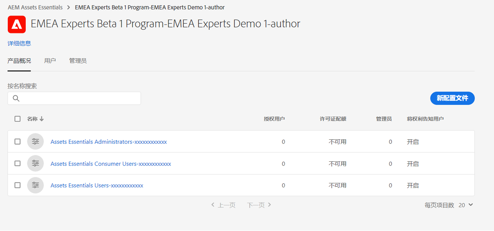
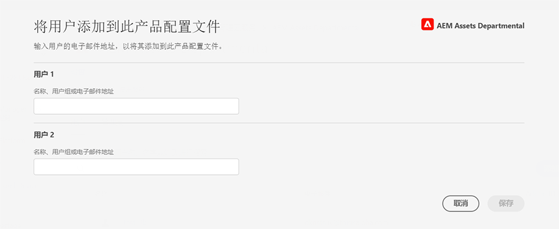
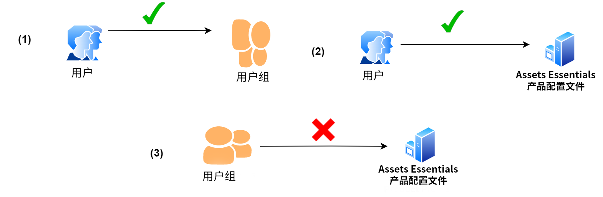
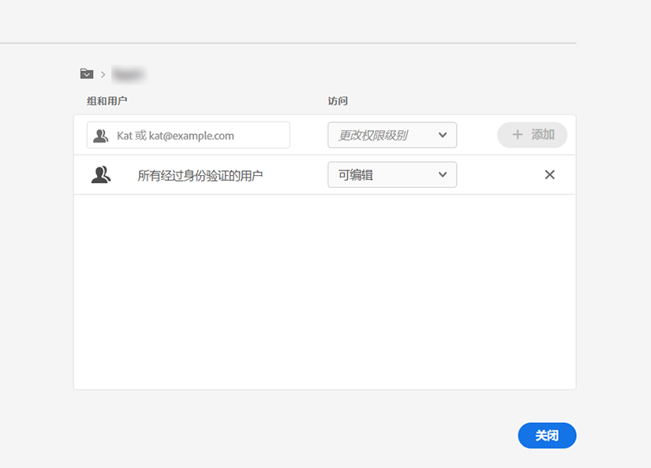
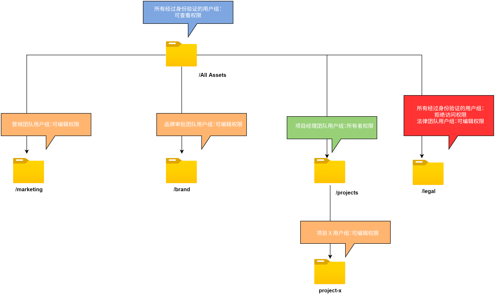

# 管理文件夹的权限

Assets Essentials允许管理员管理存储库中可用文件夹的访问权限级别。 作为管理员，您可以创建用户组并为这些组分配权限以管理访问级别。 您还可以将权限管理权限委派给文件夹级别的用户组。

以下数据流图说明了配置和管理Assets Essentials存储库中可用文件夹的权限时需要执行的一系列任务：

## 在管理文件夹的权限之前 {#before-managing-permissions}

在开始管理Assets Essentials存储库中文件夹的权限之前，必须执行某些任务，例如添加管理员，这些管理员可以创建逻辑文件夹结构、创建用户组以及管理各个用户组的文件夹权限。

### 添加管理员 {#add-admin-users}

为Assets Essentials应用程序添加管理员，以便他们可以管理其他用户组的文件夹权限。

添加管理员：

1. 访问 [Admin Console](https://adminconsole.adobe.com) 对于贵组织，单击 **[!UICONTROL 产品]** 在顶部栏中，单击 **[!UICONTROL AEM Assets Essentials]**，然后单击 [!DNL Assets Essentials] 环境。 [!DNL Assets Essentials] 具有三个产品配置文件，它们表示管理员、常规用户和消费者用户的访问权限。

   

1. 要将用户添加到群组，请单击Assets Essentials管理员群组，选择 **[!UICONTROL 添加用户]**，提供用户详细信息，然后单击 **[!UICONTROL 保存]**.

   

   添加用户时，用户会收到开始使用的电子邮件邀请。 您可以在 [!DNL Admin Console].

1. 要从群组中删除用户，请单击该群组，选择现有用户，然后选择 **[!UICONTROL 删除用户]**.

### 添加用户组 {#add-user-groups}

创建用户组并为这些组分配权限，以管理Assets Essentials存储库中的文件夹访问级别。 然后，您可以将用户分配给用户群组。

您可以将用户添加到用户组(1)和 [Assets Essentials产品配置文件用户(2)](#add-admin-users). 但是，您无法将用户组直接添加到Assets Essentials产品配置文件(3)中。

有关如何管理用户群组的信息，请参阅 `Create user groups` 和 `Edit user groups` 可在 [管理用户组](https://helpx.adobe.com/enterprise/using/user-groups.html).

>[!NOTE]
>
>如果您的Admin Console设置为利用外部系统来管理用户/组分配(如Azure或Google连接器、用户同步工具或用户管理休息API)，则您的组和用户分配将自动进行配置。 有关更多信息，请参阅 [Adobe Admin Console用户](https://helpx.adobe.com/enterprise/using/users.html).

### 将用户添加到群组 {#add-users-to-uesr-groups}

创建用户组后，您可以开始将用户添加到用户组。

有关如何管理将用户添加到用户群组的信息，请参阅 `Add users to groups` 可在 [管理用户组](https://helpx.adobe.com/in/enterprise/using/user-groups.html#add-users-to-groups).

### 创建文件夹结构 {#create-folder-structure}

您可以使用以下方法在Assets Essentials存储库中创建文件夹结构：

* 单击 **[!UICONTROL 创建文件夹]** 选项来创建空文件夹。

* 单击 **[!UICONTROL 添加资产]** 工具栏中的选项 [上载本地计算机上可用的文件夹结构](add-delete.md).

创建一个文件夹结构，该结构非常适合组织的业务目标。 如果要将现有文件夹结构上传到Assets Essentials存储库，则应查看该结构。 有关更多信息，请参阅 [有效权限管理的最佳实践](permission-management-best-practices.md).

## 管理文件夹的权限 {#manage-permissions-folders}

您可以将以下权限分配给用户组或用户。 Adobe不建议向用户分配权限。

| 权限名称 | 描述 |
|-----|------|
| 可以查看 | <ul><li>对查看和导航文件夹的读取权限 </li><li>预览资产</li><li>下载资源</li><li>复制资产</li><li>共享资产链接</li><ul> |
| 可以编辑 | <ul><li>所有可用于“可以查看”权限的权限 </li><li>创建文件夹</li><li>删除文件夹</li><li>重命名文件夹</li><li>创建资产</li><li>更新资产</li><li>删除资产</li><li>移动资产</li><li>重命名资产</li><ul> |
| 所有者 | <ul><li>可以编辑权限的所有可用权限</li><li>管理文件夹及其子文件夹的权限</li>此权限允许管理员将文件夹及其子文件夹的管理员权限委派给其他人。<ul> |
| 拒绝访问 | 删除文件夹及其子文件夹的“可以查看”、“可以编辑”和“所有者”权限。 |

**默认权限**

已通过身份验证并可以登录到Assets Essentials应用程序的所有用户都 `Can Edit` 最初对Assets Essentials存储库的权限。 管理员可以根据 [编辑整个Assets Essentials存储库的权限](#edit-permissions-entire-repository).

**将文件夹权限分配给用户组的顺序**

创建规则以将文件夹权限分配给用户组。 用于为文件夹分配权限的顺序很重要，它决定了用户组以及最终用户的可用访问权限。

例如，如果您将 `Can View` 将文件夹的权限分配给超级组，然后 `Can Edit` 对其子组的权限，则只有该子组的成员具有对文件夹的编辑权限。 超级组用户有权查看文件夹。

如果您需要为 `Marketing` 文件夹，并且仅查看您组织的营销部门的权限， `Can View` 超级组的权限 `All Authenticated Users` 和 `Can Edit` 其子组的权限 `Marketing`.

**权限继承**

Assets Essentials使用权限继承，这允许您继承子文件夹中父文件夹的权限集。 例如，如果父文件夹具有 `Can View` 权限 `All Authenticated Users` 组和子文件夹具有 `Can Edit` 权限 `Marketing` 用户组，它允许所有经过身份验证的用户拥有子文件夹和 `Marketing` 用户组，以拥有子文件夹的编辑权限。 的 `Marketing` 用户群组在子文件夹（营销）下拥有进一步级别文件夹的编辑权限。

>[!NOTE]
>
> 设置 `Deny Access` 对较高级别文件夹上的组的权限，然后恢复访问权限(`Can view`, `Can edit` 或 `Owner`)。 使用 `Deny Access` 很谨慎。

### 向用户组添加权限 {#add-permissions}

要为文件夹分配组权限，请执行以下操作：

1. 选择文件夹并单击 **[!UICONTROL 管理权限]**.

1. 在 **[!UICONTROL 管理权限]** 对话框中，指定组或用户的名称 **[!UICONTROL 群组和用户]** 字段。

1. 选择 [访问级别](#manage-permissions-folders) 从 **[!UICONTROL 访问]** 下拉列表。

1. 单击 **[!UICONTROL 添加]** 立即更改用户或组的权限。

1. 重复步骤1-3，向 **[!UICONTROL 管理权限]** 对话框。

   

   >[!NOTE]
   >
   > 您用于为文件夹分配权限的顺序很重要，它决定了用户组以及最终添加到这些组的用户的可用访问权限。

   如果您管理多个文件夹的权限，则还可以从左侧窗格中选择任何其他文件夹，然后开始管理该文件夹的权限。

1. 单击&#x200B;**[!UICONTROL 关闭]**。

>[!CAUTION]
>
> 建议管理用户群组的权限，而不是个人用户。 设置 `Deny access` 仅支持用户组，但不支持个人用户。

### 编辑分配给用户组的权限 {#edit-permissions}

要编辑文件夹上分配给用户组的权限，请执行以下操作：

1. 选择文件夹并单击 **[!UICONTROL 管理权限]**.

1. 在 **[!UICONTROL 管理权限]** 对话框，编辑 [访问级别](#manage-permissions-folders) 从 **[!UICONTROL 访问]** 下拉列表。

1. [添加更多用户组或用户](#add-permissions) 权限规则（如有必要）。

1. 单击X可删除分配给用户群组的权限。

### 编辑整个Assets Essentials存储库的权限 {#edit-permissions-entire-repository}

应用程序管理员可以从默认位置编辑整个Assets Essentials存储库的权限 `Can Edit` 到任何其他访问级别。

要编辑整个Assets Essentials存储库的权限，请执行以下操作：

1. 选择任意文件夹并单击 **[!UICONTROL 管理权限]**.

1. 在 **[!UICONTROL 管理权限]** 对话框，单击 **[!UICONTROL 所有资产]** 中。

1. [编辑权限](#edit-permissions) 并关闭对话框。

>[!NOTE]
>
>管理员无法选择 `Deny Access` 权限级别，以确保用户至少具有对应用程序的读取权限。 同样， `All Authenticated Users` 至少具有对存储库的读取权限，即使管理员明确删除 `Can Edit` 权限 [!UICONTROL 管理权限] 对话框。

## 有效权限管理的示例 {#example-permission-management}

**用例**

* 所有已验证的用户组都具有对存储库的查看权限。
* 特定于团队的用户组拥有其自身特定于功能的文件夹的编辑权限。
* 除法律团队之外，法律文件夹不可用于查看任何经过身份验证的用户。

在Admin Console中创建以下用户组：

* 营销团队

* 品牌批准者团队

* 项目经理团队

* 项目X团队

* 法律团队

下图说明了文件夹层次结构以及分配给每个用户群组的权限：

以下是文件夹层次结构中所有用户组的访问级别：

* /所有资产：管理员会从默认级别修改根级别的权限 `Can Edit` to `Can View`. 所有用户都可以查看文件夹和资产，但无法编辑它们。

* /marketing:所有用户都可以根据权限继承来查看文件夹及其子文件夹，但是，营销团队用户组具有该文件夹的编辑权限。

* /brand:所有用户都可以根据权限继承来查看文件夹及其子文件夹，但是，品牌批准者团队用户组对文件夹具有编辑权限。

* /projects:所有用户都可以根据权限继承查看文件夹及其子文件夹。 项目经理团队用户组具有：

   * 编辑权限

   * 所有者权限：管理文件夹及其子文件夹的权限。

* /projects/project-x:所有用户都可以查看文件夹及其子文件夹。 项目经理团队用户组具有编辑权限，并可以管理文件夹及其子文件夹的权限（所有者权限）。 项目X团队用户组具有编辑权限。

* /legal:所有用户都无法基于 `Deny Access` 权限 `All Authenticated Users` 群组。 法律团队用户组具有编辑权限。
