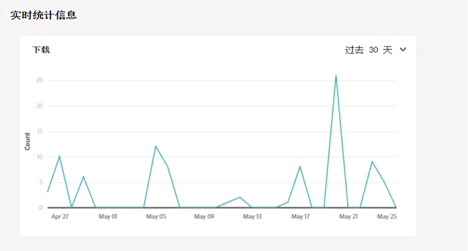
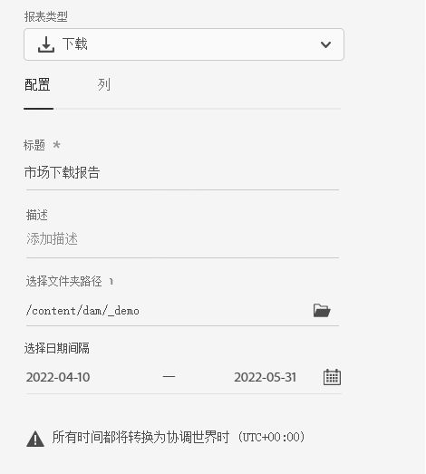
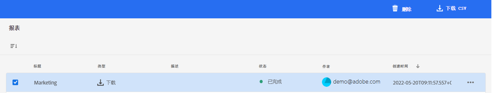

# 管理报表 {#manage-reports}

资产报表可为管理员提供Adobe Experience Manager Assets Essentials环境活动的可见性。 此数据提供有关用户如何与内容和产品进行交互的有用信息。

## 访问报告 {#access-reports}

分配给 [Assets Essentials管理员产品配置文件](deploy-administer.md) 可以在Assets Essentials中访问“实时统计”功能板并创建用户定义的报表。

## 查看实时统计信息 {#view-live-statistics}

Assets Essentials允许您使用“实时统计”功能板查看Assets Essentials环境的实时数据。 您可以查看过去30天或过去12个月内的实时事件量度。

导航到 **[!UICONTROL 设置]** > **[!UICONTROL 实时统计]** 查看自动生成的下载数据。

## 创建报表 {#create-report}

要创建报表，请执行以下操作：

1. 导航到 **[!UICONTROL 设置]** > **[!UICONTROL 报表]** 单击 **[!UICONTROL 创建报表]**.

1. 在 [!UICONTROL 配置] 选项卡，为报表指定标题和可选描述。

1. 使用 **[!UICONTROL 选择文件夹路径]** 字段。

1. 选择报表的日期间隔。

1. 在 [!UICONTROL 列] 选项卡，选择需要在报表中显示的列名称。

1. 单击&#x200B;**[!UICONTROL 创建]**。

   

下表说明了可添加到报表的所有列的用法：

<table>
    <tbody>
     <tr>
      <th><strong>列名称</strong></th>
      <th><strong>描述</strong></th>
     </tr>
     <tr>
      <td>标题</td>
      <td>资产的标题。</td>
     </tr>
     <tr>
      <td>路径</td>
      <td>资产在Assets Essentials中可用的文件夹路径。</td>
     </tr>
     <tr>
      <td>类型</td>
      <td>资产的MIME类型。</td>
     </tr>
     <tr>
      <td>大小</td>
      <td>资产的大小。</td>
     </tr>
     <tr>
      <td>下载者</td>
      <td>下载资产的用户的电子邮件ID。</td>
     </tr>
     <tr>
      <td>下载日期</td>
      <td>执行资产下载操作的日期。</td>
     </tr>
     <tr>
      <td>创作</td>
      <td>资产的作者。</td>
     </tr>
     <tr>
      <td>创建日期</td>
      <td>资产上传到Assets Essentials的日期。</td>
     </tr>
     <tr>
      <td>修改日期</td>
      <td>上次修改资产的日期。</td>
     </tr>
     <tr>
      <td>已过期</td>
      <td>资产的过期状态。</td>
     </tr>
     <tr>
      <td>按用户名下载</td>
      <td>下载资产的用户的名称。</td>
     </tr>           
    </tbody>
   </table>

## 查看现有报表 {#view-report-list}

之后 [创建报告](#create-report)，则可以查看现有报表的列表，并选择以CSV格式下载或删除这些报表。

要查看报表列表，请导航至 **[!UICONTROL 设置]** > **[!UICONTROL 报表]**.

对于每个报表，您都可以查看报表标题、报表类型、创建报表时指定的描述、报表状态、创建报表的作者的电子邮件ID以及报表创建日期。

`Completed ` 报表状态表示报表已准备好下载。

## 下载CSV报表 {#download-csv-report}

要下载CSV格式的报表，请执行以下操作：

1. 导航到 **[!UICONTROL 设置]** > **[!UICONTROL 报表]**.

1. 选择报表并单击 **[!UICONTROL 下载CSV]**.

所选报表将下载CSV格式。 CSV报表中显示的列取决于您在 [创建报告](#create-report).

## 删除报表 {#delete-report}

要删除报表，请执行以下操作：

1. 导航到 **[!UICONTROL 设置]** > **[!UICONTROL 报表]**.

1. 选择报表并单击 **[!UICONTROL 删除]**.
