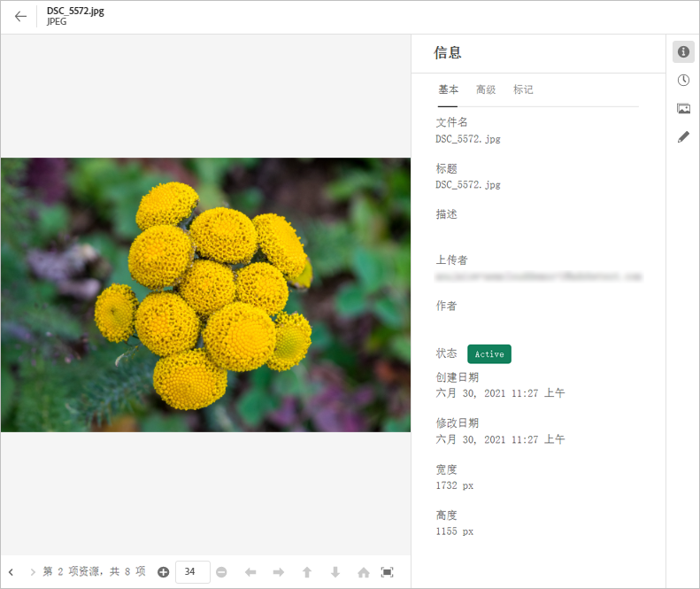
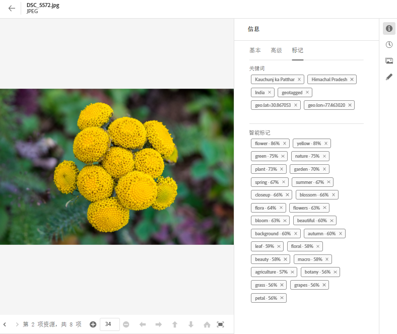
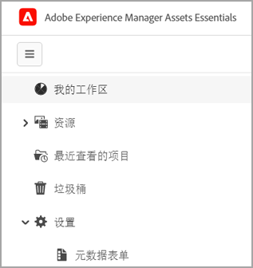
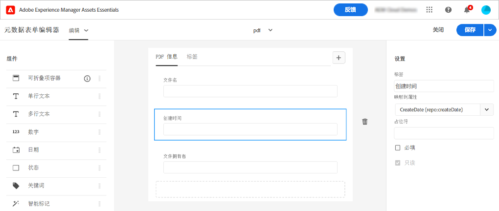

# [!DNL Assets Essentials]中的元数据 {#metadata}

元数据是指有关数据的数据或描述。 例如，您的图像作为资产，可以包含有关被单击的相机的信息或任何版权信息。 此信息是图像的元数据。 元数据对于有效管理资产至关重要。 元数据是资产所有可用数据的集合，但不一定包含在该资产中。

元数据可帮助您进一步对资产进行分类，并且随着数字信息量的增长，该元数据会非常有用。 仅根据文件名、缩略图和内存可以管理几百个文件。 但是，此方法无法扩展。 当涉及的人员数量和受管资产数量增加时，该指标就会落空。

随着元数据的添加，数字资产的价值会随着资产的变化而增加，

* 更易于访问 — 系统和用户可以轻松找到它。
* 更易于管理 — 您可以更轻松地查找具有相同属性集的资产，并对其应用更改。
* 完成 — 资产会携带更多信息，并且上下文中包含更多元数据。

出于这些原因，Assets为您提供了为数字资产创建、管理和交换元数据的正确方法。

## 查看元数据 {#view-metadata}

要查看资产的元数据，请浏览到资产或搜索资产，选择资产，然后单击工具栏中的&#x200B;**[!UICONTROL Details]**。

*图：要查看资产及其元数据，请单击工&#x200B;**[!UICONTROL Details]**具栏中的，或双击资产。*

[!UICONTROL Basic]选项卡中提供了标题、描述和上传日期等基本元数据。 [!UICONTROL Advanced]选项卡包含更高级的元数据，如相机型号、镜头详细信息和地理标记。 [!UICONTROL Tags]选项卡包含根据图像内容自动应用的标记。

## 更新元数据 {#update-metadata}

您可以手动更新一些元数据字段。 这些字段包括[!UICONTROL Title]、[!UICONTROL Description]、[!UICONTROL Author]和[!UICONTROL Keywords]。

## 标记 {#tags}

[!DNL Assets Essentials] 使用由Adobe发送器提供 [的人](https://www.adobe.com/cn/sensei.html) 工智能，自动将相关标记应用于所有上传的资产。这些标记（称为智能标记）可帮助您快速查找相关资产，从而提高项目的内容速度。 智能标记是未包含在图像中的元数据的示例。

所述智能标记以接近实时的方式应用并基于所述图像的内容产生。 上传资产时，用户界面会在资产缩略图上显示一段时间的[!UICONTROL Processing]。 处理完成后，您可以[查看元数据](#view-metadata)和智能标记。

*图：要查看资产的智能标记，请在工具&#x200B;**[!UICONTROL Details]**栏中单击或双击资产。*

智能标记还包含置信度得分（以百分比表示）。 它表示与应用的标记关联的置信度。 您可以审核自动应用的智能标记。

## 添加或更新标记 {#manually-tag}

除了使用[!DNL Adobe Sensei]智能服务自动添加的智能标记之外，您还可以向资产添加更多标记。 打开资产进行预览，单击[!UICONTROL Tags]，然后在[!UICONTROL Keywords]字段中键入所需的关键字。 要添加标记，请按返回。 [!DNL Assets Essentials] 对关键词进行近乎实时的索引，您的团队很快就可以使用新关键词搜索更新的资产。

您还可以从[!UICONTROL Smart Tags]部分中删除由[!DNL Assets Essentials]自动添加到所有上传资产的标记。

## 元数据表单 {#metadata-forms}

Assets Essentials默认提供许多标准元数据字段。 组织还有其他元数据需求，需要更多元数据字段来添加特定于业务的元数据。 元数据表单允许企业将自定义元数据字段添加到资产的[!UICONTROL Details]页面。 特定于业务的元数据可改进其资产的管理和发现。

您可以为不同类型的资产（不同的MIME类型）配置元数据表单。 使用与文件的MIME类型相同的表单名称。 Essentials会自动将上传的资产与表单名称匹配。 例如，如果存在名为`PDF`或`pdf`的元数据表单，则上传的PDF文档包含在表单中定义的元数据字段。 您可以从头开始创建表单，或重新设定现有表单的用途。

>[!IMPORTANT]
>
>特定文件类型的新元数据表单完全替换了[!DNL Assets Essentials]提供的默认元数据表单。 如果删除或重命名元数据表单，默认的元数据字段将再次可用于新资产。

要创建元数据表单，请执行以下步骤：

1. 在左边栏中，单击&#x200B;**[!UICONTROL Settings]** > **[!UICONTROL Metadata Forms]**。

   

1. 单击用户界面右上角的&#x200B;**[!UICONTROL Create]**。
1. 提供表单的名称，然后单击&#x200B;**[!UICONTROL Create]**。
1. 在右边栏的&#x200B;**[!UICONTROL Settings]**&#x200B;中为选项卡提供名称。
1. 从左边栏的&#x200B;**[!UICONTROL Components]**&#x200B;中，将所需组件拖动到表单的选项卡上。 按所需的顺序拖动组件。

   

   *图：元数据表单创建界面，其中包含用于添加组件的选项和用于预览表单的选项。*

1. 对于每个组件，在右边栏的&#x200B;**[!UICONTROL Settings]**&#x200B;中提供名称，提供包含支持属性的映射。
1. （可选）对于组件，选择&#x200B;**[!UICONTROL Required]**&#x200B;以将元数据字段设为必填字段，然后选择&#x200B;**[!UICONTROL Read-Only]**&#x200B;以使该字段在资产[!UICONTROL Details]页面中不可编辑。
1. （可选）单击&#x200B;**[!UICONTROL Preview]**&#x200B;以预览要创建的表单。
1. （可选）在每个选项卡中添加更多选项卡和所需的组件。
1. 表单完成后，单击&#x200B;**[!UICONTROL Save]**。

创建表单后，当用户上传具有匹配MIME类型的资产时，将自动应用该表单。

要重复使用现有表单以创建新表单，请选择元数据表单，单击工具栏中的&#x200B;**[!UICONTROL Copy]** ，提供名称，然后单击&#x200B;**[!UICONTROL Confirm]**。 您可以编辑元数据表单以对其进行更改。 当您更改表单时，该表单将用于更改后上传的资产。 它不会更改现有资产。

<!-- TBD: Cannot create a form using the second option. Documenting only the first option for now.
To reuse an existing form to create a new form, do one of these:

* Select a metadata form and click **[!UICONTROL Copy]** from the toolbar, provide a name, and click **[!UICONTROL Confirm]**.

* Click **[!UICONTROL Create]**, select **[!UICONTROL Use existing form structure as template]** option, and select an existing form. 
-->

<!-- TBD: Queries for PM and engg.

Can we edit the existing metadata in any form?

How to moderate smart tags?

Allow or deny list for smart tags?

What about Tags displayed just above Smart Tags in the UI?

Is there a detailed metadata tab. Where do the other details of an asset go?

How can one search based strictly on the metadata. Similar to AEM Assets GQL queries.
-->

<!-- TBD: Link to related articles if any.

>[!MORELIKETHIS]
>
>* [Search assets](search.md).
-->
