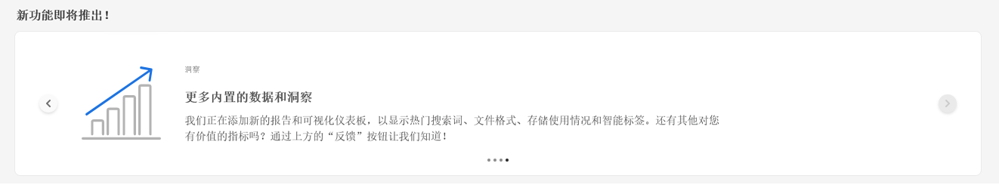
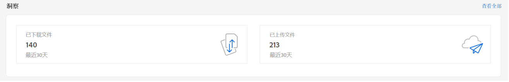
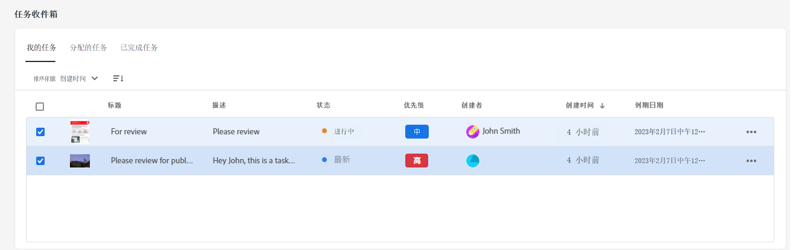
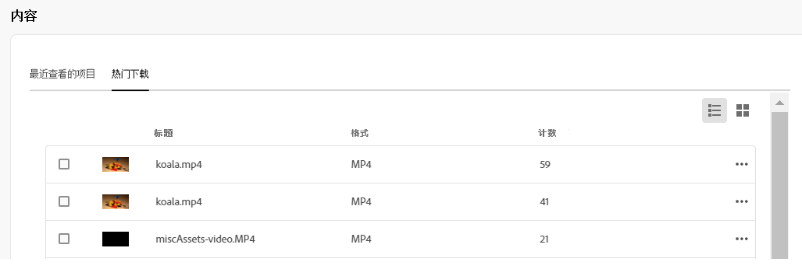

# 我的资产工作区 {#my-workspace}

资产现在包含一个可自定义的工作区，该工作区提供了用于方便访问资产用户界面关键区域以及与您最相关的信息的小组件。 本页提供一站式解决方案，用于概述您的工作项目并快速访问关键工作流。 更便捷地访问这些选项可以提高效率和内容速度。

您可以通过单击 **[!UICONTROL 我的工作区]** 从左侧导航窗格中可用的项目。 我的工作区中包含各种小组件，用于显示即将推出的新增功能、分析、任务和内容小组件。 您可以根据自己的首选项配置这些小组件在工作区中的显示方式。

>[!NOTE]
>
>分析小组件仅对管理员可见。

**即将推出新功能**

重点介绍即将推出的资产功能。

**见解**

管理员可以查看过去30天内在资产环境中执行的下载和上传次数的摘要。 您可以单击 **[!UICONTROL 查看全部]** 以快速导航到分析页面以查看更详细的功能板。

**任务**

显示 **[!UICONTROL 我的任务]** 选项卡，由您在 **[!UICONTROL 分配的任务]** ，并且您已在 **[!UICONTROL 已完成]** 选项卡。 您可以选择任务并单击 **[!UICONTROL 完成任务]** 批准或拒绝任务。 您还可以选择任务并单击 **[!UICONTROL 打开任务详细信息]** 查看任务并批准、拒绝、编辑或删除该任务。

>[!NOTE]
>
> 的 **[!UICONTROL 分配任务]** 当您选择资产或打开资产信息视图时，可以将资产上的任务分配给其他用户的选项可用。

**内容**

显示资产的各种视图，包括您最近查看的资产列表。 您可以选择在列表视图、网格视图、图库视图或瀑布视图中显示小组件中的资产，并按名称、大小和修改日期对资产进行排序。 您还可以选择资产以查看资产详细信息，或从最近查看的资产列表中将其删除。

## 自定义我的工作区 {#configure-widgets}

默认情况下，会显示所有小组件，但您可以启用或禁用“我的工作区”中显示的小组件。 每个用户的首选项都是特定的。

1. 单击 **[!UICONTROL 我的工作区]** 在左侧导航窗格中可用，然后单击 **[!UICONTROL 自定义]**.

1. 关闭在工作区中不需要显示的小组件的切换开关。 您还可以将小组件拖动到相应的位置，以在工作区中更新其显示顺序。

1. 单击 **[!UICONTROL 完成]** 以保存更改。

   
