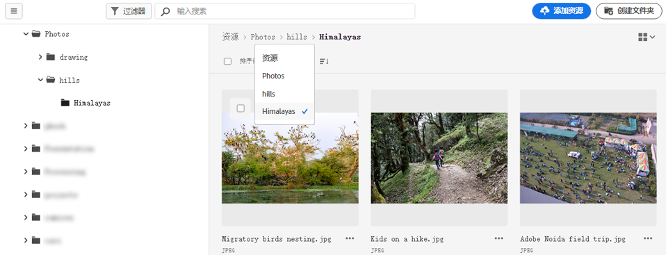
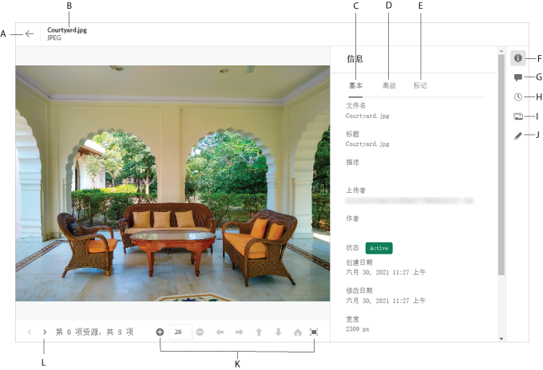

# 导航到文件和文件夹并查看资产{#view-assets-and-details}

<!-- TBD: Give screenshots of all views with many assets. Zoom out to showcase how the thumbnails/tiles flow on the UI in different views. -->

<!-- TBD: The options in left sidebar may change. Shared with me and Shared by me are missing for now. Update this section as UI is updated. -->

## 了解[!DNL Assets Essentials]用户界面{#understand-interface-navigation}

[!DNL Assets Essentials] 提供了直观且用户友好的用户界面。整洁的界面使资产和相关信息易于查找和记忆。

登录[!DNL Assets Essentials]时，您会看到以下界面。

<!-- TBD: Update this screenshot. Remove top bar. Remove 2 labels from top bar. -->

![[!DNL Assets Essentials] 用户界面](assets/essentials-interface1.png)

*图：首次登录屏幕以及在何处查找显着功能。*
     *答：用于浏览存储库的左侧栏，并提供对其他几个选项的访问权限。*
     *B:显示或折叠左侧栏以增加资产查看区域。*
     *C:筛选搜索结果。*
     *D:搜索框。*
     *E:用于对资产进行排序的选项。*
     *F:提供产品反馈。*
     *G:编辑用户首选项或注销。*
     *H:在不同视图之间切换。*

<!-- TBD: Need an embedded video here with narration. It has to be hosted on MPC to be embeddable. -->

## 浏览并查看资产和文件夹{#browse-repository}

您可以从主用户界面或从左侧栏浏览到所需的文件或文件夹。 浏览时，您可以使用界面查看资产缩略图，以可视方式浏览存储库或查看资产详细信息，以快速找到所需的资产。 左侧边栏中可用的选项包括：

* **资产**:树视图中您有权访问的所有文件夹和资产的列表。
* **最近查看的**:您最近预览的资产列表。[!DNL Assets Essentials] 仅显示您预览的资产。浏览存储库文件或文件夹时，它不会在此处显示您滚过的资产。
* **库**:访问( [!DNL Adobe Creative Cloud Team] CCT)库视图。仅当用户有权访问CCT库时，此视图才可见。

<!-- TBD: My Work Space shows task inbox and it is not visible on AEM Cloud Demos as of now. It is the source of truth server hence not documenting My Work Space option for now.
-->

您可以打开或折叠左侧栏以增加可用的资产查看区域。

在[!DNL Assets Essentials]中，您可以以四种不同类型的布局查看资产、文件夹和搜索结果。

*  [!UICONTROL List View]
*  [!UICONTROL Grid View]
*  [!UICONTROL Gallery View]
*  [!UICONTROL Waterfall View]

要找到资产，您可以按`Name`、`Relevancy`、`Size`、`Modified`和`Created`的升序或降序对资产进行排序。

要导航到文件夹中，请双击文件夹的缩略图，或从左侧边栏中选择文件夹。 要查看文件夹的详细信息，请选择它，然后单击顶部工具栏中的详细信息。 要向上和向下导航层次结构，请使用左侧边栏或使用顶部的痕迹导航。

*图：要浏览层级，请使用顶部或左侧边栏的痕迹导航。*

## 预览资产{#preview-assets}

在使用、共享或下载资产之前，您可以更仔细地查看资产。 通过预览功能，您不仅可以查看图像，还可以查看其他一些受支持的资产类型。

要预览资产，请选择资产，然后单击顶部工具栏中的[!UICONTROL Details] 。 您不仅可以查看资产，还可以查看其详细元数据并执行其他操作。

*答：返回到存储库中的当前文件夹或当前搜索结果。*
*B:您正在预览的文件的名称和格式。*
*C:基本元数据。*
*D:高级元数据。*
*E:关键词和智能标记。*
*F:预览资产并查看元数据信息。*
*G:注释和注释。*
*H:查看和管理版本。*
*I:查看图像的演绎版。*
*J:编辑图像。*
*K:更仔细地预览。缩放、全屏和其他选项。*
*L:继续当前文件夹中的上一个或下一个资产，而不返回到该文件夹。*

<!-- TBD: Describe the options.

Explicitly previewed assets are displayed as recently viewed assets. Give screenshot of this.
Other use cases after previewing.

-->

>[!MORELIKETHIS]
>
>* [查看资产版本](/help/manage-organize.md#view-versions)。

