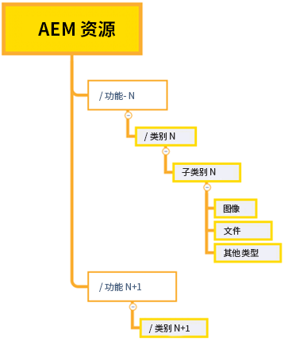
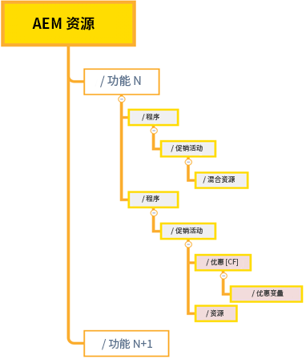
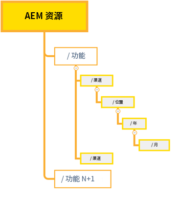

# 有效权限管理的最佳实践 {#best-practices-permissions-management}

作为管理员，在开始管理Assets Essentials存储库的文件夹权限之前，您可以实施各种最佳实践，以便在以后管理操作时使基础架构对管理员和最终用户具有直观性。

您可以在以下情况下融入这些最佳实践：

* [在Admin Console中创建用户组](#admin-console-best-practices)

* [在Assets Essentials存储库中创建文件夹结构](#folder-structure-assets-essentials)

* [管理Assets Essentials存储库中的权限](#folder-permissions)

## Admin Console {#admin-console-best-practices}

根据组织中的用户组确定访问需求。 为您的组织规划和创建用户组，并将用户添加到这些用户组。 根据用户组（而非个人用户）更容易管理文件夹权限。

## Assets Essentials存储库的文件夹结构 {#folder-structure-assets-essentials}

开始计划在Assets Essentials存储库中创建文件夹结构时，请考虑以下几点：

* 未来治理：受管理员管理的文件夹和受管理的文件夹 [已向其他用户（作为所有者）授予权限](manage-permissions.md##manage-permissions-folders).

* 可扩展：文件夹结构应符合您组织的未来需求，并且应易于扩展。

* 大小：文件夹不得包含太多资产。 它可能会导致可用性问题，并且可能会变得难以管理。

* 直观：文件夹结构应易于浏览，并且对最终用户而言应该是直观的。 用户应该能够轻松地确定在文件夹结构中上传新资产的位置。

您可以为组织使用各种可能的文件夹结构类型。 以下是典型文件夹结构的一些示例：

* 基于功能和分类

   

* 基于促销活动

   

* 基于选件位置（或渠道）

   

## 文件夹权限 {#folder-permissions}

在为您的组织创建用户组、将用户添加到这些用户组，以及在Assets Essentials存储库中选择和创建适合您组织需求的文件夹结构后，您可以开始管理您组织的文件夹权限。 开始管理文件夹权限时，请考虑以下几点：

* 应用用户群组的权限，而不是个人用户。 这样可以构建更简单、更高效的权限结构。

* 尽可能简化权限结构，以提高操作效率。

* 仔细使用拒绝访问权限，并倾向于将正面权限（可以编辑、可以查看、所有者）应用到文件夹结构。

有关如何实现高效且简单的文件夹结构的示例，请参阅 [管理文件夹的权限](manage-permissions.md##manage-permissions-folders).

