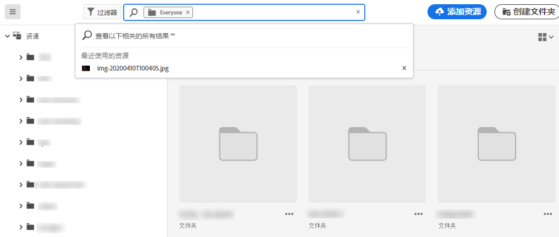
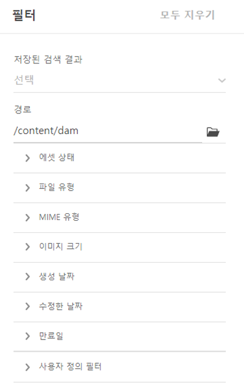
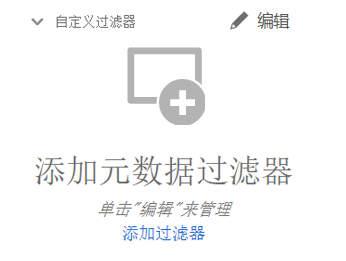
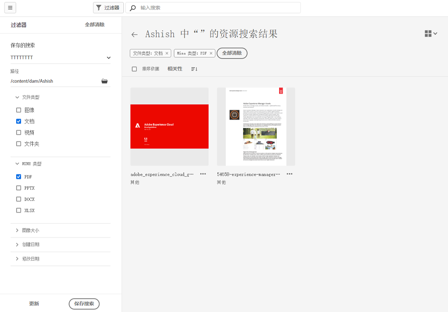

# 在 [!DNL Assets Essentials] 中搜索资源 {#search-assets}

[!DNL Assets Essentials] 提供了高效的搜索功能，只需按默认设置即可使用。该搜索执行全文搜索，因此非常全面。利用强大的搜索功能，您可以快速发现适用的资源，并帮助您提升内容速度。[!DNL Assets Essentials] 提供全文搜索，甚至可以对元数据进行搜索，例如智能标记、标题、创建日期和版权。

要搜索资源，

* 请单击页面顶部的搜索框。默认情况下，它会在您当前浏览的文件夹中进行搜索。执行下列操作之一：

   

   * 使用关键词搜索并可选择更改文件夹。按 Return。

   * 通过直接搜索资源，开始处理最近查看过的资源。单击搜索框，从建议中选择最近查看过的资源。

## 筛选搜索结果 {#refine-search-results}

您可以根据以下参数筛选搜索结果。

*图：根据各种参数筛选搜索出的资源。*

* 资产状态：使用 `Approved` 或 `Rejected` 资产状态。

* 文件类型：按照支持的文件类型筛选搜索结果，即 `Images`、`Documents` 和 `Videos`。
* MIME 类型：筛选一种或多种支持的文件格式。<!-- TBD:  [supported file formats](/help/supported-file-formats.md). -->
* 图像大小：提供一个或多个最小尺寸和最大尺寸来筛选图像。大小按照以像素为单位的尺寸提供，而不是图像的文件大小。
* 创建日期：元数据中提供的资源的创建日期。使用的标准日期格式为 `yyyy-mm-dd`。
* 修改日期：资源的最后修改日期。使用的标准日期格式为 `yyyy-mm-dd`。

您可以按照 `Name`、`Relevancy`、`Size`、`Modified` 和 `Created` 的升序或降序对搜索出的资源排序。

## 管理自定义过滤器 {#custom-filters}

**所需权限：**  `Can Edit`, `Owner`，或管理员。

Assets Essentials还允许您向用户界面添加自定义过滤器。 然后，除了 [标准过滤器](#refine-search-results) 以优化搜索结果。

Assets Essentials提供了以下自定义过滤器：

<table>
    <tbody>
     <tr>
      <th><strong>自定义过滤器名称</strong></th>
      <th><strong>描述</strong></th>
     </tr>
     <tr>
      <td>标题</td>
      <td>使用资产标题筛选资产。 您在区分大小写的搜索条件中指定的标题必须与要在结果中显示的资产标题完全匹配。</td>
     </tr>
     <tr>
      <td>名称</td>
      <td>使用资产文件名过滤资产。 您在区分大小写的搜索条件中指定的名称必须与要在结果中显示的资产的确切文件名匹配。</td>
     </tr>
     <tr>
      <td>资产大小</td>
      <td>在搜索条件中，通过定义要在结果中显示的资产的大小范围（以字节为单位）来筛选资产。</td>
     </tr>
     <tr>
      <td>预测的标记</td>
      <td>使用资产智能标记筛选资产。 您在区分大小写的搜索条件中指定的智能标记名称必须与要在结果中显示的资产智能标记名称完全匹配。 您无法在搜索条件中指定多个智能标记。</td>
     </tr>    
    </tbody>
   </table>

### 添加自定义过滤器 {#add-custom-filters}

要添加自定义过滤器，请执行以下操作：

1. 单击 **[!UICONTROL 过滤器]**.

1. 在 **[!UICONTROL 自定义过滤器]** ，单击 **[!UICONTROL 编辑]** 或 **[!UICONTROL 添加过滤器]**.

   

1. 在 **[!UICONTROL 自定义过滤器管理]** 对话框中，选择要添加到现有过滤器列表的过滤器。 选择 **[!UICONTROL 自定义过滤器]** 来选择所有过滤器。

1. 单击 **[!UICONTROL 确认]** 将过滤器添加到用户界面。

### 删除自定义过滤器 {#remove-custom-filters}

要删除自定义过滤器，请执行以下操作：

1. 单击 **[!UICONTROL 过滤器]**.

1. 在 **[!UICONTROL 自定义过滤器]** ，单击 **[!UICONTROL 编辑]**.

1. 在 **[!UICONTROL 自定义过滤器管理]** ，请从现有过滤器列表中取消选择需要删除的过滤器。

1. 单击 **[!UICONTROL 确认]** 从用户界面中删除过滤器。

## 保存的搜索 {#saved-search}

[!DNL Assets Essentials] 中的搜索功能非常易于使用。在搜索框中，您不仅可以输入关键词并按 Enter 来查看结果，而且只需一次单击即可快速重新搜索最近搜索过的关键词。

您还可以根据有关元数据和资源类型的特定标准来筛选搜索结果。对于经常使用的筛选条件，为了改进搜索体验，[!DNL Assets Essentials] 允许您保存搜索参数。以后，您可以选择保存的搜索来执行搜索，只需一次单击即可应用筛选条件。

要创建保存的搜索，请搜索某些资源，应用一个或多个筛选条件，然后在[!UICONTROL 筛选条件]面板中单击[!UICONTROL 保存搜索]。

<!-- TBD: Search behavior. Full-text search. Ranking and rank boosts. Hidden assets.
Report poor UX that users can only save a filtered search and not a simple search.
.
Are other supported files fully indexed and support full-text search? Eg. audio/videos files can at best have metadata indexed.
Anything about ranking of assets displayed in search results?

What about temporarily hiding an asset (suspending search on it) from the search results? If an asset is undergoing review collaboration, should it be used by others? Should it be hidden in search?

When userA is searching and userB add an asset that matches search results, will the asset display in search as soon as userA refreshes the page? Assuming indexing is near real-time. May not be so for bulk uploads.
-->
