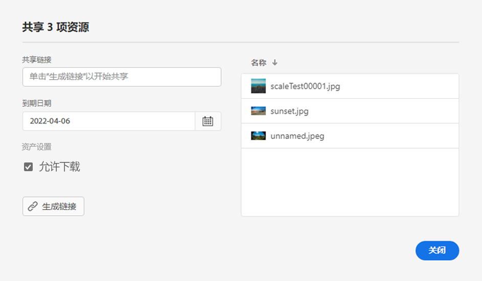
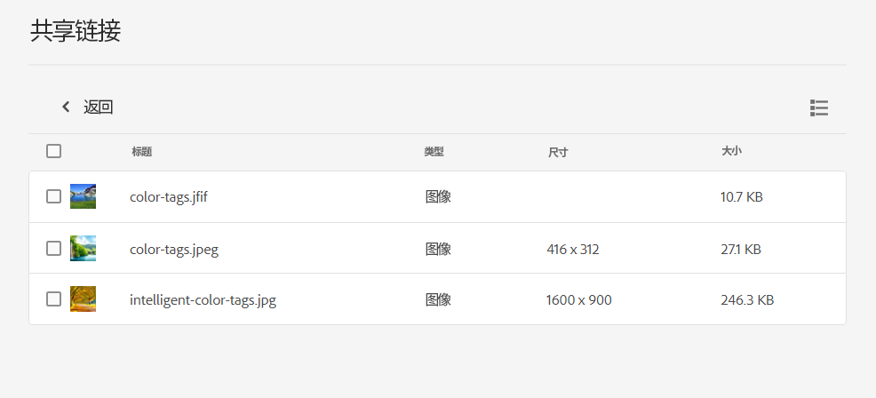

# 共享资产链接 {#share-links-assets}

[!DNL Assets Essentials] 允许您生成链接，并与无权访问的外部利益相关方共享资产 [!DNL Assets Essentials] 应用程序。 您可以定义：

* 链接的过期日期

* 如果允许收件人在访问链接后下载资产（原始二进制文件）。

根据这些设置，链接的收件人可以选择预览或下载资产。

## 为资产生成链接 {#generate-link-for-assets}

要为资产或包含资产的文件夹生成链接，请执行以下操作：

1. 选择资产和/或包含资产的文件夹，然后单击 **[!UICONTROL Share Link]**.

1. 如果要调整该日历，请单击日历图标，以使用 **[!UICONTROL Expiration Date]** 字段。 您还可以直接在 `yyyy-mm-dd` 格式。 默认情况下，链接的过期日期会设置为从共享日期开始2周。

1. 选择 **[!UICONTROL Allow download]** 以允许链接的收件人下载资产。

1. 单击 **[!UICONTROL Generate Link]**.

1. 单击 **[!UICONTROL Copy Link]** 以复制链接。 您还可以从 **[!UICONTROL Share Link]** 字段。

   

1. 单击 **[!UICONTROL Close]** 以及使用电子邮件或其他协作工具共享链接。

## 访问共享资产 {#access-shared-assets}

共享资产的公共链接后，收件人可以单击该链接，以在Web浏览器中预览或下载共享的资产，而无需登录到 [!DNL Assets Essentials].

单击链接，单击文件夹以导航到资产，然后单击资产以进行预览。 您可以选择在列表视图或卡片视图中查看共享的资产。

您可以将鼠标悬停在共享资产或共享资产文件夹上，以选择或下载资产。

您还可以选择多个资产并单击 **[!UICONTROL Download]**. [!DNL Assets Essentials] 将选定的资产下载为zip文件。 [!DNL Assets Essentials] 会在父zip文件中为您选择下载的每个资产创建一个与资产同名的子文件夹。

要同时下载所有资产，请切换到 **[!UICONTROL List view]**，单击 **[!UICONTROL Select all]** 然后单击 **[!UICONTROL Download]**.

>[!NOTE]
>
>如果在 [生成链接](#share-links-assets) ，并且如果链接的收件人选择下载资产， [!DNL Assets Essentials] 下载空zip文件。

