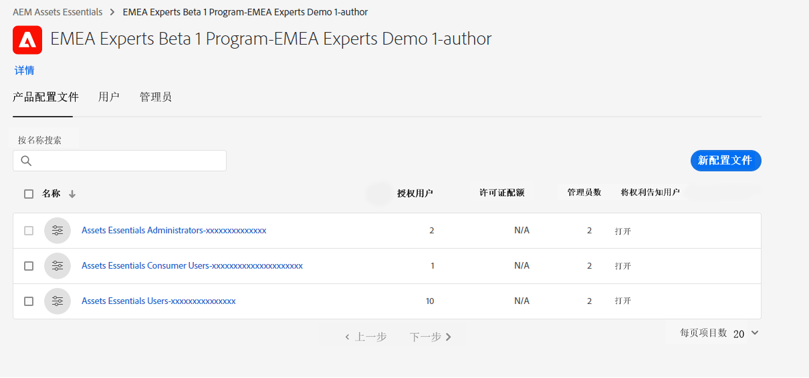

# 管理员 Experience Manager Assets Essentials {#administer-assets-essentials}

## 目标

* **受众**：Assets Essentials 管理员

* **受众**：使用 Admin Console 配置对 Assets Essentials 应用程序的访问权限，然后管理登录到 Assets Essentials 应用程序后可以执行的任务。

## 概述 {#overview}

[!DNL Adobe Experience Manager Assets Essentials] 由 Adobe 为其客户配置。作为配置过程的一部分，[!DNL Assets Essentials] 添加到客户组织的 [!DNL Adobe Admin Console] 中。管理员使用 [!DNL Admin Console] 管理用户对 [!DNL Assets Essentials] 解决方案的权限，并指派应用程序管理员在 [!DNL Assets Essentials] 中设置权限和元数据表单。

以下数据流图说明了管理员必须执行的配置和管理 Assets Essentials 的任务序列：

## 访问 Admin Console {#access-admin-console}

配置 Assets Essentials 解决方案之后，管理员会收到来自 Adobe 的电子邮件。该电子邮件包含欢迎消息以及开始使用链接。此外，Adobe 启动流程来自动部署 Assets Essentials。部署流程需要一个小时来完成。

通过电子邮件中的链接，访问并登录 [Admin Console](https://adminconsole.adobe.com)。如果您有多个组织帐户的管理员访问权限，请使用[组织选择器](https://helpx.adobe.com/cn/enterprise/using/admin-console.html)选择适当的组织或切换到该组织。自动部署过程完毕后，即可在 [!DNL Admin Console] 中看到 [!DNL AEM Assets Essentials] 的产品卡。

## 管理 Admin Console 任务 {#manage-admin-console-tasks}

在 Admin Console 中执行以下任务：

* [将用户添加到产品配置文件](#add-users-to-product-profiles)

* [添加用户组](#add-user-groups)

* [将用户添加到组](#add-users-to-user-groups)

### 将用户添加到产品配置文件 {#add-users-to-product-profiles}

将用户添加到产品配置文件，以便他们可以访问 Assets Essentials 应用程序。

要将用户添加到产品配置文件：

1. 访问您所在组织的 [Admin Console](https://adminconsole.adobe.com)，单击在顶部栏目中的&#x200B;**[!UICONTROL “产品”]**，单击&#x200B;**[!UICONTROL “AEM Assets Essentials”]**，然后单击 [!DNL Assets Essentials] 的实例。实例的名称可能与下面的屏幕快照中的名称不同。
   >[!NOTE]
   >
   >[!DNL Cloud Manager] 实例仅用于特殊管理用途，如检查服务状态和访问服务日志，并且不能用于向产品添加用户。有关更多信息，请参阅[添加管指南](deploy-administer.md#view-service-status-and-access-logs-view-logs)。

   

   [!DNL Assets Essentials] 有三个产品配置文件，分别表示管理员访问、定期访问和使用者用户访问。

   

1. 要向产品添加用户，请单击三个 Assets Essentials 产品配置文件之一，选择&#x200B;**[!UICONTROL “添加用户”]**，提供用户详细信息，然后单击&#x200B;**[!UICONTROL “保存”]**。

   

   添加用户时，用户将收到电子邮件邀请以开始使用。您可以在 [!DNL Admin Console] 的产品配置文件设置中关闭电子邮件邀请。

1. 要从组中删除某个用户，请单击改组，选择现有用户，然后选择&#x200B;**[!UICONTROL 删除用户]**。

   >[!NOTE]
   >
   >您必须将用户添加到 Admin Console 中的管理员 Assets Essentials 产品配置文件中，以便他们在 Assets Essentials 应用程序中执行管理任务。这些任务包括[创建文件夹结构](#create-folder-structure)、[管理文件夹](#manage-permissions-for-folders)的权限以及[设置元数据表单](#metadata-forms)。

### 添加用户组 {#add-user-groups}

创建用户组，然后将用户分配给用户组。这些用户组将在 Assets Essentials 应用程序中提供，以用于设置文件夹权限。

您可以将用户添加到用户组 (1) 并[将用户添加到 Assets Essentials 产品配置文件 (2)](#add-admin-users)。但是，您不能将用户组直接添加到 Assets Essentials 产品配置文件 (3)。

有关如何管理用户组的信息，请参阅[管理用户组](https://helpx.adobe.com/cn/enterprise/using/user-groups.html)中的 `Create user groups` 和 `Edit user groups`。

>[!NOTE]
>
>如果您的 Admin Console 设置为利用外部系统来管理用户/组分配，例如 Azure 或 Google 连接器、用户同步工具或 User Management Rest API，则您的组和用户分配会自动配置。有关更多信息，请参阅 [Adobe Admin Console 用户](https://helpx.adobe.com/cn/enterprise/using/users.html)。

### 将用户添加到组 {#add-users-to-user-groups}

创建用户组后，您可以开始将用户添加到用户组。

有关如何管理将用户添加到用户组的信息，请参阅[管理用户组](https://helpx.adobe.com/cn/enterprise/using/user-groups.html#add-users-to-groups)中的 `Add users to groups`。

## 管理 Assets Essentials 管理任务 {#manage-assets-essentials-tasks}

执行 Admin Console 任务后，现在可以在 Assets Essentials 应用程序中执行以下管理任务：

* [创建文件夹结构](#create-folder-structure)

* [管理文件夹权限](#manage-permissions-for-folders)

* [设置元数据表单](#metadata-forms)

>[!NOTE]
>
>若要管理这些任务（尤其是管理权限），您的用户必须具有应用程序管理权限——需要将其添加到[ Administrator Assets Essentials 产品配置文件](#add-users-to-product-profiles)。

### 创建文件夹结构 {#create-folder-structure}

您可以使用以下方法在 Assets Essentials 存储库中创建文件夹结构：

* 单击工具栏中可用的&#x200B;**[!UICONTROL 创建文件夹]**&#x200B;选项以创建一个空文件夹。

* 单击工具栏中可用的&#x200B;**[!UICONTROL 添加资产]**&#x200B;选项以[上传本地计算机上可用的文件夹结构](add-delete.md)。

创建一个适合组织业务目标的文件夹结构。如果要将现有文件夹结构上传到 Assets Essentials 存储库，则应审查该结构。有关详细信息，请参阅[有效权限管理的最佳实践](permission-management-best-practices.md)。

当您开始计划在 Assets Essentials 存储库中创建文件夹结构时，请考虑以下几点：

* 未来管理：由管理员管理的文件夹和被[委派所有者权限给其他用户](manage-permissions.md##manage-permissions-folders)的文件夹。

* 可扩展：文件夹结构应符合您组织的未来需求，并且应易于扩展。

* 大小：一个文件夹不能包含太多资产。它可能会导致可用性问题并且可能变得难以管理。

* 直观：文件夹结构应该易于浏览，并且对于最终用户来说是直观的。用户应该能够轻松识别在文件夹结构中上传新资产的位置。

您可以为您的组织使用多种可能的文件夹结构类型。以下是一些典型文件夹结构的示例：

### 管理文件夹的权限 {#manage-permissions-for-folders}

Assets Essentials 允许管理员管理存储库中可用文件夹的访问级别。作为管理员，您可以创建用户组并向这些组分配权限以管理访问级别。您还可以将权限管理权限委派给文件夹级别的用户组。

>[!VIDEO](https://video.tv.adobe.com/v/341104)

有关详细信息，请参阅[管理文件夹权限](manage-permissions.md)。

### 设置元数据表单 {#metadata-forms}

默认情况下，Assets Essentials 提供了多个标准元数据字段。组织有额外的元数据需求，就需要更多元数据字段以添加业务特有的元数据。通过元数据表单，可将自定义元数据字段添加到资源的[!UICONTROL 详细信息]页面。业务特有的元数据改善对其资源的治理和发现。您可以从头开始创建表单，也可以重新利用现有表单。

您可以为不同的资源类型（不同的 MIME 类型）配置元数据表单。使用与文件的 MIME 类型相同的表单名称。Essentials 会自动将上载的资源 MIME 类型与表单名称相匹配，并根据表单字段更新上载资源的元数据。

例如，如果存在名为 `PDF` 或 `pdf` 的元数据表单，则上载的 PDF 文档包含表单中定义的元数据字段。

Assets Essentials 使用以下顺序搜索现有元数据表单名称，以将元数据字段应用于特定类型的上载资源：

MIME 子类型 > MIME 类型 > `default`表单 > 现成表单

例如，如果存在名为 `PDF` 或 `pdf` 的元数据表单，则上传的 PDF 文档将包含该表单中定义的元数据字段。如果不存在名为 `PDF` 或 `pdf` 的元数据表单，但存在名为 `application` 的元数据表单，则 Assets Essentials 匹配。如果存在名为 `application` 的元数据表单，则上传的 PDF 文档将包含该表单中定义的元数据字段。如果 Assets Essentials 仍然找不到匹配的元数据表单，它将搜索`default` 元数据表单，以将表单中定义的元数据字段应用于上载的 PDF 文档。如果这些步骤都不起作用，Assets Essentials 会将现成表单中定义的元数据字段应用于所有上载的 PDF 文档。

>[!IMPORTANT]
>
>针对特定文件类型的新元数据表单将完全替换 [!DNL Assets Essentials] 提供的默认元数据表单。如果您删除或重命名元数据表单，则默认元数据字段将重新对新资源可用。

>[!VIDEO](https://video.tv.adobe.com/v/341275)

有关元数据表单的更多信息，请参阅 [Assets Essentials 中的元数据表单](metadata.md#metadata-forms)。

## 接下来呢？

您现在已经配置并管理了Assets Essentials应用程序，[请将 Creative Cloud 应用程序与 Experience Manager Assets Essentials](integrate-assets-essentials-creative-cloud.md) 应用程序集成。
