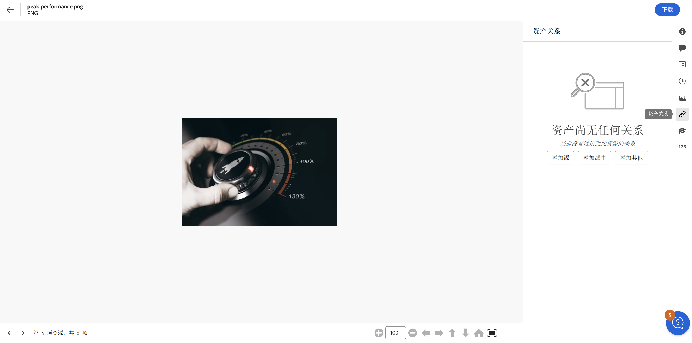
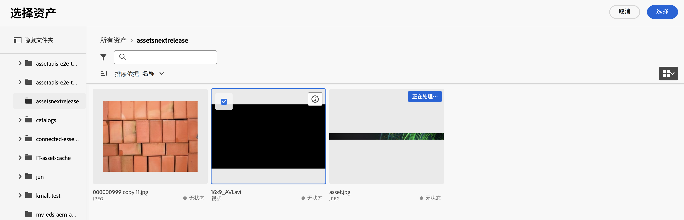
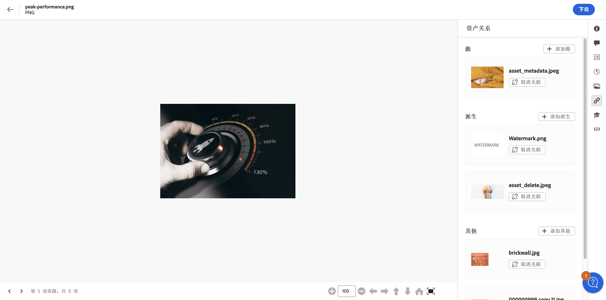

# 资产关系 {#related-assets}

[!DNL Adobe Experience Manager Assets] 允许您使用相关的资产功能，根据您组织的需求手动关联资产。 例如，您可以将一个许可证文件与类似主题的一个资产或图像/视频相关联。 您可以关联那些共享某些共用属性的资产。 您还可以使用此功能创建资产之间的来源/派生关系。 例如，如果您有一个从 INDD 文件生成的 PDF 文件，就可以将这个 PDF 文件与其 INDD 源文件相关联。

使用此功能，您可以灵活地与供应商或机构共享一个低分辨率 PDF 文件或 JPG 文件，仅在接受请求时才提供高分辨率 INDD 文件。

>[!NOTE]
>
>只有对资产具有编辑权限的用户才能关联资产和取消关联。

## 关联资产的步骤 {#steps-to-relate-assets}

1. 在 [!DNL Experience Manager] 界面中打开您想关联的资产的&#x200B;**[!UICONTROL 属性]**&#x200B;页面。

   

1. 要将另一个资产与您选择的资产相关联，点击&#x200B;**[!UICONTROL 资产关系]** 。
1. 执行下列操作之一：

   * 要关联资产的源文件，请从列表中选择&#x200B;**[!UICONTROL 添加来源]**。 您只能关联一个资产作为来源。
   * 要关联一个派生文件，请从列表中选择&#x200B;**[!UICONTROL 添加派生]**。 您可以关联这个类别中的多个资产。
   * 要在资产之间创建双向关系，请从列表中选择&#x200B;**[!UICONTROL 添加其他]**。 您可以关联这个类别中的多个资产。

1. 在&#x200B;**[!UICONTROL 选择资产]**&#x200B;屏幕中，导航到您想关联的资产的位置，然后选择该资产。 您可以一次选择一个资产，或者在点击的同时按住 Shift 键选择多个资产，其中可以包含 [Assets 视图中任何受支持的文件格式](supported-file-formats.md)。

   

1. 单击&#x200B;**[!UICONTROL 选择]**。 根据您在步骤 3 中选择的关系，关联的资产列在&#x200B;**[!UICONTROL 资产关系]**&#x200B;部分的一个适当的类别下。 例如，如果您关联的资产是当前资产的源文件，它就会列在&#x200B;**[!UICONTROL 来源]**&#x200B;下。

   

1. 点击&#x200B;**[!UICONTROL 取消关联]** 可用于每个部分（[!UICONTROL 来源]、[!UICONTROL 派生]和[!UICONTROL 其他]）中所有关联的资产，以取消资产的关联。

## 翻译关联的资产 {#translating-related-assets}

使用关联资产功能创建资产之间的来源/派生关系，这在翻译工作流中也很有帮助。 如果您在派生资产上运行翻译工作流，[!DNL Experience Manager Assets] 会自动获取源文件引用的任何资产，并将其包含用于翻译。 通过这种方式，源资产引用的资产会与源资产和派生资产一起被翻译。 如果源文件与另一个资产关联，[!DNL Experience Manager Assets] 就会获取被引用的资产，并将其包含用于翻译。

请参阅[在 AEM 中翻译资产](https://experienceleague.adobe.com/zh-hans/docs/experience-manager-cloud-service/content/assets/admin/translate-assets)。

## 后续步骤 {#next-steps}

* 利用资源视图用户界面上的[!UICONTROL 反馈]选项提供产品反馈

* 通过右侧边栏中的[!UICONTROL 编辑此页面]或[!UICONTROL 记录问题]来提供文档反馈

* 联系[客户关怀团队](https://experienceleague.adobe.com/zh-hans?support-solution=General#support)

>[!MORELIKETHIS]
>
>* [查看资源的版本](manage-organize.md#view-versions)
>* [在 AEM 中翻译资产](https://experienceleague.adobe.com/zh-hans/docs/experience-manager-cloud-service/content/assets/admin/translate-assets)
>* [Assets 视图中受支持的文件格式](supported-file-formats.md)。
