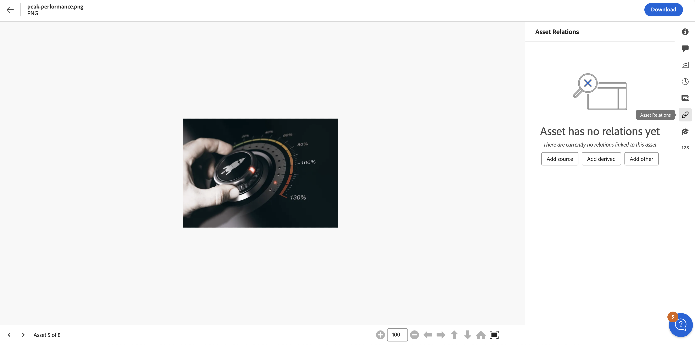

# 资产关系 {#related-assets}

[!DNL Adobe Experience Manager Assets]允许您使用相关资源功能，根据组织的需求手动关联资源。 例如，您可以将许可证文件与类似主题中的资产或图像/视频相关联。 您可以关联共享某些通用属性的资源。 您还可以使用该功能创建资源之间的源/派生关系。 例如，如果您有一个从INDD文件生成的PDF文件，则可以将PDF文件与其源INDD文件相关联。

使用此功能，您可以灵活地与供应商或机构共享低分辨率PDF文件或JPG文件，并且仅在提出请求时才提供高分辨率INDD文件。

>[!NOTE]
>
>只有对资源具有编辑权限的用户才能关联和取消关联资源。

## 关联资产的步骤 {#steps-to-relate-assets}

1. 从[!DNL Experience Manager]界面中，打开要关联的资源的&#x200B;**[!UICONTROL 属性]**&#x200B;页面。

   

1. 要将其他资源与您选择的资源相关联，请单击&#x200B;**[!UICONTROL 资源关系]** 。
1. 执行下列操作之一：

   * 要关联资源的源文件，请从列表中选择&#x200B;**[!UICONTROL 添加Source]**。 您只能将单个资产关联为源。
   * 若要关联派生文件，请从列表中选择&#x200B;**[!UICONTROL 添加派生]**。 您可以关联此类别中的多个资产。
   * 若要在资产之间创建双向关系，请从列表中选择&#x200B;**[!UICONTROL 添加其他]**。 您可以关联此类别中的多个资产。

1. 从&#x200B;**[!UICONTROL 选择Assets]**&#x200B;屏幕中，导航到要关联的资源的位置，然后选择该资源。 您可以在单击时按住Shift键，一次选择单个资源或多个资源，该键可包括Assets视图[&#128279;](supported-file-formats.md)中支持的文件格式的任意。

   

1. 单击&#x200B;**[!UICONTROL 选择]**。 根据您在步骤3中选择的关系，相关资产列在&#x200B;**[!UICONTROL 资产关系]**&#x200B;部分的相应类别下。 例如，如果您相关的资源是当前资源的源文件，则它列在&#x200B;**[!UICONTROL Source]**&#x200B;下。

   

1. 单击&#x200B;**[!UICONTROL 取消关联]** ![取消关联可用于每个部分([!UICONTROL Source]、[!UICONTROL 派生]和[!UICONTROL 其他])中所有相关资源的资源](assets/do-not-localize/link-unrelate-icon.png)以取消关联资源。

## 翻译相关资源 {#translating-related-assets}

使用相关资源功能在资源之间创建源/派生关系在翻译工作流中也很有帮助。 对派生资源运行翻译工作流时，[!DNL Experience Manager Assets]会自动获取源文件引用的任何资源并将其包含用于翻译。 通过这种方式，源资产引用的资产将随源和派生资产一起转换。 如果源文件与另一个资产相关，[!DNL Experience Manager Assets]将获取引用的资产并将其包含以供翻译。

请参阅[在AEM中翻译资源](https://experienceleague.adobe.com/zh-hans/docs/experience-manager-cloud-service/content/assets/admin/translate-assets)。

## 后续步骤 {#next-steps}

* 利用资源视图用户界面上的[!UICONTROL 反馈]选项提供产品反馈

* 通过右侧边栏中的[!UICONTROL 编辑此页面]或[!UICONTROL 记录问题]来提供文档反馈

* 联系[客户关怀团队](https://experienceleague.adobe.com/zh-hans?support-solution=General#support)

>[!MORELIKETHIS]
>
>* [查看资源的版本](manage-organize.md#view-versions)
>* [在AEM中翻译资源](https://experienceleague.adobe.com/zh-hans/docs/experience-manager-cloud-service/content/assets/admin/translate-assets)
>* Assets视图[&#128279;](supported-file-formats.md)中的支持的文件格式。
