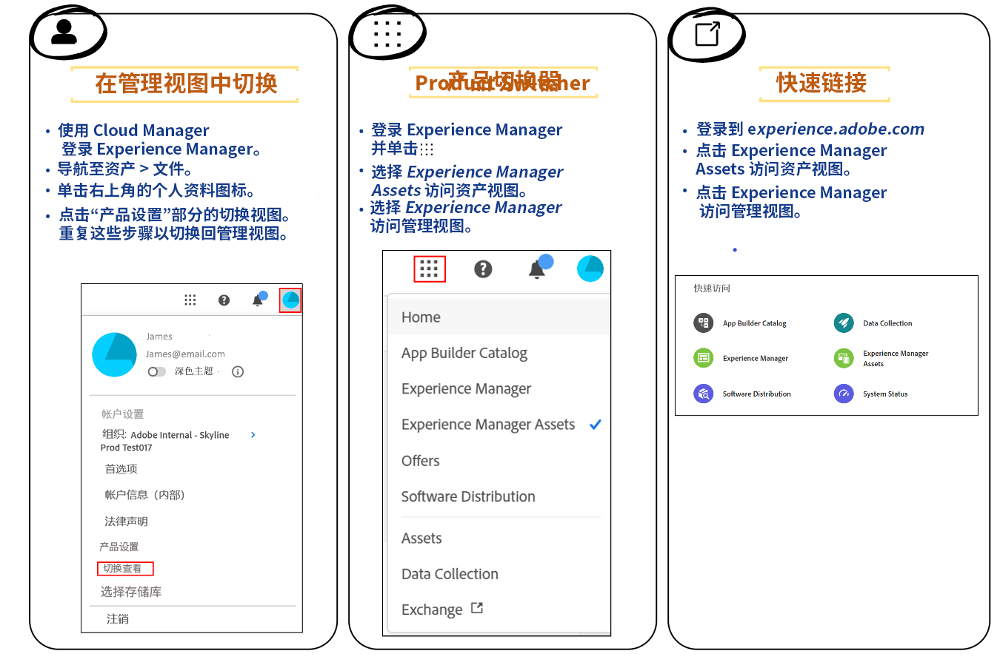

# 资源视图简介 {#assets-view}

在当今快节奏、数字优先的环境下（其中实时创作和投放内容必不可少），专为快速的下游市场营销而设计的数字资源管理 (DAM) 体验最为重要。Adobe 利用其在支持营销和创意专业人士方面的专业知识，推出了变革性的全新用户体验。这种工作流程优先的方法彻底改变了企业处理动态数字资源的方式，使营销人员能够最大限度地提高查找、协作、个性化和交付资源的效率。这些简化的工作流程可加快内容处理速度，并将您的营销工作推向新的高度。

## 如何访问资源视图？ {#access-assets-view}

您可以通过以下方式访问资源视图：

<!--

* **Toggle in Admin view**

    * Log into [!DNL Experience Manager] using Cloud Manager.
    * Navigate to **[!UICONTROL Assets]** > **[!UICONTROL Files]**.
    * Click the profile icon on the top right corner.
    * Click **[!UICONTROL Switch View]** from the **[!UICONTROL Profile Settings]** section.
    Repeat these steps to switch back to the Admin view.

* **Product Switcher**
    * Log into [!DNL Experience Manager] and click .
    * Select **[!UICONTROL Experience Manager Assets]** to access the Assets view.
    * Select **[!UICONTROL Experience Manager]** to access the Admin view.

* **Quick Links** 
    * Log into experience.adobe.com.
    * Click **[!UICONTROL Experience Manager Assets]** to access the Assets view.
    * Click **[!UICONTROL Experience Manager Assets]** to access the Assets view.

    -->

## 为什么使用资源视图？

资源视图提供了管理视图中所没有的以下主要优点：

* [通过“我的工作区”仪表板提供简化的体验](#my-workspace-for-streamlined-experience)
* [通过以搜索优先的方法来提高效率](#search-first)
* [有助于做出以数据为驱动的决策的见解](#insights-data)
* [Adobe Photoshop Express 集成可加速协作](#accelerate-collaboration)
* [上传文件夹以设置组织的层次结构](#folder-uploads)
* [订阅存储库内容以进行高效的资源管理](#subscribe-content)
* [软删除资源，提升管理员的控制能力](#soft-delete-assets)

### 通过“我的工作区”仪表板提供简化的体验 {#my-workspace-for-streamlined-experience}

获得可满足不同组织角色的不同需求的数字资源管理解决方案。时尚的全新 Assets 视图优先考虑易用性和速度，满足营销人员对视觉吸引力和整洁工作区的偏好。借助可定制的用户特定的“我的工作区”仪表板，营销人员可以以卓越的效率快速查找、预览、编辑、管理和交付资源。无需再花费大量的时间寻找特定资源，享受简化的体验，让您所需的一切触手可及。

### 有助于做出以数据为驱动的决策的见解 {#insights-data}

为了跟上内容更新速度，可行的见解至关重要。新的 Assets 视图体验在“我的工作区”中提供了高级见解，其中可提供有关资源绩效、受众使用情况和参与度的宝贵数据。营销人员可以做出以数据驱动的决策、优化内容策略并完善下游交付以实现最佳结果。通过获得有意义的见解，企业可以在竞争中保持领先地位并取得卓越成果。

### Adobe Photoshop Express 集成可加速协作 {#accelerate-collaboration}

这种全新的体验提供了一组强大的协作功能，包括使用内置 Adob&#x200B;&#x200B;e Photoshop 功能进行实时编辑、版本控制和注释工具。这使得设计、创意、品牌和营销团队之间能够无缝协作，使他们能够克服瓶颈并加快营销运营流程。营销人员现在可以使用强大的工具来加速项目交付并提高整体生产力。

观看此视频，了解资源视图与 Adob&#x200B;&#x200B;e Photoshop Express 集成的强大功能：

>[!VIDEO](https://video.tv.adobe.com/v/3420922)

即将发布的版本还包括[通过 Adob&#x200B;&#x200B;e Express 集成 Adob&#x200B;&#x200B;e Firefly](https://firefly.adobe.com/?gclid=EAIaIQobChMIlZeKuNfj_wIVeyCtBh3e5g2cEAAYASAAEgL56_D_BwE&amp;sdid=JM4FW6VL&amp;mv=search&amp;mv2=paidsearch&amp;ef_id=EAIaIQobChMIlZeKuNfj_wIVeyCtBh3e5g2cEAAYASAAEgL56_D_BwE:G:s&amp;s_kwcid=AL!3085!3!652077237594!e!!g!!adobe%20firefly!19870733758!148140507838)。

### 上传文件夹以设置组织的层次结构 {#folder-uploads}

通过上传本地文件系统上存在的文件夹，使用资源视图快速为您的组织设置文件夹结构。您无需在根文件夹下创建文件夹，也无需手动将资源上传到这些文件夹来维护逻辑层次结构。根文件夹下的所有文件夹和资源都会自动上传到 Experience Manager Assets。

### 通过以搜索优先的方法来提高效率 {#search-first}

借助具有尖端功能的搜索选择，释放组织数字资源库的潜力。您可以告别手动筛选无数文件和文件夹所带来的麻烦。任何用户都可以立即找到所需的完美图像、视频或文档，以创建令人惊叹的营销活动、引人入胜的演示文稿和丰富有趣的内容。我们的搜索优先型引擎使您能够轻松地浏览资源类型、元数据、智能标记，甚至内容本身，而无需知道确切的关键字。通过我们的搜索优先型技术拥抱 DAM 的未来，并释放您的数字资源库的全部潜力。

### 订阅存储库内容以进行高效的资源管理 {#subscribe-content}

通过资源视图，您能够监视对存储库中可用资源、文件夹或收藏集执行的操作。需要选择并订阅将向您发送其通知的内容。您还可以配置事件类型，例如删除订阅内容、修改订阅内容等。然后，系统会仅针对这些事件类型向您发送通知。

### 软删除资源，提升管理员的控制能力 {#soft-delete-assets}

资源视图中的垃圾桶文件夹列出了从根 Assets 文件夹中删除的资源。“垃圾箱”文件夹中选择某个资源可将它还原到原有位置或永久删除它。您还可以指定关键字或应用标准或自定义过滤器来搜索“垃圾箱”文件夹中的相应资源。

除了这些功能之外，资源视图还使您能够执行管理视图中不可用的以下功能：

* 将具有不同名称的新版本资源从本地文件系统上传到资源存储库。上传的资源会作为新版本提供，其名称与原始资源相同。

* 重命名存储库中可用的资源和文件夹。

## 结论 {#conclusion}

数字优先的时代已经到来，我们需要转变我们的营销工具以支持不断变化的商业环境。全新的 Adobe Experience Manager Assets 视图专为简化工作流程、促进协作并加速资源交付而量身定制。通过提升内容处理速度，营销人员可以解锁数字资源的全部潜力，并以前所未有的方式释放创造力。准备好利用 Adobe 全新的 Assets 视图体验的强大功能，在您的营销活动中取得卓越成果。拥抱 DAM 的未来，推动您的业务向前发展。

