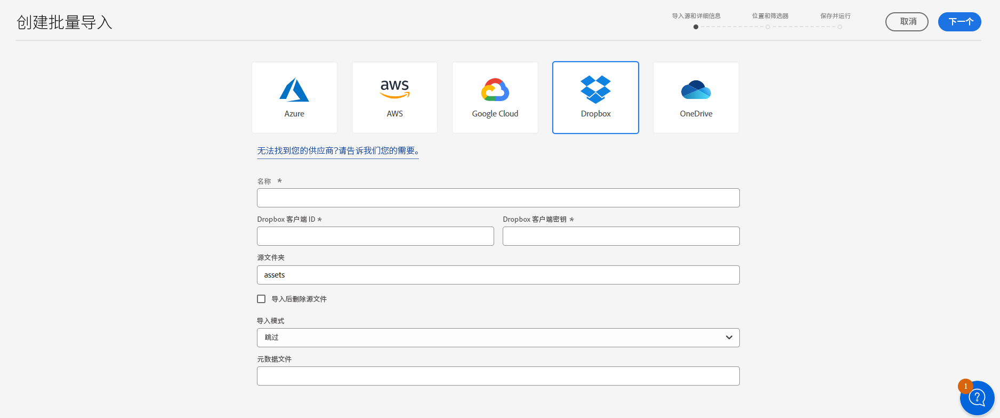
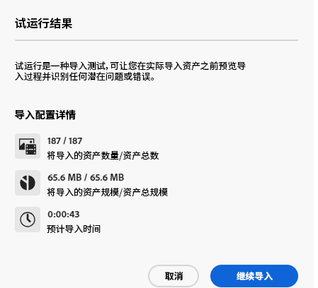

# 使用资源视图批量导入资源  {#bulk-import-assets-view}

>[!CONTEXTUALHELP]
>id="assets_bulk_import"
>title="批量导入资源"
>abstract="管理员现在能够使用资源视图将大量资源从数据源导入到 Experience Manager Assets。管理员不再需要将单个资源或文件夹上传到 Experience Manager Assets。支持的批量导入云存储提供程序包括 Azure、AWS、Google Cloud 和 Dropbox。"

AEM Assets 视图中的“批量导入”功能使管理员能够将大量资源从数据源导入到 AEM Assets。管理员不再需要将单个资源或文件夹上传到 AEM Assets。

>[!NOTE]
>
>资源视图批量导入器使用与管理视图批量导入器相同的后端。但是，它提供了更多可供导入的数据源和更简化的用户体验。

您可以从以下数据源导入资源：

* Azure
* AWS
* Google Cloud
* Dropbox

## 前提条件 {#prerequisites}

| 数据源 | 前提条件 |
|-----|------|
| Azure | <ul> <li>Azure 存储帐户 </li> <li> Azure Blob 容器 <li> 基于身份验证模式的 Azure 访问密钥或 SAS 令牌 </li></ul> |
| AWS | <ul> <li>AWS 区域 </li> <li> AWS 分段 <li> AWS 访问密钥 </li><li> AWS 访问私钥 </li></ul> |
| Google Cloud | <ul> <li>GCP 桶 </li> <li> GCP 服务帐户电子邮件 <li> GCP 服务帐户私钥</li></ul> |
| Dropbox | <ul> <li>Dropbox 客户端 ID </li> <li> Dropbox 客户端私钥</li></ul> |

除了基于数据源的这些先决条件之外，您还必须了解数据源中可用的源文件夹名称，其中包含需要导入到 AEM Assets 的所有资源。

## 创建批量导入配置 {#create-bulk-import-configuration}

执行以下步骤创建批量导入配置：

1. 请导航到&#x200B;**[!UICONTROL “设置”]**>**[!UICONTROL “批量导入”]**，然后单击&#x200B;**[!UICONTROL “创建导入”。]**
1. 选择数据源。可用选项包括 Azure、AWS、Google Cloud 和 Dropbox。
1. 在&#x200B;**[!UICONTROL “名称”]**&#x200B;字段中指定批量导入配置的名称。
1. 指定数据源特定的凭据，如[“先决条件”](#prerequisites)中所述。
1. 在&#x200B;**[!UICONTROL 源文件夹]**&#x200B;字段中提供包含数据源中资源的根文件夹的名称。
1. （可选）选择&#x200B;**[!UICONTROL “导入后删除源文件”]**&#x200B;选项，以在文件导入到 Experience Manager Assets 后，从源数据存储中删除原始文件。
1. 选择&#x200B;**[!UICONTROL “导入模式”。]**&#x200B;选择&#x200B;**[!UICONTROL “跳过”]**、**[!UICONTROL “代替”]**，或者&#x200B;**[!UICONTROL 创建版本。]**跳过模式是默认模式，在该模式下，如果资源已经存在，则摄取器会跳过导入该资源。
   

1. （可选）在“元数据文件”字段中指定以 CSV 格式提供的要导入的元数据文件，然后单击&#x200B;**[!UICONTROL “下一个”]**&#x200B;导航到&#x200B;**[!UICONTROL 位置和筛选器。]**
1. 要使用&#x200B;**[!UICONTROL 资源目标文件夹]**&#x200B;字段在 DAM 中定义要导入资源的位置，请指定路径。例如：`/content/dam/imported_assets`。
1. （可选）在&#x200B;**[!UICONTROL “选择筛选器”]**&#x200B;部分，在&#x200B;**[!UICONTROL 按最小尺寸过滤]**&#x200B;字段中提供资源的最小文件大小（MB），以将其包括在摄取过程中。
1. （可选）在&#x200B;**[!UICONTROL 按最大尺寸过滤]**&#x200B;字段中，以 MB 为单位提供资源的最大文件大小，以将其包括在摄取过程中。
1. （可选）使用&#x200B;**[!UICONTROL 包括 MIME 类型]**&#x200B;字段选择要包含在摄取过程中的 MIME 类型。您可以在此字段中选择多种 MIME 类型。如果您未定义值，则所有 MIME 类型都会包含在摄取过程中。

1. （可选）使用&#x200B;**[!UICONTROL 排除 MIME 类型]**&#x200B;字段选择要排除在摄取过程中的 MIME 类型。您可以在此字段中选择多种 MIME 类型。如果您未定义值，则所有 MIME 类型都会包含在摄取过程中。

   

1. 单击&#x200B;**[!UICONTROL “下一个”。]**&#x200B;选择&#x200B;**[!UICONTROL “保存和运行导入”]**&#x200B;保存配置并运行批量导入。选择&#x200B;**[!UICONTROL “保存导入”]**，暂时保存配置，以便稍后运行。

   

1. 单击&#x200B;**[!UICONTROL “保存”]**，执行所选选项。

### 批量导入期间处理文件名 {#filename-handling-bulkimport-assets-view}

当您批量导入资源或文件夹时，[!DNL Experience Manager Assets] 会将导入源中存在的整个结构进行导入。[!DNL Experience Manager] 将遵循有关资源和文件夹名称中的特殊字符的内置规则，因此这些文件名需要净化。对于文件夹名称和资源名称，用户定义的标题将保持不变，并存储在 `jcr:title` 中。

批量导入时，[!DNL Experience Manager] 将查找现有文件夹以避免重新导入资源和文件夹，并验证在发生导入的父文件夹中应用的净化规则。如果在父文件夹中应用净化规则，则相同的规则也将应用于导入源。对于新导入，将应用以下净化规则来管理资源和文件夹的文件名。

有关批量导入期间禁止的名称、资源名称和文件夹名称的处理的更多信息，请参阅[批量导入期间在管理视图中处理文件名](https://experienceleague.adobe.com/docs/experience-manager-cloud-service/content/assets/manage/add-assets.html?lang=en#filename-handling-bulkimport)。

## 查看现有的批量导入配置 {#view-import-configuration}

如果您在创建配置后选择保存配置，则该配置会显示在&#x200B;**[!UICONTROL “已保存的导入”]**&#x200B;选项卡中。

如果您选择保存并运行导入，则导入配置会显示在&#x200B;**[!UICONTROL “已执行的导入”]**&#x200B;选项卡中。

计划执行的导入会显示在&#x200B;**[!UICONTROL “已计划的导入”]**&#x200B;选项卡中。

## 编辑批量导入配置 {#edit-import-configuration}

要编辑配置详情，请单击配置名称对应的...，然后单击&#x200B;**[!UICONTROL “编辑”。]**&#x200B;执行编辑操作时无法编辑配置的标题和导入数据源。您可以使用“已执行”、“已计划”或“已保存的导入”选项卡编辑配置。

## 计划一次性或定期导入 {#schedule-imports}

要计划一次性或定期批量导入，请执行以下步骤：

1. 单击对应于&#x200B;**[!UICONTROL “已执行的导入”]**&#x200B;或&#x200B;**[!UICONTROL ”已保存的导入“]**&#x200B;选项卡中可用的配置名称，然后单击&#x200B;**[!UICONTROL “计划”。]**&#x200B;您也可以通过导航到&#x200B;**[!UICONTROL ”已计划的导入“]**&#x200B;选项卡，并单击&#x200B;**[!UICONTROL ”计划“]**&#x200B;来重新计划当前计划的导入。

1. 设置一次性摄取或安排每小时、每天或每周的摄取计划。单击&#x200B;**[!UICONTROL “提交”。]**

   

## 执行导入健康检查 {#import-health-check}

要验证与数据源的连接，请单击与配置名称相对应的...，然后单击&#x200B;**[!UICONTROL “检查”。]**&#x200B;如果连接成功，Experience Manager Assets 将会显示以下消息：

## 在执行导入之前执行练习 {#dry-run-bulk-import}

单击配置名称对应的...，然后单击&#x200B;**[!UICONTROL “练习”]**，以为“批量导入”任务调用测试运行。Experience Manager Assets 显示有关“批量导入”作业的以下详细信息：

## 运行批量导入 {#run-bulk-import}

如果您在创建配置时保存了导入，则可以导航到“已保存的导入”选项卡，单击与配置对应的...，然后单击&#x200B;**[!UICONTROL “运行”。]**

同样，如果您需要执行已执行的导入，请导航到“已执行的导入”选项卡，单击与配置名称相对应的...，然后单击&#x200B;**[!UICONTROL “运行”。]**

## 停止或计划正在进行的导入 {#schedule-stop-ongoing-report}

您可以使用导入期间显示在“批量导入”主页上的批量导入状态对话框来计划或停&#x200B;&#x200B;止正在进行的批量导入。

您还可以通过单击&#x200B;**[!UICONTROL “查看资源”]**&#x200B;来查看已导入目标文件夹中的资源。

## 删除批量导入配置 {#delete-bulk-import-configuration}

单击对应于&#x200B;**[!UICONTROL “已执行的导入”]**、**[!UICONTROL “已计划的导入”]**&#x200B;或&#x200B;**[!UICONTROL “已保存的导入”]**&#x200B;选项卡中的配置名称，然后单击&#x200B;**[!UICONTROL “删除”]**，以删除“批量导入”配置。

## 执行批量导入后导航到资源 {#view-assets-after-bulk-import}

要查看运行批量导入任务后导入资源的资源目标位置，请单击配置名称对应的...，然后单击&#x200B;**[!UICONTROL “查看资源”。]**

