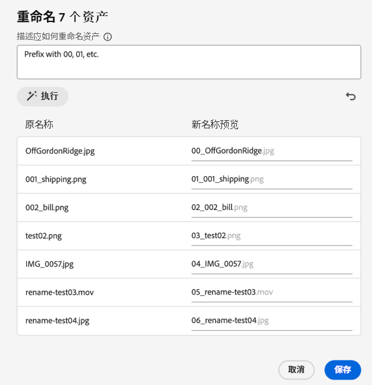

# 重命名 [!DNL Assets Essentials] 中的资产或文件夹 {#rename-single-asset-or-folder}

重命名有助于更好地组织、分类和识别资产，而无需改变其内容或位置。 [!DNL Assets Essentials] 允许您重命名选定的资产或文件夹。

按照以下步骤重命名资产或文件夹：

1. 找到您想重命名的资产或文件夹。

1. 使用下述方法之一重命名资产或文件夹：

   * 选择资产或文件夹，然后点击顶部菜单中的 **[!UICONTROL 重命名]**。
   * 点击资产或文件夹上的更多选项 `...`，然后选择&#x200B;**[!UICONTROL 重命名]**。
   * 点击资产或文件夹的标题，将其重命名。 在 **重命名资产** 文本框中提及新文本，然后单击 **保存**。 此功能可在网格、库、瀑布和列表视图中使用。

## AI 驱动的资产批量重命名 {#rename-bulk-assets-using-ai}

[!DNL Assets Essentials] 允许您使用 AI 一次性重命名多个资产。 AI 批量重命名功能只能应用于文件，不能应用于文件夹。 您可以一次选择多个文件，并统一进行重命名。

按照以下步骤，使用 AI 生成的提示词一次性批量重命名资产：

1. 选择多个资产，然后点击顶部菜单中的&#x200B;**[!UICONTROL 批量重命名]**。

1. 添加描述您想如何重命名选定资产的提示词。 请参阅[说明 AI 批量重命名的一些示例](#examples-ai-bulk-rename)。

1. 点击&#x200B;**[!UICONTROL 执行]**，允许 AI 重命名提示词中提到的资产。

1. [可选]点击，撤消或取消您执行的上一个操作。

1. 在[!UICONTROL 新名称预览]一列中检查您的更改，然后点击&#x200B;**[!UICONTROL 保存]**。

   

## 说明 AI 批量重命名的一些示例 {#examples-ai-bulk-rename}

以下是根据一个 AI 提示词用 AI 批量重命名资产的几个示例：

* 以 00、01 等作为前缀，以今天的日期作为后缀。
* 将所有文件更改为“my-file”，并附加一个递增的数字。
* 移除前缀和后缀，只保留名称的中间部分。
* 为文件添加 001、002 等作为前缀，并翻译成英语。

>[!VIDEO](https://video.tv.adobe.com/v/3440975)

>[!NOTE]
>
> * 您无法将表情符转换为文本。
> * 使用唯一名称，避免在重命名资产时出现警告消息。 不过您可以用新名称重试。
> * 您还可以将 Unicode 或非字母数字字符转换为文本。

## 后续步骤 {#next-steps}

* [观看视频，了解如何在 Assets Essentials 中管理元数据表单](https://experienceleague.adobe.com/docs/experience-manager-learn/assets-essentials/configuring/metadata-forms.html)

* 利用 Assets Essentials 用户界面上的[!UICONTROL 反馈]选项提供产品反馈

* 通过右侧边栏中的[!UICONTROL 编辑此页面]或[!UICONTROL 记录问题]来提供文档反馈

* 联系[客户关怀团队](https://experienceleague.adobe.com/?support-solution=General#support)

