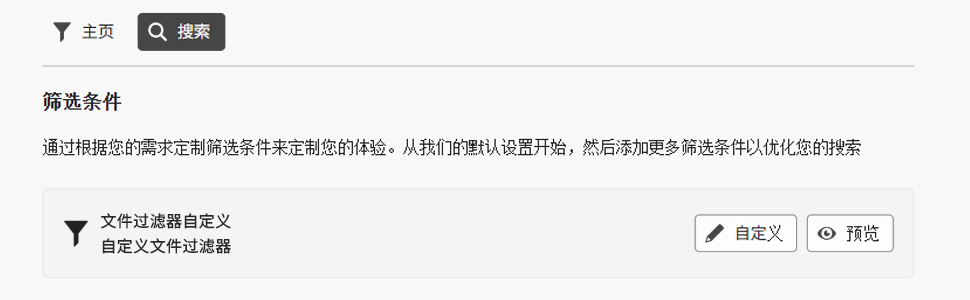
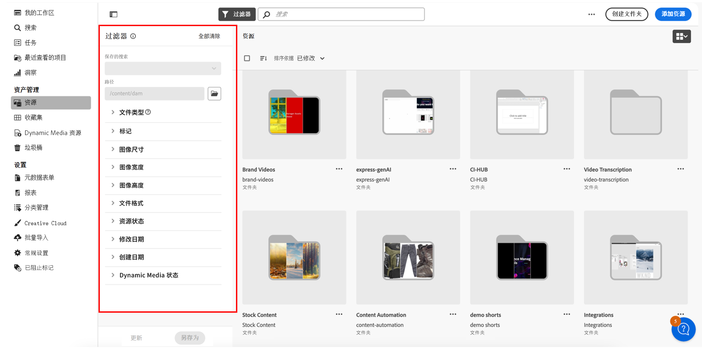

<table>
    <tr>
        <td>
            
            <a href="https://experienceleague.adobe.com/zh-hans/docs/experience-manager-cloud-service/content/assets/dynamicmedia/dm-prime-ultimate"><b>Dynamic Media Prime 和 Ultimate</b></a>
        </td>
        <td>
            
            <a href="https://experienceleague.adobe.com/zh-hans/docs/experience-manager-cloud-service/content/assets/assets-ultimate-overview"><b>AEM Assets Ultimate</b></a>
        </td>
        <td>
            
            <a href="http://experienceleague.adobe.com/zh-hans/docs/experience-manager-cloud-service/content/assets/integrate-aem-assets-edge-delivery-services"><b>AEM Assets 与 Edge Delivery Services 集成</b></a>
        </td>
        <td>
            
            <a href="https://experienceleague.adobe.com/zh-hans/docs/experience-manager-cloud-service/content/assets/assets-view/aem-assets-view-ui-extensibility"><b>UI 可扩展性</b></a>
        </td>
          <td>
            
            <a href="https://experienceleague.adobe.com/zh-hans/docs/experience-manager-cloud-service/content/assets/dynamicmedia/dm-prime-ultimate"><b>启用 Dynamic Media Prime 和 Ultimate</b></a>
        </td>
    </tr>
    <tr>
        <td>
            <a href="https://experienceleague.adobe.com/zh-hans/docs/experience-manager-cloud-service/content/assets/best-practices/search-best-practices"><b>搜索最佳实践</b></a>
        </td>
        <td>
            <a href="https://experienceleague.adobe.com/zh-hans/docs/experience-manager-cloud-service/content/assets/best-practices/metadata-best-practices"><b>元数据最佳实践</b></a>
        </td>
        <td>
            <a href="https://experienceleague.adobe.com/zh-hans/docs/experience-manager-cloud-service/content/assets/content-hub/product-overview"><b>Content Hub</b></a>
        </td>
        <td>
            <a href="https://experienceleague.adobe.com/zh-hans/docs/experience-manager-assets-essentials/help/custom-search-filters"><b>具有 OpenAPI 功能的 Dynamic Media</b></a>
        </td>
        <td>
            <a href="https://developer.adobe.com/experience-cloud/experience-manager-apis/"><b>AEM Assets 开发人员文档</b></a>
        </td>
    </tr>
</table>

# 自定义搜索过滤器 {#customize-search-filters}

通过搜索过滤器，您可以根据日期、文件类型、标记和相关性等各种参数来优化搜索结果，从而提高搜索查询的准确度。 通过应用过滤器，您可以高效地快速筛选相关性最高的结果。 这不仅可以节省时间，还可以根据特定的偏好和需求定制结果，从而改善整体搜索体验。
查看有关[搜索](search.md)的更多信息。

自定义搜索过滤器 AEM Assets 只能映射到您的可搜索属性索引中的条目。 在配置您的自定义过滤器体验之前，请确保包含了任何自定义元数据。 [!DNL Assets Essentials] 有助于自定义搜索过滤器，简化搜索过程。 要自定义 AEM Assets 自定义搜索过滤器，请执行以下步骤：

1. 前往&#x200B;**[!UICONTROL 设置]** > **[!UICONTROL 常规设置]**。
1. 前往&#x200B;**[!UICONTROL 搜索]**&#x200B;选项卡。 点击&#x200B;**[!UICONTROL 自定义]**，配置您的搜索表单。

   

1. 现在会显示[!UICONTROL 配置过滤器]表单。 确保您处于编辑模式，以便您能在模板中进行更改。 您可以切换到[!UICONTROL 预览模式]，查看现有搜索表单的预览。
1. 将[自定义过滤器](#available-custom-filters)中的筛选元素拖放到画布上。 如果需要，您可以拖放组件，重新排序。

   >[!VIDEO](https://video.tv.adobe.com/v/3443080)

1. 点击&#x200B;**[!UICONTROL 预览模式]**，审阅所做的更改。
1. 点击&#x200B;**[!UICONTROL 确认]**，将其保存。

## 可用的自定义过滤器 {#available-custom-filters}

Assets Essentials 提供以下自定义过滤器，可根据要求将其重新配置：

* [筛选元素](#filter-elements)
* [预配置的过滤器](#preconfigured-filters)

### 筛选元素 {#filter-elements}

自定义过滤器 AEM Assets 允许您在自定义搜索过滤器画布上使用一个筛选元素收藏集。 这些元素可根据搜索属性的可用性进行重新配置。 但是，您可以根据需要自定义[过滤器属性](#filter-properties)。 [!DNL Assets Essentials] 中提供以下筛选元素：

<table>
    <tr>
        <th>筛选元素</th>
        <th>描述</th>
        <th>属性</th>
    </tr>
    <tr>
        <td>文本</td>
        <td>文本字段是一个输入区域，您可以在其中输入与过滤器相关的信息。</td>
        <td>
            <ul>
                <li>标签
                <li>元数据
                <li>值
                <li>描述
            </ul>
        </td>
    </tr>
    <tr>
        <td>选项</td>
        <td>选项是指从列表中选择一个首选项时可用的替代项。</td>
        <td>
            <ul>
                <li>标签
                <li>元数据
                <li>值
                <li>选项
                <li>描述
            </ul>
        </td>
    </tr>
    <tr>
        <td>布尔值</td>
        <td>布尔值表示一个真值。 如果您想在多个选项中选择一个特定选项时，可以使用它。</td>
        <td>
            <ul>
                <li>标签
                <li>元数据
                <li>描述
            </ul>
        </td>
    </tr>
    <tr>
        <td>数字</td>
        <td>使用这个筛选元素表示一个数值。</td>
        <td>
            <ul>
                <li>标签
                <li>元数据
                <li>选择类型
                <li>步进器
                <li>步进值
                <li>描述
            </ul>
        </td>
    </tr>
    <tr>
        <td>下拉列表</td>
        <td>从一个选项列表中显示的各种选项中进行选择。</td>
        <td>
            <ul>
                <li>标签
                <li>元数据
                <li>选项
                <li>值
                <li>描述
            </ul>
        </td>
    </tr>
    <tr>
        <td>日期</td>
        <td>用于指定日期。</td>
        <td>
            <ul>
                <li>标签
                <li>元数据
                <li>选择类型
                <li>描述
            </ul>
        </td>
    </tr>
    <tr>
        <td>路径浏览器</td>
        <td>用于在 Experience Manager 存储库中的文件或文件夹中导航。</td>
        <td>
            <ul>
                <li>标签
                <li>元数据
                <li>路径资源管理器
                <li>描述
            </ul>
        </td>
    </tr>
    <tr>
        <td>标记</td>
        <td>用于从可用的选项中选择标记。 标记提供了关于资产的更具体的信息，增强它们的可发现性。 标记应用于选定资产后，会显示在<b>属性</b>面板中。 如果您将标记存储在一个自定义元数据属性中，并使用根路径将其限制为一个层级结构，就可以在搜索过滤器中利用相同的配置。 如果找不到相关的标记，请创建标记，然后将其分配给选定的资产。 有关创建标记并将其分配给资产的详细信息，请参阅<a href = "/help/using/tagging-management.md">在 Assets Essentials 中管理标记</a>。</td>
        <td>
            <ul>
                <li>标签
                <li>元数据
                <li>标记选取器
                <li>描述
            </ul>
        </td>
    </tr>
    <tr>
        <td>用户</td>
        <td>用于指定管理员、常规用户和消费者用户这几个用户类型。</td>
        <td>
            <ul>
                <li>标签
                <li>元数据
                <li>描述
            </ul>
        </td>
    </tr>
</table>

### 预配置的过滤器 {#preconfigured-filters}

预配置的过滤器是预设的设置，您可以直接在画布上使用它们。 但是，您可以根据需要自定义[过滤器属性](#filter-properties)。 以下过滤器已在 [!DNL Assets Essentials] 中进行了预配置：

<table>
    <tr>
        <th>预配置的过滤器</th>
        <th>描述</th>
        <th>属性</th>
    </tr>
    <tr>
        <td>文件类型</td>
        <td>按照受支持的文件类型，即“图像”、“文档”和“视频”，筛选搜索结果。</td>
        <td>
            <ul>
                <li>标签
                <li>元数据
                <li>选择类型
                <li>选项
                <li>值
                <li>描述
            </ul>
        </td>
    </tr>
    <tr>
        <td>文件格式</td>
        <td>Assets Essentials 支持任何二进制文件格式并提供基本服务，例如存储、上传、复制、移动、删除和添加元数据。</td>
        <td>
            <ul>
                <li>标签
                <li>元数据
                <li>选择类型
                <li>描述
            </ul>
        </td>
    </tr>
    <tr>
        <td>图像大小</td>
        <td>提供一个或多个最小尺寸和最大尺寸来筛选图像。 大小按照以像素为单位的尺寸提供，而不是图像的文件大小。</td>
        <td>
            <ul>
                <li>标签
                <li>元数据
                <li>选择类型
                <li>步进器
                <li>步进值
                <li>描述
            </ul>
        </td>
    </tr>
    <tr>
        <td>图像宽度</td>
        <td>图像的垂直尺寸。</td>
        <td>
            <ul>
                <li>标签
                <li>元数据
                <li>选择类型
                <li>步进器
                <li>步进值
                <li>描述
            </ul>
        </td>
    </tr>
    <tr>
        <td>图像高度</td>
        <td>图像的水平尺寸。</td>
        <td>
            <ul>
                <li>标签
                <li>元数据
                <li>选择类型
                <li>步进器
                <li>步进值
                <li>描述
            </ul>
        </td>
    </tr>
    <tr>
        <td>创建日期</td>
        <td>创建资产的日期范围。</td>
        <td>
            <ul>
                <li>标签
                <li>元数据
                <li>选择类型
                <li>描述
            </ul>
        </td>
    </tr>
    <tr>
        <td>修改日期</td>
        <td>更改资产的日期范围。</td>
        <td>
            <ul>
                <li>标签
                <li>元数据
                <li>选择类型
                <li>描述
            </ul>
        </td>
    </tr>
    <tr>
        <td>资产状态</td>
        <td>Assets Essentials 允许您为存储库中可用的资产设置状态。 设置资产状态，以更好地治理和管理下游对数字资产的消耗。 从<b>已批准、已拒绝或无状态</b>中进行选择。</td>
        <td>
            <ul>
                <li>标签
                <li>元数据
                <li>选择类型
                <li>描述
            </ul>
        </td>
    </tr>
    <tr>
        <td>智能标记</td>
        <td>使用 Experience Manager 存储库中添加的智能标记筛选资产。</td>
        <td>
            <ul>
                <li>标签
                <li>元数据
                <li>选择类型
                <li>分隔符支持
                <li>描述
            </ul>
        </td>
    </tr>
    <tr>
        <td>Dynamic Media 状态</td>
        <td>选择已发布或未发布的资产状态。</td>
        <td>
            <ul>
                <li>标签
                <li>元数据
                <li>选择类型
                <li>选项
                <li>值
                <li>描述
            </ul>
        </td>
    </tr>
    <tr>
        <td>过期日期</td>
        <td>筛选资产，指定在哪个日期范围过去后资产不再有效或不再需要。 </td>
        <td>
            <ul>
                <li>标签
                <li>元数据
                <li>选择类型
                <li>描述
            </ul>
        </td>
    </tr>
    <tr>
        <td>标记（分类法）</td>
        <td>这是一个使用标记来组织和分类数字资产的系统，主要是创建关键词的层级结构，允许用户将特定的标记应用于每一个资产，由此轻松地搜索和查找相关内容， </td>
        <td>
            <ul>
                <li>标签
                <li>元数据
                <li>标记选取器
                <li>描述
            </ul>
        </td>
    </tr>
</table>

#### 过滤器属性 {#filter-properties}

每一个筛选元素都与一组属性相关联。 AEM Assets 自定义搜索过滤器在过滤器和预配置的元素中使用以下属性：

<table>
    <tr>
        <th>属性</th>
        <th>值</th>
        <th>描述</th>
    </tr>
    <tr>
        <td>标签</td>
        <td>文本</td>
        <td>这是您使用的过滤器的标识符。</td>
    </tr>
    <tr>
        <td>元数据</td>
        <td>下拉面板</td>
        <td>元数据属性用于映射来自 Adobe Experience Manager Assets 存储库的已批准的元数据。 您可以从下拉菜单中选择需要通过筛选元素进行映射的元数据值。 </td>
    </tr>
    <tr>
        <td>选择类型</td> 
        <td>单个、多个、准确或范围 </td>
        <td>
            <ul>
                <li><b>单选</b>允许一次选择一项，非常适合不同的选择。
                <li><b>多选</b>允许同时选择多项，这对于选择多个选项很有用。 
                <li><b>准确选择</b>允许从不同的选项中选择准确的一项。
                <li><b>范围选择</b>允许在一个确定的范围内选择一组连续的值，在选择日期范围或数值时很有用。
            </ul>
        </td>   
    </tr>
    <tr>
        <td>选项</td>
        <td>手动、JSON 路径或 CSV 上传</td>
        <td>
            <ul>
                <li>如果您想手动添加选项，请选择<b>手动</b>。 
                <li>选择 <b>JSON 路径</b>可从 JSON 文件添加选项。 
                <li>选择 <b>CSV 上传</b>可导入一个包含了要添加到选项中的值的 CSV 文件。
            </ul>
        </td>
    </tr>
    <tr>
       <td>值</td>
        <td>添加或编辑</td>
        <td>
        <ul>
        <li>点击<b>添加</b>可添加一个新值。 
        <li>点击 ✎ 可编辑标签。 
        <li>点击 ?? 可删除选项值。 
        <li>点击<b>编辑</b>可更改编辑选项。 
        <li>您也可以按住选项来改变选项的顺序。
        </td>
    </tr>
    <tr>
        <td>分隔符支持</td>
        <td>启用或禁用</td>
        <td>分隔符是用于分隔文本中不同元素的符号。 例如逗号、空格或分号。</td>
    </tr>
    <tr>
        <td>步进器</td>
        <td>值</td>
        <td>启用数字字段的步进器按钮，这样每次点击就可以增加或减少此值。 </td>
    </tr>
    <tr>
        <td>步进值 </td>
        <td>数字</td>
        <td>表示使用步进器按钮时增加/减少的值。 步进器启用后就会出现。</td>
    </tr>
    <tr>
        <td>描述</td>
        <td>文本</td>
        <td>添加详细说明，提供有关筛选元素的附加信息。</td>
    </tr>
</table>

## 删除一个筛选元素 {#delete-a-filter-element}

要删除搜索过滤器，请执行以下步骤：

1. 前往&#x200B;**[!UICONTROL 设置]** > **[!UICONTROL 常规设置]**。
1. 前往&#x200B;**[!UICONTROL 搜索]**&#x200B;选项卡。 点击&#x200B;**[!UICONTROL 自定义]**，配置您的搜索表单。
1. 现在会显示[!UICONTROL 配置过滤器]表单。 确保您处于编辑模式，以便您能在模板中进行更改。
1. 选择您想删除的筛选元素。 例如，选择&#x200B;**[!UICONTROL 图像高度]**。
1. 点击&#x200B;**[!UICONTROL 删除类别]**，删除这个筛选元素。 **[!UICONTROL 图像高度]**&#x200B;元素就从画布中移除。
1. 点击&#x200B;**[!UICONTROL 确认]**，保存表单。

## 使用自定义搜索过滤器{#using-custom-search-filters}

配置搜索过滤器后，您就可以使用这些过滤器在存储库中搜索资产。

>[!MORELIKETHIS]
>
>* [搜索资产](/help/using/search.md)
