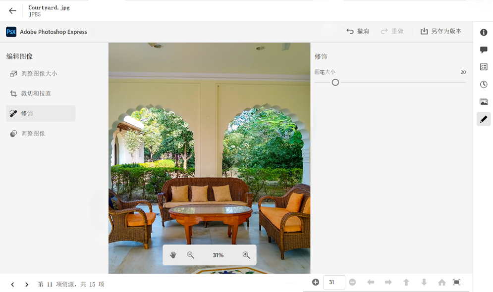
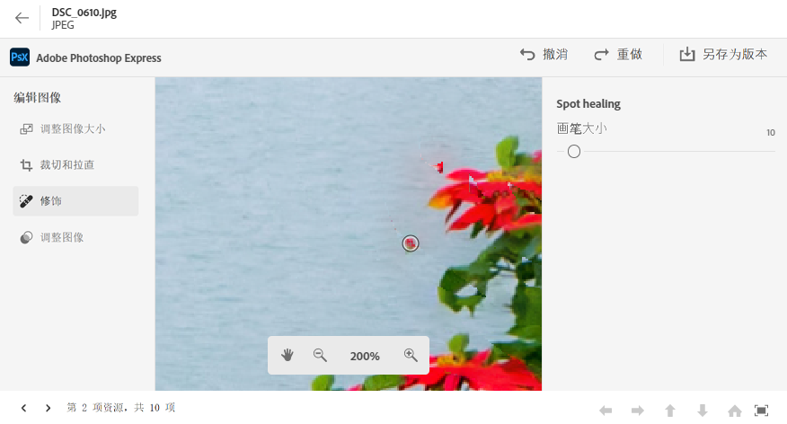
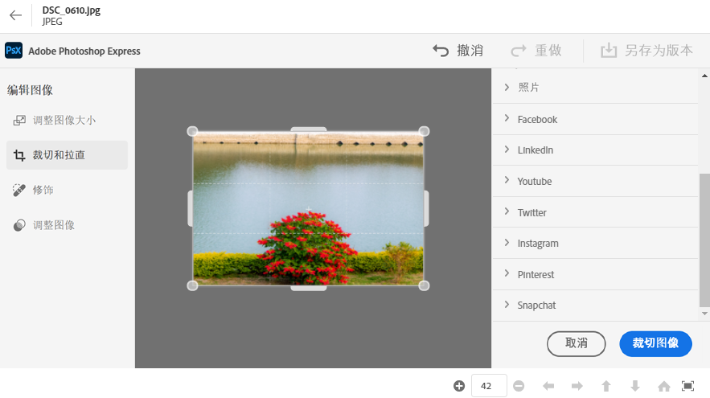
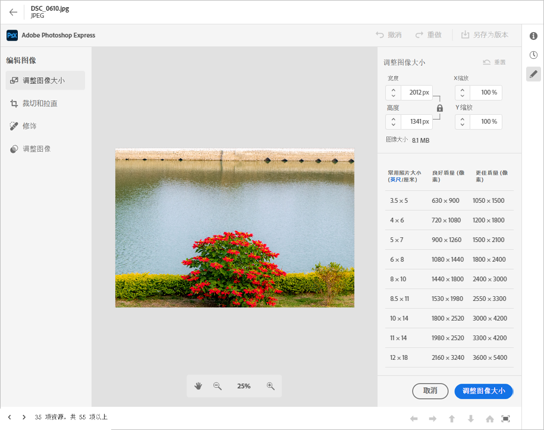
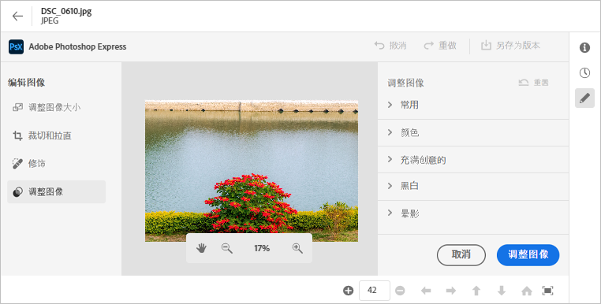

# 在 [!DNL Assets Essentials] 中编辑图像 {#edit-images-in-assets-essentials}

Asset Essentials UI 支持基本的图像编辑，包括调整大小、去除背景、裁剪以及在 JPEG 和 PNG 格式之间转换。此外，它还允许通过与 Adobe Express 集成进行高级编辑。在编辑图像之后，您可以将新图像另存为新版本。版本控制可帮助您在需要时还原为原始资源。若要编辑图像，请[打开其预览](https://experienceleague.adobe.com/zh-hans/docs/experience-manager-assets-essentials/help/navigate-view#preview-assets)，然后单击&#x200B;**“编辑图像”。**

>[!NOTE]
>
>您可以使用 Adobe Express 编辑 PNG 和 JPEG 文件类型的图像。

<!--The editing actions that are available are Spot healing, Crop and straighten, Resize image, and Adjust image.-->

## 编辑图像 {#edit-images}

进入 Asset Essentials UI，使用链接 - [Asset Essentials UI](https://experience.adobe.com/#/assets) 并选择正确的存储库。要获得访问权限，请联系您组织的管理员。
如需任何其他参考信息，请参阅 [开始使用 Adobe Experience Manager Assets Essentials](https://experienceleague.adobe.com/zh-hans/docs/experience-manager-assets-essentials/help/get-started)、[了解用户界面](https://experienceleague.adobe.com/zh-hans/docs/experience-manager-assets-essentials/help/navigate-view)、 [Asset Essentials 用例](https://experienceleague.adobe.com/zh-hans/docs/experience-manager-assets-essentials/help/get-started#use-cases) 和 [已知问题](https://experienceleague.adobe.com/zh-hans/docs/experience-manager-assets-essentials/help/release-notes)。

### 使用 Adobe Express 编辑图像 {#edit-images-using-adobe-express}

>[!CONTEXTUALHELP]
>id="assets_express_integration"
>title="Adobe Express 集成"
>abstract="可直接在 AEM Assets 中使用简单而直观的受 Adobe Express 支持的图像编辑工具，以提高内容重用率并加快内容速度。"

进入 Essentials UI 后，点击 **资源**，选择一张图像，然后点击顶部栏中的 **编辑**。新屏幕显示可用的编辑选项，包括调整大小、背景去除、裁剪以及 JPEG 与 PNG 格式之间的转换。

#### 调整图像大小 {#resize-image-using-express}

将图像大小调整为热门用例中的特定大小。Assets Essentials 提供针对特定照片大小预先计算的新分辨率，让您可以快速地调整图像大小以适合常见的照片尺寸。要使用 Assets Essentials 调整图像大小，请按照以下步骤操作：

1. 单击左侧窗格中的 **调整图像大小**。
2. 从“调整大小对象”下拉列表中选择适当的社交媒体平台，并从显示的选项中选择图像的大小。
3. 如果需要，使用&#x200B;**“图像比例”**&#x200B;字段缩放图像。
4. 单击&#x200B;**应用**以应用您的更改。
   

   您编辑的图像可供下载。您可以将编辑后的资源另存为同一资源的新版本，也可以将其另存为新资源。
   

#### 移除背景 {#remove-background-using-express}

您可以按照以下步骤从图像中移除背景：

1. 单击左侧窗格中的 **删除背景**。Experience Manager Assets 不含背景地显示该图像。
2. 单击&#x200B;**[!UICONTROL 应用]**以应用您的更改。
   

   您编辑的图像可供下载。您可以将编辑后的资源另存为同一资源的新版本，也可以将其另存为新资源。

#### 裁切图像 {#crop-image-using-express}

使用嵌入的 [!DNL Adobe Express] 快速操作可以简单地将图像转换为完美尺寸。

1. 单击左侧窗格中的 **[!UICONTROL 剪裁图像]**。
2. 拖动该图像四角的手柄以创建您想要的裁切效果。
3. 单击&#x200B;**[!UICONTROL 应用]**。
   
裁剪后的图像可供下载。您可以将编辑后的资源另存为同一资源的新版本，也可以将其另存为新资源。

#### 在图像文件类型之间转换 {#convert-image-types-using-express}

您可以使用 Adobe Express 在 JPEG 和 PNG 图像格式之间快速转换。执行以下步骤：

1. 在左侧窗格中单击将 **JPEG 转换为 PNG** 或将 **PNG 转换为 JPEG**。
   
2. 单击&#x200B;**[!UICONTROL “下载”。]**

#### 限制 {#limitations-adobe-express}

* 支持的图像分辨率：最小 - 50 像素，最大 - 每维 6000 像素。
* 支持的最大文件大小：17 MB。

### 在 Adobe Express 嵌入式编辑器中编辑图像 {#edit-images-in-adobe-express-embedded-editor}

具有 Express 权利的用户可以使用 Assets Essentials UI 中嵌入的 Express 编辑器轻松编辑内容，并使用 Adobe Firefly 的 GenAI 创建新内容。这提高了内容重用性并加快了内容速度。您还可以使用预定义的元素使您的资源看起来令人惊叹，或者只需单击几下即可执行快速操作来编辑图像。

要使用 Adobe Express 嵌入式编辑器编辑图像，请按照以下步骤操作：

1. 使用链接 - [AEM Asset Essentials UI](https://experience.adobe.com/#/assets) 进入 AEM Asset Essentials UI 并选择正确的存储库。
1. 点击 **资源**，进入文件夹，然后选择一张图像。
1. 单击&#x200B;**在 Adobe Express 中打开**。图像在快捷画布上打开。
1. 对图像进行必要的编辑。
1. 如果你的项目需要你添加更多页面，请单击 **添加**，选择资源，进入文件夹，选择要带到画布页面的图像，然后对图像执行所需的编辑。
1. 单击&#x200B;**“保存”**，以保存图像。此时将显示保存对话框。

   >[!NOTE]
   >
   > **1. 对于单页面**
   >
   > **另存为版本：** 此功能仅支持保存单个资源。选择此选项可以将图像导出为新版本（保留原始格式），并将其保存在同一文件夹中。
   > **另存为新资源：** 选择此选项可以以与原始格式不同的格式导出资源，并将其作为新资源保存到任何文件夹。
   >  
   > **2。对于多页**
   >
   > **另存为版本：** 此功能仅支持保存单个资源。如果您想从多个页面中保存单个页面，请选择此选项以将资源保存为其原始格式和位置。\
   > **另存为新资源：** 使用此选项，您可以将多个资源或单个资源导出到任何文件夹，并将它们另存为新资源，其文件格式与原始格式相同或不同。

1. 在保存对话框中：
   1. 在 **另存为** 字段中输入文件的名称。
   1. 选择目标文件夹。
   1. 可选：提供详细信息，例如 项目或活动名称、关键字、渠道、时间范围和地区。
1. 点击 **另存为版本** 或 **另存为新资源** 以保存资源。

#### 在 Express Editor 中编辑图像的限制 {#limitations-of-editing-images-in-the-express-editor}

* 支持的文件类型：JPEG or PNG。
* 支持的最大文件大小：40 MB。
* 支持的宽度和高度范围：50 到 8000 像素之间。
* 重新加载页面以查看源文件夹中最新保存的新资源。

### 使用 Adobe Express 创建新资源 {#create-new-assets-using-embedded-editor}

Assets Essentials 使您能够使用 Adobe Express 嵌入式编辑器从头开始创建新模板。若要使用 Adobe Express 创建新资源，请执行以下步骤：

1. 导航至 **My Workspace**，然后单击显示在快速访问部分上方的&#x200B;**Adobe Express 横幅中的**&#x200B;创建。Adobe Express 空白画布显示在 Assets Essentials 用户界面内。
1. 使用[模板](https://helpx.adobe.com/cn/express/using/work-with-templates.html)创建您的内容。否则，导航至您的内容来修改现有内容。
1. 完成编辑后，点击 **保存**。
1. 指定创建资源的目标路径，然后单击&#x200B;**另存为新资源**。

#### 限制 {#limitations}

* 您只能修改 `JPEG` 和 `PNG` 格式类型的图像。
* 资源大小必须小于 40 MB。
* 您可以将图像保存为 `PDF`, `JPEG` 或者 `PNG` 格式。

<!--
## Edit images using [!DNL Adobe Photoshop Express] {#edit-using-photoshop-express}

<!--
After editing an image, you can save the new image as a new version. Versioning helps you to revert to the original asset later, if needed. To edit an image, [open its preview](/help/using/navigate-view.md#preview-assets) and click **[!UICONTROL Edit Image]**  from the rail on the right.

*Figure: The options to edit images are powered by [!DNL Adobe Photoshop Express].*
-->
<!--
### Spot heal images {#spot-heal-images-using-photoshop-express}

If there are minor spots or small objects on an image, you can edit and remove the spots using the spot healing feature provided by Adobe Photoshop.

The brush samples the retouched area and makes the repaired pixels blend seamlessly into the rest of the image. Use a brush size that is only slightly larger than the spot you want to fix.

<!-- 
TBD: See if we should give backlinks to PS docs for these concepts.
For more information about how Spot Healing works in Photoshop, see [retouching and repairing photos](https://helpx.adobe.com/photoshop/using/retouching-repairing-images.html). 
-->
<!--
### Crop and straighten images {#crop-straighten-images-using-photoshop-express}

Using the crop and straighten option that you can do basic cropping, rotate image, flip it horizontally or vertically, and crop it to dimensions suitable for popular social media websites.

To save your edits, click **[!UICONTROL Crop Image]**. After editing, you can save the new image as a version.

Many default options let you crop your image to the best proportions that fit various social media profiles and posts.

### Resize image {#resize-image-using-photoshop-express}

You can view the common photo sizes in centimeters or inches to know the dimensions. By default, the resizing method retains the aspect ratio. To manually override the aspect ratio, click .

Enter the dimensions and click **[!UICONTROL Resize Image]** to resize the image. Before you save the changes as a version, you can either undo all the changes done before saving by clicking [!UICONTROL Undo] or you can change the specific step in the editing process by clicking [!UICONTROL Revert].

### Adjust image {#adjust-image-using-photoshop-express}

[!DNL Assets Essentials] lets you adjust the color, tone, contrast, and more, with just a few clicks. Click **[!UICONTROL Adjust image]** in the edit window. The following options are available in the right sidebar:

* **Popular**: [!UICONTROL High Contrast & Detail], [!UICONTROL Desaturated Contrast], [!UICONTROL Aged Photo], [!UICONTROL B&W Soft], and [!UICONTROL B&W Sepia Tone].
* **Color**: [!UICONTROL Natural], [!UICONTROL Bright], [!UICONTROL High Contrast], [!UICONTROL High Contrast & Detail], [!UICONTROL Vivid], and [!UICONTROL Matte].
* **Creative**: [!UICONTROL Desaturated Contrast], [!UICONTROL Cool Light], [!UICONTROL Turquoise & Red], [!UICONTROL Soft Mist], [!UICONTROL Vintage Instant], [!UICONTROL Warm Contrast], [!UICONTROL Flat & Green], [!UICONTROL Red Lift Matte], [!UICONTROL Warm Shadows], and [!UICONTROL Aged Photo].
* **B&W**: [!UICONTROL B&W Landscape], [!UICONTROL B&W High Contrast], [!UICONTROL B&W Punch], [!UICONTROL B&W Low Contrast], [!UICONTROL B&W Flat], [!UICONTROL B&W Soft], [!UICONTROL B&W Infrared], [!UICONTROL B&W Selenium Tone], [!UICONTROL B&W Sepia Tone], and [!UICONTROL B&W Split Tone].
* **Vignetting**: [!UICONTROL None], [!UICONTROL Light], [!UICONTROL Medium], and [!UICONTROL Heavy].

<!--
TBD: Insert a video of the available social media options.
-->

### 后续步骤 {#next-steps}

* 利用 Assets Essentials 用户界面上的[!UICONTROL 反馈]选项提供产品反馈

* 通过右侧边栏中的[!UICONTROL 编辑此页面]或[!UICONTROL 记录问题]来提供文档反馈

* 联系[客户关怀团队](https://experienceleague.adobe.com/?support-solution=General#support)

>[!MORELIKETHIS]
>
>* [查看资源的版本历史记录](/help/using/navigate-view.md)
