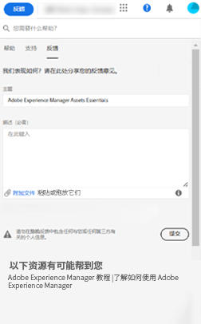

# 开始使用 [!DNL Adobe Experience Manager Assets Essentials] {#assets-essentials-get-started}

<!-- TBD: Make links for these steps. -->

使用 [!DNL Assets Essentials] 管理数字资源只需要三个简单的步骤：

* **步骤 1**：[上传](/help/using/add-delete.md)和[查看](/help/using/navigate-view.md)资源。
* **步骤 2**：[搜索](/help/using/search.md)和[下载](/help/using/manage-organize.md#download)资源。
* **步骤 3**：[管理和组织](/help/using/manage-organize.md)资源。

要使用 [!DNL Assets Essentials]，请通过 [https://experience.adobe.com/#/assets](https://experience.adobe.com/#/assets) 登录。在登录时，选择 `Company or School Account`。要获得访问权限，请联系您组织的管理员。

此外，[了解用户界面](/help/using/navigate-view.md)、[用例列表](#use-cases)、<!-- TBD: [supported file types](/help/using/supported-file-formats.md), -->和[已知问题](/help/using/release-notes.md#known-issues)中提供了更多有用的参考信息。

## 获取对 [!DNL Assets Essentials] 的访问权限 {#get-access}

Adobe 配置解决方案并将您的组织中的指定人员添加作为管理员。管理员可以使用 [[!DNL Admin Console]](https://helpx.adobe.com/cn/enterprise/using/admin-console.html) 向组织中的不同用户提供访问权限。对于与您的访问权限相关的请求，请联系组织的管理员。

在登录时，提供凭据之后，[!DNL Assets Essentials] 提示您选择帐户。在此例中，选择 `Company or School Account` 以继续。

## 配置 [!DNL Assets Essentials] {#configuration}

要打开偏好设置，请单击用户界面右上角的头像。在解决方案偏好设置中，您可以在浅色和深色主题之间切换。

如果您属于不同的组织，则还可以更改组织和跨不同组织访问您的帐户。

要更改您的 [!UICONTROL Experience Cloud 偏好设置]，请单击[!UICONTROL 偏好设置]。

## [!DNL Assets Essentials] 用例 {#use-cases}

您可以使用 [!DNL Assets Essentials] 完成的各种数字资源管理 (DAM) 任务如下所示。

| 用户任务 | 功能和操作方法信息 |
|-----|------|
| 浏览和查看资源 | <ul> <li>[浏览存储库](/help/using/navigate-view.md#view-assets-and-details) </li> <li> [预览资源](/help/using/navigate-view.md#preview-assets) <li> [查看资源的演绎版](/help/using/add-delete.md#renditions) </li> <li>[查看资源的版本](/help/using/manage-organize.md#view-versions)</li></ul> |
| 添加新资源 | <ul> <li>[上传新资源和文件夹](/help/using/add-delete.md#add-assets)</li> <li>[监控上传进度和管理上传](/help/using/add-delete.md#upload-progress)</li> <li>[解决重复资源](/help/using/add-delete.md#resolve-upload-fails)</li> </ul> |
| 更新资源或相关信息 | <ul> <li>[编辑图像](/help/using/edit-images.md)</li> <li>[创建版本](/help/using/manage-organize.md#create-versions)和[查看版本](/help/using/manage-organize.md#view-versions)</li> <li>[编辑图像](/help/using/edit-images.md)</li> </ul> |
| 编辑资源 | <ul> <li>[使用 Adobe Photoshop Express 的浏览器中编辑](/help/using/edit-images.md)</li> <li>[针对社交媒体配置文件裁切](/help/using/edit-images.md#crop-straighten-images)</li> <li>[查看和管理版本](/help/using/manage-organize.md#view-versions)</li> <li>[使用 [!DNL Adobe Asset Link]](/help/using/integration.md#integrations)</ul></ul> |
| 在存储库中搜索资源 | <ul> <li>[在特定文件夹中搜索](/help/using/search.md#refine-search-results)</li> <li>[保存的搜索](/help/using/search.md#saved-search)</li> <li>[搜索最近查看的资源](/help/using/search.md)</li> <li>[全文搜索](/help/using/search.md) |
| 下载资源 | <ul> <li> [预览资源](/help/using/navigate-view.md#preview-assets) </li> <li> [下载资源](/help/using/manage-organize.md#download) <li> [下载演绎版](/help/using/add-delete.md#renditions) </li></ul> |
| 元数据操作 | <ul> <li>[查看详细的元数据](/help/using/metadata.md) </li> <li> [更新元数据](/help/using/metadata.md#update-metadata)</li> <li> [创建新元数据表单](/help/using/metadata.md#metadata-forms) </li> </ul> |
| 与其他解决方案集成 | <ul> <li>[在  [!DNL Adobe Journey Optimizer]](/help/using/integration.md) 中使用资源选择器</li> <li> [!DNL Creative Cloud]](/help/using/integration.md) 的 [[!DNL Adobe Asset Link] </li> <li>[与 [!DNL Adobe Workfront]](/help/using/integration.md) 集成</li> </ul> |

## 后续步骤 {#next-steps}

* [观看视频，了解如何开始使用 Assets Essentials](https://experienceleague.adobe.com/docs/experience-manager-learn/assets-essentials/getting-started.html)

* 利用 Assets Essentials 用户界面上的[!UICONTROL 反馈]选项提供产品反馈

* 通过右侧边栏中的[!UICONTROL 编辑此页面]或[!UICONTROL 记录问题]来提供文档反馈

* 联系[客户关怀团队](https://experienceleague.adobe.com/?support-solution=General#support)

<!--TBD: Merge the below rows in the table when the use cases are documented/available.

| How do I delete assets? | <ul> <li>[Delete assets](/help/using/manage-organize.md)</li> <li>Recover deleted assets</li> <li>Permanently delete assets</li> </ul> |
| How do I share assets or find shared assets? | <ul> <li>Shared by me</li> <li>Shared with me</li> <li>Share for comments and review</li> <li>Unshare assets</li> </ul> |
| How do I collaborate with others and get my assets reviewed | <ul> <li>Share for review</li> <li>Provide comments. Resolve and filter comments</li> <li>Annotations on images</li> <li>Assign tasks to specific users and prioritize</li> </ul> |

-->

<!-- 

##  Provide product feedback {#provide-feedback}

Adobe welcomes feedback about the solution. To provide feedback without even switching your working application, use the [!UICONTROL Feedback] option in the user interface. It also lets you attach files such as screenshots or video recording of an issue.

  

To provide feedback for documentation, click [!UICONTROL Edit this page]  or [!UICONTROL Log an issue]  from the right sidebar. You can do one of the following: 

* Make the content updates and submit a GitHub pull request.
* Create an issue or ticket in GitHub. Retain the automatically populated article name when creating an issue.

-->

>[!MORELIKETHIS]
>
>* [了解用户界面](/help/using/navigate-view.md)。
>* [发行说明和已知问题](/help/using/release-notes.md)。

<!-- TBD: 
>* [Supported file types](/help/using/supported-file-formats.md).
-->
