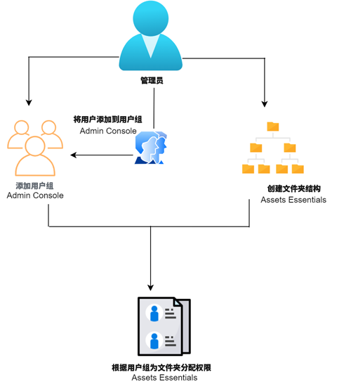

# 管理文件夹的权限 {#manage-permissions}

>[!CONTEXTUALHELP]
>id="assets_permissions_folders"
>title="管理权限"
>abstract="[!DNL Assets Essentials] 允许管理员管理存储库中可用文件夹的访问级别。作为管理员，您可以创建用户组并向这些组分配权限以管理访问级别。您还可以将权限管理权委派给文件夹级别的用户组。"

Assets Essentials 允许管理员管理存储库中可用文件夹的访问级别。作为管理员，您可以创建用户组并向这些组分配权限以管理访问级别。您还可以将权限管理权委派给文件夹级别的用户组。

以下数据流程图说明了您为配置和管理 Assets Essentials 存储库中可用文件夹的权限而执行的任务序列：

## 管理文件夹的权限之前 {#before-managing-permissions}

在开始管理 Assets Essentials 存储库中文件夹的权限之前，您必须执行某些任务，例如添加可以创建逻辑文件夹结构、创建用户组和管理各种用户组的文件夹权限的管理员。

### 添加管理员 {#add-admin-users}

为 Assets Essentials 应用程序添加管理员，以便他们可以管理其他用户组的文件夹权限。

添加管理员：

1. 访问组织的 [Admin Console](https://adminconsole.adobe.com)，单击顶部工具栏中的&#x200B;**[!UICONTROL 产品]**，单击 **[!UICONTROL AEM Assets Essentials]**，然后单击 [!DNL Assets Essentials] 环境。[!DNL Assets Essentials] 有三个产品配置文件，分别代表管理员、常规和消费者用户的访问权限。

   

1. 要将用户添加到组，请单击 Assets Essentials Administrators 组，选择&#x200B;**[!UICONTROL 添加用户]**，提供用户详细信息，然后单击&#x200B;**[!UICONTROL 保存]**。

   

   添加用户时，用户将收到电子邮件邀请以开始使用。您可以在 [!DNL Admin Console] 的产品配置文件设置中关闭电子邮件邀请。

1. 要从组中删除某个用户，请单击改组，选择现有用户，然后选择&#x200B;**[!UICONTROL 删除用户]**。

### 添加用户组 {#add-user-groups}

创建用户组并向这些组分配权限以管理 Assets Essentials 存储库中的文件夹访问级别。然后，您可以将您的用户分配到用户组。

您可以将用户添加到用户组 (1) 并[将用户添加到 Assets Essentials 产品配置文件 (2)](#add-admin-users)。但是，您不能将用户组直接添加到 Assets Essentials 产品配置文件 (3)。

有关如何管理用户组的信息，请参阅[管理用户组](https://helpx.adobe.com/cn/enterprise/using/user-groups.html)中的 `Create user groups` 和 `Edit user groups`。

>[!NOTE]
>
>如果您的 Admin Console 设置为利用外部系统来管理用户/组分配，例如 Azure 或 Google 连接器、用户同步工具或 User Management Rest API，则您的组和用户分配会自动配置。有关更多信息，请参阅 [Adobe Admin Console 用户](https://helpx.adobe.com/cn/enterprise/using/users.html)。

### 将用户添加到组 {#add-users-to-uesr-groups}

创建用户组后，您可以开始将用户添加到用户组。

有关如何管理将用户添加到用户组的信息，请参阅[管理用户组](https://helpx.adobe.com/cn/enterprise/using/user-groups.html#add-users-to-groups)中的 `Add users to groups`。

### 创建文件夹结构 {#create-folder-structure}

您可以使用以下方法在 Assets Essentials 存储库中创建文件夹结构：

* 单击工具栏中可用的&#x200B;**[!UICONTROL 创建文件夹]**&#x200B;选项以创建一个空文件夹。

* 单击工具栏中可用的&#x200B;**[!UICONTROL 添加资产]**&#x200B;选项以[上传本地计算机上可用的文件夹结构](add-delete.md)。

创建一个适合组织业务目标的文件夹结构。如果要将现有文件夹结构上传到 Assets Essentials 存储库，则应审查该结构。有关详细信息，请参阅[有效权限管理的最佳实践](permission-management-best-practices.md)。

## 管理文件夹的权限 {#manage-permissions-on-folders}

您可以为用户组或用户分配以下权限。Adobe 不建议向用户分配权限。

| 权限名称 | 描述 |
|-----|------|
| 可以查看 | <ul><li>具有查看和导航文件夹的读取权限 </li><li>预览资源</li><li>下载资源</li><li>复制资产</li><li>分享资产链接</li><ul> |
| 可以编辑 | <ul><li>“可以查看”权限的所有可用权限 </li><li>创建文件夹</li><li>删除文件夹</li><li>重命名文件夹</li><li>创建资产</li><li>更新资产</li><li>删除资产</li><li>移动资产</li><li>重命名资产</li><ul> |
| 所有者 | <ul><li>“可以编辑”权限的所有可用权限</li><li>管理文件夹及其子文件夹的权限</li>此权限允许管理员将文件夹及其子文件夹的管理员权限委派给其他人。<ul> |
| 拒绝访问 | 删除文件夹及其子文件夹的“可以查看”、“可以编辑”和“所有者”权限。 |

**默认权限**

所有经过身份验证并可以登录到 Assets Essentials 应用程序的用户最初都拥有对 Assets Essentials 存储库的 `Can Edit` 权限。管理员可以通过[编辑整个 Assets Essentials 存储库的权限](#edit-permissions-entire-repository)来调整更改默认权限。

**将文件夹权限分配给用户组的序列**

创建规则以将文件夹权限分配给用户组。您用于为文件夹分配权限的序列很重要，它决定了用户组和最终用户可用的访问权限。

例如，如果您将文件夹的 `Can View` 权限分配给超级组，然后将 `Can Edit` 权限分配给其子组，则只有子组的成员具有对该文件夹的编辑权限。超级组用户具有对该文件夹的查看权限。

如果您需要仅向您组织的营销部门提供对 `Marketing` 文件夹的编辑权限并为其他人提供查看权限，请将 `Can View` 权限分配给超级组 `All Authenticated Users`，将 `Can Edit` 权限分配给其子组 `Marketing`。

**权限继承**

Assets Essentials 使用权限继承，这使您可以在子文件夹中继承为父文件夹设置的权限。例如，如果父文件夹对 `All Authenticated Users` 组具有 `Can View` 权限，而子文件夹对 `Marketing` 用户组具有 `Can Edit` 权限，则它使所有经过身份验证的用户都具有查看子文件夹的权限，并且 `Marketing` 用户组拥有子文件夹的编辑权限。`Marketing` 用户组对子文件夹 (Marketing) 下的其他级别的文件夹具有编辑权限。

>[!NOTE]
>
> 不支持为更高级别文件夹上的组设置 `Deny Access` 权限，然后恢复该组或其成员的访问权限（`Can view`、`Can edit` 或 `Owner`）。请谨慎使用 `Deny Access`。

### 向用户组添加权限 {#add-permissions}

要为文件夹分配组权限：

1. 选择文件夹并点击&#x200B;**[!UICONTROL 管理权限]**。

1. 在&#x200B;**[!UICONTROL 管理权限]**&#x200B;对话框中，在&#x200B;**[!UICONTROL 组和用户]**&#x200B;字段中指定组或用户的名称。

1. 从&#x200B;**[!UICONTROL 访问]**&#x200B;下拉列表中选择[访问级别](#manage-permissions-folders)。

1. 单击&#x200B;**[!UICONTROL 添加]**&#x200B;立即更改用户或用户组的权限。

1. 重复步骤 1 – 3 以向&#x200B;**[!UICONTROL 管理权限]**&#x200B;对话框添加更多规则。

   

   >[!NOTE]
   >
   > 您用于为文件夹分配权限的顺序很重要，它决定了用户组以及最终添加到组的用户的访问权限。

   如果您正在管理多个文件夹的权限，您还可以从左侧窗格中选择任何其他文件夹并开始管理该文件夹的权限。

1. 单击&#x200B;**[!UICONTROL 关闭]**。

>[!CAUTION]
>
> 建议管理用户组而不是单个用户的权限。仅用户组支持设置 `Deny access` 权限，个人用户不支持。

### 编辑分配给用户组的权限 {#edit-permissions}

要编辑分配给文件夹用户组的权限：

1. 选择文件夹并点击&#x200B;**[!UICONTROL 管理权限]**。

1. 在&#x200B;**[!UICONTROL 管理权限]**&#x200B;对话框中，从&#x200B;**[!UICONTROL 访问]**&#x200B;下拉列表中编辑[访问级别](#manage-permissions-folders)。

1. 如有必要，[添加更多用户组或用户](#add-permissions)到现有权限规则。

1. 单击 X 删除分配给用户组的权限。

### 编辑整个 Assets Essentials 存储库的权限 {#edit-permissions-entire-repository}

应用程序管理员可以将整个 Assets Essentials 存储库的权限从默认权限`Can Edit`编辑为任何其他访问级别。

要编辑整个 Assets Essentials 存储库的权限：

1. 选择任意文件夹并点击&#x200B;**[!UICONTROL 管理权限]**。

1. 在&#x200B;**[!UICONTROL 管理权限]**&#x200B;对话框中，单击左侧边栏中的&#x200B;**[!UICONTROL 所有资产]**。

1. [编辑权限](#edit-permissions)并关闭对话框。

>[!NOTE]
>
>管理员不能为整个 Assets Essentials 存储库选择 `Deny Access` 权限级别，以确保用户至少具有对应用程序的读取权限。同样，`All Authenticated Users` 至少具有对存储库的读取权限，即使管理员在[!UICONTROL 管理权限]对话框中明确删除了 `Can Edit` 权限。

## 有效权限管理示例 {#example-permission-management}

**用例**

* “所有经过身份验证的用户”组具有对存储库的查看访问权限。
* 团队特定用户组对其自己的功能特定文件夹具有编辑权限。
* 除法律团队外，任何认证用户都无法查看“Legal”文件夹。

在 Admin Console 中创建以下用户组：

* 营销团队

* 品牌审批团队

* 项目经理团队

* X 项目团队

* 法律团队

下图说明了文件夹层次结构和分配给每个用户组的权限：

以下是文件夹层次结构中所有用户组的访问级别：

* /All Assets：管理员将根级别的权限从默认的 `Can Edit` 修改为 `Can View`。所有用户都可以查看文件夹和资产，但不能对其进行编辑。

* /marketing：所有用户都可以根据权限继承查看文件夹及其子文件夹，但是，“营销团队”用户组对文件夹具有编辑权限。

* /brand：所有用户都可以根据权限继承查看文件夹及其子文件夹，但是，“品牌审批团队”用户组对该文件夹具有编辑权限。

* /projects：所有用户都可以根据权限继承查看文件夹及其子文件夹。“项目经理团队”用户组具有：

   * 编辑权限

   * “所有者”权限：管理文件夹及其子文件夹的权限。

* /projects/project-x：所有用户都可以查看文件夹及其子文件夹。“项目经理团队”用户组具有编辑权限，可以管理文件夹及其子文件夹的权限（“所有者”权限）。“X 项目团队”用户组具有编辑权限。

* /legal：根据 `All Authenticated Users` 组的 `Deny Access` 权限，没有任何用户可以访问该文件夹。“法律团队”用户组具有编辑权限。

## 后续步骤 {#next-steps}

* [观看视频，了解如何在 Assets Essentials 中管理权限](https://experienceleague.adobe.com/docs/experience-manager-learn/assets-essentials/configuring/permissions-management.html)

* 通过右侧边栏中的[!UICONTROL 编辑此页面]或[!UICONTROL 记录问题]来提供文档反馈

* 联系[客户关怀团队](https://experienceleague.adobe.com/?support-solution=General#support)
