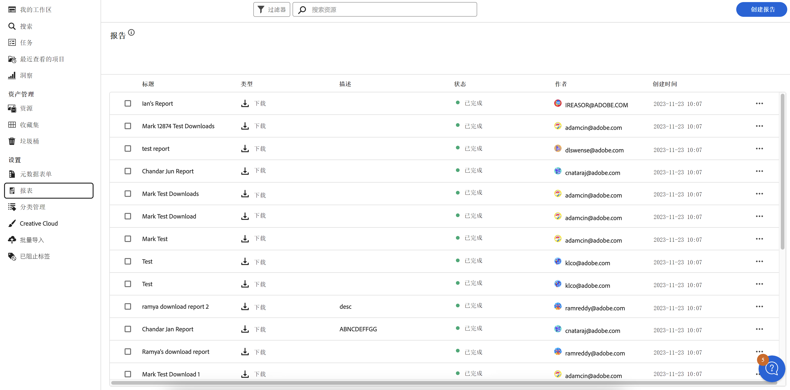

# 管理报告 {#manage-reports}

通过资产报告，管理员可了解 Adobe Experience Manager Assets Essentials 环境的活动。这些数据提供关于用户如何与内容和产品进行交互的有用信息。所有用户都可以访问 Insights 仪表板，分配给管理员产品配置文件的用户可以创建用户定义的报告。

## 访问报告 {#access-reports}

所有分配给 [Assets Essentials 管理员产品配置文件](deploy-administer.md)的用户均可在 Assets Essentials 中访问“见解”仪表板或创建用户定义的报告。

要访问报告，请导航到&#x200B;**[!UICONTROL 设置]**&#x200B;下方的&#x200B;**[!UICONTROL 报告]**。

<!--
In the **[!UICONTROL Reports]** screen, various components are shown in the tabular format which includes the following:

* **Title**: Title of the report
* **Type**: Determines whether the report is uploaded or downloaded to the repository
* **Description**: Provide details of the report that was given during uploading/downloading the report
* **Status**: Determines whether the report is completed, under progress, or deleted.
* **Author**: Provides email of the author who has uploaded/downloaded the report.
* **Created**: Gives information of the date when the report was generated.
-->

## 创建报告 {#create-report}

AEM Assets Essentials 环境通过报告仪表板提供全面的报告功能。这项功能使用户能够生成和下载 CSV 报告，详细记录指定时间范围内的资产上传和下载情况，从一次性到每日、每周、每月或每年。

**要创建报告，请执行以下操作：**

1. 导航到&#x200B;**报告**&#x200B;并点击&#x200B;**创建报告**（在右上角）。**创建报告**对话框会显示以下字段：
   

   **在“配置”选项卡中：**

   1. **报告类型：**&#x200B;从[!UICONTROL 上传]或[!UICONTROL 下载]报告类型中进行选择。
   1. **标题：**&#x200B;为报告添加标题。
   1. **描述：**&#x200B;为报告添加可选描述。
   1. **选择文件夹路径：**&#x200B;选择一个文件夹路径，生成该特定文件夹内上传和下载资产的报告。例如，如果需要上传至文件夹的资产报告，请指定该文件夹的路径。
   1. **选择日期间隔：**&#x200B;选择日期范围，查看文件夹内的上传或下载活动。
    

   >[!NOTE]
   >
   > Assets Essentials 将所有本地时区转换为协调世界时 (UTC)。

   **在“列”选项卡中：**&#x200B;选择要在报告中显示的列名称。下表解释了所有列的用途：

   <table>
    <tbody>
     <tr>
      <th><strong>列名称</strong></th>
      <th><strong>描述</strong></th>
      <th><strong>报告类型</strong></th>
     </tr>
     <tr>
      <td>标题</td>
      <td>资产的标题。</td>
      <td>上传和下载</td>
     </tr>
     <tr>
      <td>路径</td>
      <td>在 Assets Essentials 中可从中找到资产的文件夹路径。</td>
      <td>上传和下载</td>
     </tr>
     <tr>
      <td>MIME 类型</td>
      <td>资产的 MIME 类型。</td>
      <td>上传和下载</td>
     </tr>
     <tr>
      <td>大小</td>
      <td>资产的大小，以字节为单位。</td>
      <td>上传和下载</td>
     </tr>
     <tr>
      <td>下载者</td>
      <td>下载资产的用户的电子邮件 ID。</td>
      <td>下载</td>
     </tr>
     <tr>
      <td>下载日期</td>
      <td>执行资产下载操作的日期。</td>
      <td>下载</td>
     </tr>
     <tr>
      <td>创作</td>
      <td>资产的作者。</td>
      <td>上传和下载</td>
     </tr>
     <tr>
      <td>创建日期</td>
      <td>将资产上传到 Assets Essentials 的日期。</td>
      <td>上传和下载</td>
     </tr>
     <tr>
      <td>修改日期</td>
      <td>上次修改资产的日期。</td>
      <td>上传和下载</td>
     </tr>
     <tr>
      <td>到期</td>
      <td>资产的到期状态。</td>
      <td>上传和下载</td>
     </tr>
     <tr>
      <td>下载者用户名</td>
      <td>下载资产的用户的名称。</td>
      <td>下载</td>
     </tr>              
    </tbody>
   </table>

## 查看和下载现有报告 {#View-and-download-existing-report}

现有报告显示在&#x200B;**已执行报告** 选项卡下。点击&#x200B;**报告**&#x200B;并选择&#x200B;**已执行报告**&#x200B;可查看所有已创建的报告，其状态为&#x200B;**已完成**，表示这些报告可随时下载。要以CSV格式下载报告或删除报告，请选择报告行并选择&#x200B;**下载CSV**&#x200B;或&#x200B;**删除**。

## 计划一份报告 {#schedule-report}

在 AEM Essentials UI 中，**计划报告**&#x200B;设置在指定的未来时间间隔（如每天、每周、每月或每年）自动生成报告。此功能有助于简化定期报告需求并确保及时更新数据。**创建报告**&#x200B;会生成过去日期的报告。已完成的报告列于&#x200B;**已执行报告**&#x200B;下，即将生成的报告列于&#x200B;**计划报告**&#x200B;下。

要计划一份报告，请按照以下步骤操作：

1. 点击左侧窗格中的“报告”，然后点击“创建报告”（在右上角）。
1. 报告对话框会显示以下信息：
   1. **报告类型：**&#x200B;选择上传或下载类型。
   1. **标题：**&#x200B;为报告添加标题。
   1. **描述**：为报告添加可选描述。
   1. **选择文件夹路径：**&#x200B;选择一个文件夹路径，为将来上传到该特定文件夹或从该文件夹下载的资产生成报告。
   1. 切换&#x200B;**计划报告：**切换以将报告安排到稍后时间或重复出现。
      

   1. **选择频率：**&#x200B;指定生成报告的时间间隔（例如，每天、每周、每月、每年或一次），并设置运行报告的日期和时间以及重复出现的结束日期。对于一次性报告，请选择 AEM 环境中所选活动类型的报告的日期范围。例如，如果需要某月 10 日至 29 日（未来日期）的下载资产报告，请在&#x200B;**选择日期间隔**&#x200B;字段中选择这些日期。

   >[!NOTE]
   >
   > Assets Essentials 将所有本地时区转换为协调世界时 (UTC)。

## 查看计划报告 {#view-scheduled-reports}

计划报告以系统组织的方式在&#x200B;**计划报告**&#x200B;选项卡下显示。每个计划报告的所有已完成报告都存储在一个报告文件夹中。点击即可查看已完成的报告。例如，如果您安排了每日报告，所有已完成的报告都会分组放在一个文件夹中。这种组织方式简化了报告的导航和查找。要查看计划报告，请点击&#x200B;**报告**，然后点击&#x200B;**计划报告**。所有的计划报告状态都会显示为进行中或已完成。已完成的报告可随时下载。

## 编辑和取消计划报告 {#edit-cancel-scheduled-reports}

1. 导航至&#x200B;**计划报告**&#x200B;选项卡。
1. 选择报告行。
1. 点击&#x200B;**编辑**。
1. 点击&#x200B;**取消计划**，然后点击&#x200B;**确认**，即可取消计划报告。对于已取消的报告，下一次运行时间将变为空，状态显示为已取消。
   

### 恢复计划 {#resume-schedule}

要恢复已取消的计划，请选择报告行并点击&#x200B;**恢复计划**。恢复后，将再次显示下一个运行时间条目，状态显示为进行中。

>[!NOTE]
>
> 如果在计划结束日期前恢复已取消的报告，则会自动生成从取消日期到恢复日期的报告。

## 查看见解 {#view-live-statistics}

>[!CONTEXTUALHELP]
>id="assets_reports"
>title="报告"
>abstract="利用 Insights 仪表板，可查看您的 Experience Manager Assets 环境在过去 30 天或过去 12 个月的实时事件量度。事件列表包括下载次数、上传次数、热门搜索等。"

通过 Assets Essentials 的“见解”仪表板，可查看 Assets Essentials 环境的实时数据。可查看过去 30 天或过去 12 个月的实时事件指标。

<!---->

单击可在左侧导航窗格中找到的&#x200B;**[!UICONTROL 见解]**&#x200B;以查看以下自动生成的图表：

* **下载**：过去 30 天或 12 个月从 Assets Essentials 环境下载的资产数量，用折线图表示。
  

* **上载**：过去 30 天或 12 个月上载到 Assets Essentials 环境中的资产数量，用折线图表示。
  

<!--* **Asset Count by Size**: The division of count of assets based on their range of various sizes from 0 MB to 100 GB.-->

* **存储用量**：使用条形图表示的 Assets Essentials 环境的存储使用率（以字节为单位）。
  
  <!--* **Delivery**: The graph depicts the count of assets as the delivery dates.-->

<!--* **Asset Count by Asset Type**: Represents count of various MIME types of the available assets. For example, application/zip, image/png, video/mp4, application/postscripte.-->

* **热门搜索**：以表格格式查看过去 30 天或 12 个月内在 Assets Essentials 环境中搜索最多的术语以及这些术语的搜索次数。
  

  <!--
   
   
   -->

* **按规模统计资产数量：**将 Assets Essentials 环境中的总资产数量细分为不同的规模范围，突出显示每个规模范围内的资产数量和百分比，用圆环图表示。
  

* **按资产类型统计资产数量：**将 Assets Essentials 环境中的总资产数量进行细分，根据文件类型突出显示资产数量和百分比，用圆环图表示。
  

