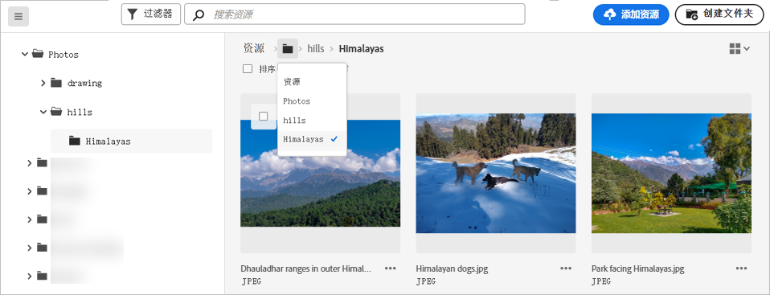
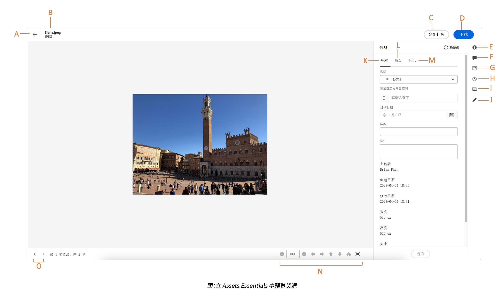

# 浏览到文件和文件夹并查看资源 {#view-assets-and-details}

<!-- TBD: Give screenshots of all views with many assets. Zoom out to showcase how the thumbnails/tiles flow on the UI in different views. -->

<!-- TBD: The options in left sidebar may change. Shared with me and Shared by me are missing for now. Update this section as UI is updated. -->

## 了解 [!DNL Assets Essentials] 用户界面 {#understand-interface-navigation}

[!DNL Assets Essentials] 提供简单易用的直观用户界面。利用简洁的界面更容易查找和记住资源及相关信息。

登录 [!DNL Assets Essentials] 时，您会看到以下界面。

![[!DNL Assets Essentials] 用户界面](assets/essentials-interface.png)

**A**：左侧边栏用于浏览存储库并提供访问另外一些选项的途径 **B**：显示左侧边栏或折叠左侧边栏以增大用于查看资源的区域 **C**：过滤搜索结果 **D**：选择所选文件夹的所有内容 **E**：为资源排序的选项 **F**：搜索框 **G**：使用 `Add Assets` 按钮或拖放以上传文件 **H**：创建新文件夹 **I**：切换不同视图

<!-- TBD: Need an embedded video here with narration. It has to be hosted on MPC to be embeddable. -->

## 浏览并查看资源和文件夹 {#browse-repository}

您可以从主用户界面或者从左侧边栏浏览文件夹。现在，在浏览或搜索内容时，Experience Manager Assets会在文件夹缩略图上显示文件夹内容的可视预览，这改进了AEM Assets存储库中可用资源的可发现性。 此文件夹缩略图可节省您在搜索AEM Assets存储库中文件夹内的特定资源时花费的时间。
浏览文件夹中的资产时，您可以使用界面查看资产缩略图，以直观地浏览存储库或查看资产详细信息，从而快速找到所需的资产。 左侧边栏中提供的选项包括：

* [我的工作区](https://experienceleague.adobe.com/docs/experience-manager-assets-essentials/help/my-workspace.html?lang=zh-Hans)：Assets 现在包括一个可自定义的工作区，此工作区提供各种小部件，以方便访问 Assets 用户界面的关键区域以及与您密切相关的信息。此页面充当一个综合解决方案以提供您工作项的概述，并且通过它可快速地访问关键工作流。由于能够更方便地访问这些选项，因此可以提高您的效率和内容速度。
* [任务](https://experienceleague.adobe.com/docs/experience-manager-assets-essentials/help/my-workspace.html?lang=zh-Hans)：您可以在&#x200B;**我的任务**&#x200B;选项卡中查看分配给您的任务。而您创建的任务可以在&#x200B;**分配的任务**&#x200B;选项卡中查看。此外，您完成的任务位于&#x200B;**完成的任务**&#x200B;选项卡中。
* [资源](https://experienceleague.adobe.com/docs/experience-manager-assets-essentials/help/manage-organize.html?lang=zh-Hans)：以树视图列出您有权访问的所有文件夹。
* **最近查看过的项目**：您最近查看过的资源列表。[!DNL Assets Essentials] 仅显示您预览过的资源。它不显示您在浏览存储库文件或文件夹时滚动浏览的资源。
* [收藏集](https://experienceleague.adobe.com/docs/experience-manager-assets-essentials/help/manage-collections.html?lang=zh-Hans)：收藏集是 Adobe Experience Manager Assets Essentials 中的一组资源、文件夹或其他收藏集。使用收藏集可在用户之间共享资源。收藏集与文件夹的不同之处是可包含来自不同位置的资源。您可以与一个用户共享多个收藏集。每个收藏集都包含对资源的引用。收藏集中会保持资源的引用完整性。

* [见解](https://experienceleague.adobe.com/docs/experience-manager-assets-essentials/help/manage-reports.html?lang=zh-Hans#view-live-statistics)：在 [!DNL Assets Essentials] 中可以在仪表板上查看实时见解。通过 Assets Essentials 的“见解”仪表板，可查看 Assets Essentials 环境的实时数据。可查看过去 30 天或过去 12 个月的实时事件指标。

* **垃圾箱**：列出从根 **[!UICONTROL Assets]** 文件夹中删除的资源。在“垃圾桶”文件夹中选择某个资源可将它还原到其原有位置或永久删除它。可指定关键字或应用过滤器，如资源状态、文件类型、mime 类型、图像大小、资源创建、修改和到期日期，并可按当前用户丢弃的资源进行过滤。还可应用自定义过滤器以在“垃圾桶”文件夹中搜索适当的资源。有关使用标准和自定义过滤器的更多信息，请参阅如何[在 Assets Essentials 中搜索资源](search.md)。

* **设置**：您可以使用&#x200B;**设置**&#x200B;配置 Assets Essentials 的各种选项，如元数据表单、报告和分类管理。

<!-- TBD: Not sure if we want to publish these right now. CC Libs are beta as per Greg.
* **Libraries**: Access to [!DNL Adobe Creative Cloud Team] (CCT) Libraries view. This view is visible only if the user is entitled to CCT Libraries.
-->

<!-- TBD: My Work Space shows task inbox and it is not visible on AEM Cloud Demos as of now. It is the source of truth server hence not documenting My Work Space option for now.
-->

您可以打开或隐藏左侧边栏，以增加可用于查看资源的区域。

在[!DNL Assets Essentials]中，您可以在四种不同的布局类型中查看资源、文件夹和搜索结果：

*  [!UICONTROL 列表视图]
*  [!UICONTROL 网格视图]
*  [!UICONTROL 图库视图]
*  [!UICONTROL 瀑布视图]

要查找某个资源，您可以按照 `Name`、`Relevancy`、`Size`、`Modified` 和 `Created` 的升序或降序对资源排序。

要在文件夹中导航，请双击文件夹的缩略图或者从左侧边栏中选择文件夹。 要查看文件夹的详细信息，请选择该文件夹并单击顶部工具栏中的“详细信息”。要在层级中向上和向下浏览，请使用左侧边栏或者使用顶部痕迹导航。

*图：要浏览层级，请使用顶部的痕迹导航或者左侧边栏。*

## 预览资源 {#preview-assets}

在使用、共享或下载资源之前，您可以更细致地查看该资源。使用预览功能，您不仅可以查看图像，还可以查看另外几个支持的资源类型。

要预览资源，请选择该资源并单击顶部工具栏中的[!UICONTROL 详细信息] 。您不仅可以查看资源，还可以查看其详细的元数据并采取操作。

**A**：返回存储库中的当前文件夹或当前搜索结果 **B**：您正在预览的文件的名称和格式 **C**：分配任务 **D**：高级元数据 **E**：关键词和智能标记 **F**：评论和注释 **G**：查看与所选资源相关的任务 **H**：查看和管理版本 **I**：查看图像的演绎版 **J**：编辑图像 **K**：基本元数据 **L**：高级元数据 **M**：关键词和智能标记 **N**：更仔细地预览。缩放、全屏和其他选项 **O**：转入当前文件夹中的上一个或下一个资源但不返回文件夹

您也可以预览视频。

如果您明确地预览某个资源，则 [!DNL Assets Essentials] 将其显示为最近查看的资源。

<!-- TBD: Describe the options.

Explicitly previewed assets are displayed as recently viewed assets. Give screenshot of this.
Other use cases after previewing.
-->

## 配置显示“资源列表”视图的各列的方式 {#configure-columns-list-view}

可选择在“资源列表”视图中显示的列，如“状态”、“格式”、“维度”、“大小”等：

1. 从左侧导航窗格中选择&#x200B;**[!UICONTROL 资源]**，切换到“资源列表”视图，然后单击 。

1. 选择需要在列表视图中显示的列，然后单击&#x200B;**[!UICONTROL 确认]**。

   

## 后续步骤 {#next-steps}

* 利用 Assets Essentials 用户界面上的[!UICONTROL 反馈]选项提供产品反馈

* 通过右侧边栏中的[!UICONTROL 编辑此页面]或[!UICONTROL 记录问题]来提供文档反馈

* 联系[客户关怀团队](https://experienceleague.adobe.com/?support-solution=General#support)

>[!MORELIKETHIS]
>
>* [查看资源的版本](/help/using/manage-organize.md#view-versions)。
