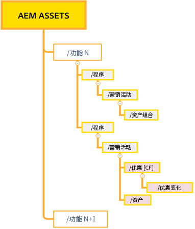
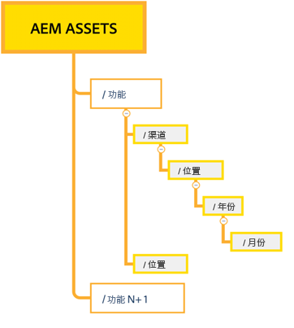

# 有效权限管理的最佳实践 {#best-practices-permissions-management}

作为管理员，在您开始管理 Assets Essentials 存储库的文件夹权限之前，您可以实施各种最佳实践，以便以后在管理操作时使基础架构对管理员和最终用户变得直观。

您可以在以下情况下合并这些最佳实践：

* [在 Admin Console 中创建用户组](#admin-console-best-practices)

* [在 Assets Essentials 存储库中创建文件夹结构](#folder-structure-assets-essentials)

* [在 Assets Essentials 存储库中管理权限](#folder-permissions)

## Admin Console {#admin-console-best-practices}

根据组织中的用户组确定访问需求。为您的组织规划和创建用户组，并将用户添加到这些用户组。基于用户组而不是单个用户来管理文件夹权限更容易。

## Assets Essentials 存储库的文件夹结构 {#folder-structure-assets-essentials}

当您开始计划在 Assets Essentials 存储库中创建文件夹结构时，请考虑以下几点：

* 未来管理：由管理员管理的文件夹和被[委派所有者权限给其他用户](manage-permissions.md##manage-permissions-folders)的文件夹。

* 可扩展：文件夹结构应符合您组织的未来需求，并且应易于扩展。

* 大小：一个文件夹不能包含太多资产。它可能会导致可用性问题并且可能变得难以管理。

* 直观：文件夹结构应该易于浏览，并且对于最终用户来说是直观的。用户应该能够轻松识别在文件夹结构中上传新资产的位置。

您可以为您的组织使用多种可能的文件夹结构类型。以下是一些典型文件夹结构的示例：

* 基于功能和分类

  

* 基于活动

  

* 基于提供位置（或渠道）

  

## 文件夹权限 {#folder-permissions}

在为您的组织创建用户组、将用户添加到这些用户组并在 Assets Essentials 存储库中选择并创建适合您组织需求的文件夹结构后，您可以开始为您的组织管理文件夹权限。开始管理文件夹权限时，请考虑以下几点：

* 为用户组应用权限，而不是单个用户。这导致更简单、更有效的权限结构。

* 保持权限结构尽可能简单以提高运营效率。

* 谨慎使用“拒绝访问”权限，并更愿意将积极的权限（可以编辑 | 可以查看 | 所有者）应用到文件夹结构。

有关如何实现高效且简单的文件夹结构的示例，请参阅[管理文件夹权限](manage-permissions.md##manage-permissions-folders)。

## 后续步骤 {#next-steps}

* 利用 Assets Essentials 用户界面上的[!UICONTROL 反馈]选项提供产品反馈

* 通过右侧边栏中的[!UICONTROL 编辑此页面]或[!UICONTROL 记录问题]来提供文档反馈

* 联系[客户关怀团队](https://experienceleague.adobe.com/?support-solution=General#support)
