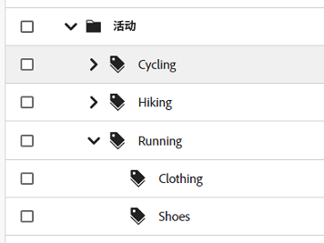
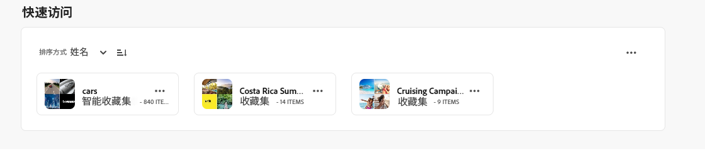
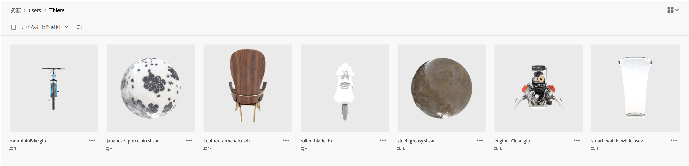
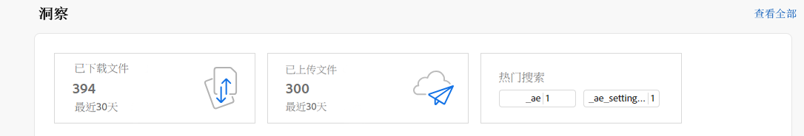
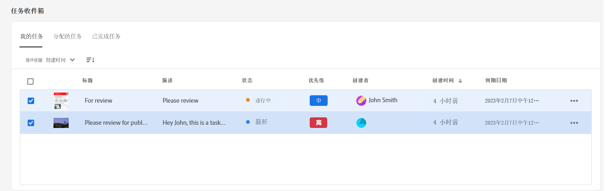

# [!DNL Assets Essentials] 的发行说明 {#release-notes}

Assets Essentials 的当前版本于 2023 年 7 月 27 日发布。

该版本中包括的功能的列表为：

<!--

**Assign metadata form to a folder**

You can now assign metadata form to a specific folder within your Assets Essentials deployment. All assets in the folder, including assets in the sub-folders, then display properties defined in the assigned metadata form.

-->

**为图像智能标记改进了人工智能框架**

Experience Manager Assets 现在使用为图像智能标记改进的人工智能框架。这种内容情报可提高对摄取的所有图像资源都可用的智能标记的相关性和准确性。

**配置显示“资源列表”视图的各列的方式**

Assets Essentials 现在让您可选择在“资源列表”视图中显示的列，如“状态”、“格式”、“维度”、“大小”等。

**根据相关性为搜索结果排序**

Assets Essentials 现在默认情况下根据相关性为搜索结果排序。可按 `Name`、`Relevance`、`Size`、`Modified` 和 `Created` 的升序或降序为搜索到的资源排序。

**基于客户反馈的改进**

基于客户反馈的增强和错误修复。

## 已知问题 {#known-issues}

[!DNL Assets Essentials] 产品的已知问题列表将持续修订和更新：

<!--

* Assets Essentials does not support creating Private collections.

-->

* 专用收藏集仅供创建者和具有管理员权限的用户使用。管理员无法将访问集合的权限委派给其他用户。

* 管理员无法将访问集合的权限委派给其他用户。

如果您遇到任何问题，亦或有改进请求，请向团队[提供反馈](#provide-feedback)。

## 过去的版本 {#past-releases}

### 6 月版 {#june2023-release}

**资源的分层标记可提供更快的搜索体验**

随着时间的推移，受控词汇的扁平列表变得难以管理。Assets Essentials 现在支持分层的标记结构，该结构便于应用相关的元数据、为资源分类、支持搜索、重用标记、提高可发现性等。

**固定文件、文件夹和集合以便快速访问**

您现在可以固定文件、文件夹和集合，以便在以后需要时更快地访问这些项目。经过固定的项目都显示在“我的工作区”的&#x200B;**快速访问**&#x200B;部分。您可以使用“我的工作区”访问它们，而无需导航到存储库中保存它们的位置。

**过滤“垃圾箱”文件夹中的资源**

现在通过 Assets Essentials 可以筛选“垃圾箱”文件夹中的资源。您还可以应用标准或自定义过滤器来搜索“垃圾箱”文件夹中的相应资源，以恢复或永久删除它们。

**3D 资源的缩略图预览**

Assets Essentials 现在可以生成常见 3D 文件格式的缩略图预览，包括 gLB、USDz、FBX、3DS、OBJ 和 SBSAR。当这些文件上传到 Assets Essentials 时，默认情况下系统会自动生成缩略图。

**查看热门搜索词**

Assets Essentials 现在支持使用“我的工作区”的&#x200B;**“见解”**&#x200B;部分查看 Assets Essentials 部署中搜索最多的术语。您还可以访问详细的见解，以查看过去 30 天或 12 个月内的热门搜索。

**元数据表单增强功能**

Assets Essentials 现在允许您向元数据表单添加多值文本和下拉列表属性组件。

### 2023 年发布的多个版本 {#multiple-releases-2023}

最近添加的特性的列表包括以下各项：

**下载次数名列前茅的资源**

“我的工作区”目前在[!UICONTROL 内容]部分中显示您的 Assets Essentials 环境下载次数排名前十的资源。您还可以查看每个列出的资源的格式类型和下载次数。

**批量更新资源元数据**

通过批量元数据更新，可同时在多个资源上执行共同元数据更新。您无需逐一更新记录，而是可快速地将属性应用于通过搜索访问的资源或文件夹。

**带有可配置的小部件的“我的工作区”**

Assets 现在为您提供一个自定义的工作区，它充当一个综合解决方案，以方便地访问 Assets 用户界面的关键区域以及与您密切相关的信息。由于能够更快地访问这些选项，因此可以提高项目的内容速度和效率。

“我的工作区”包括“见解”、“任务”和“内容”小部件。可根据自己的偏好配置如何在工作区中显示这些小部件。

**专用任务管理 UI**

现在可在 Assets Essentials 中使用可在左侧导航窗格中找到的新增&#x200B;**[!UICONTROL 任务]**&#x200B;选项，集中管理当前分配给您、由您创建和已由您完成的任务的列表。还可通过选择一个任务以批准或拒绝它，或打开该任务的详细信息以批准、拒绝、编辑或删除它，从而采取相应的操作。

**自动生成链接以共享资源**

现在，一旦您选择使用 Assets Essentials 用户界面共享资源，Assets Essentials 即自动生成链接。即使您更改到期日期，所生成的链接仍保持有效。

**基于客户反馈的改进**

基于客户反馈的增强和错误修复。

### 2022.11.0 {#november-2022}

[!DNL Assets Essentials] 的 11 月版于 2022 年 11 月 17 日发布。

此版本提供：

**使用 Document Cloud 查看器预览文档**

Assets Essentials 现在允许您上传其他受支持格式类型的文档，并使用随附的 Document Cloud 查看器预览文档。支持的格式类型包括 TXT、RTF、DOC、DOCX、PPT、PPTX、XLS 和 XLSX。

<!--

**View Smart Tags moderation reports**

Asset reporting now provides administrators with visibility into the Smart Tags promoted or deleted for an asset. You can specify a folder path and the report lists the Smart Tags promoted or deleted for all assets available at the folder path.

-->

<!--
**Read-only access to large number of users**

Assets Essentials allows administrators to provide read-only access to a large number of users for selected assets or folders in the repository. 
You can easily synchronize the user groups available on the external identity management of an organization with Adobe Admin Console and then manage permissions in Admin Console and Assets Essentials to provide the users with read-only access for selected assets or folders.

-->

**新的“保存元数据”选项**

Assets Essentials 用户界面现在提供了一个新的“保存元数据”选项，以便更好地管理元数据。

**基于客户反馈的改进**

基于客户反馈的增强和错误修复。

**Adobe Asset Link 3.3 版本**

[Adobe Asset Link](https://helpx.adobe.com/cn/enterprise/using/adobe-asset-link.html) 3.3 版本于 2022 年 12 月 13 日发布，具有以下功能：

* 除了之前支持 [Creative Cloud 企业版](https://www.adobe.com/cn/creativecloud/business/enterprise.html)之外，还支持 [Creative Cloud 团队版](https://www.adobe.com/cn/creativecloud/business/teams.html)。

* 支持最新的 Adobe InDesign、Photoshop 和 Illustrator 2023 应用程序。

* 支持在具有代理服务器的环境中使用 Adobe Asset Link CEP 插件。

### 2022.8.0 {#august-2022}

[!DNL Assets Essentials] 的八月版本于 2022 年 8 月 22 日发布。

此版本提供：

**收藏集的通知**

通过 Assets Essentials 通知，您能够监视对存储库中可用收藏集执行的操作。 您需要选择并订阅向您发送通知的收藏集。 您还可以配置发送通知的操作，例如对收藏集执行的删除、共享链接、移动、重命名和更新操作。

**编辑智能收藏集**

Assets Essentials 现在还可以编辑创建智能收藏集时使用的搜索条件。  保存新的搜索条件以动态更新收藏集内容。

**查看存储帐户的实时统计信息**

通过 Assets Essentials 的“实时统计数据”仪表板，现在还可以查看 Assets Essentials 环境的实时存储帐户数据。 可以查看过去 30 天或过去 12 个月的实时事件指标。

**查看下载报告**

资源报表功能现允许管理员查看上载到 Adobe Experience Manager Assets Essentials 部署的资源。 对于从 Assets Essentials 部署下载的资源，管理员已经能够为其生成报告。 这些数据提供关于用户如何与内容和产品进行交互的有用信息。

**基于客户反馈的改进**

基于客户反馈的增强和错误修复。

### 2022.6.0 {#june-2022}

[!DNL Assets Essentials] 的六月版本于 2022 年 7 月 14 日发布。

此版本提供：

**智能收藏集**

将搜索结果保存为智能收藏集以动态更新收藏集内容。如果有添加到 Assets Essentials 存储库的资源符合在[创建智能收藏集](manage-collections.md#create-smart-collection)时定义的搜索条件，则智能收藏集的内容将自动更新。

**通知**

通过 Assets Essentials 通知，可[监视对于可在存储库中找到的资源或文件夹执行的操作](manage-notifications.md)。需要选择并订阅将向您发送其通知的内容。还可配置向您发送其通知的类别。

**报表**

通过资源报表，管理员可评估 Adobe Experience Manager Assets Essentials 中的用户活动。“报表和实时统计数据”仪表板提供关于用户如何与可在您的部署中找到的资源进行交互的有用信息。[使用报表中的信息](manage-reports.md)获得关键成功指标以衡量在您的企业内和客户采用资源的情况。

查看“资源下载报表和实时统计数据”仪表板模块以了解正在下载哪些资源和下载的频率。

### 2022.5.0 {#may-2022}

[!DNL Assets Essentials] 的五月版本于 2022 年 6 月 16 日发布。

此版本提供：

**资源状态增强**

* 现在通过 Assets Essentials 可[设置资源的到期日期](manage-organize.md#set-asset-status)。此外，还可根据 `Expired` 资源状态和到期日期范围[筛选资源](search.md#refine-search-results)。

* 现在可查看可在垃圾桶中找到的所有资源的资源状态指示器。因此，可根据资源的状态决定是否还原该资源。

**搜索筛选器增强**

* 现在通过 Assets Essentials 可使用 `No Status` 资源状态[筛选资源](search.md#refine-search-results)。

<!--

* Assets Essentials now supports [using a wildcard operator (*) while using custom filters](search.md#custom-filters) to enable Assets Essentials to display assets in the results that partially match the search criteria.

-->

**收藏集增强**

<!--

* Assets Essentials now enables you to [create Private collections](manage-collections.md#create-collection).

-->

* Assets Essentials 现在支持[下载收藏集](manage-collections.md)。

* 现在可编辑收藏集的“描述”元数据字段。

**文档增强**

* 现已提供 [Assets Essentials 概览文档](introduction.md)的新版本。

**基于客户反馈的改进**

* 基于客户反馈的增强和错误修复。

### 2022.4.0 {#april-2022}

[!DNL Assets Essentials] 的当前版本于 2022 年 5 月 12 日发布。此版本提供：

* [!DNL Assets Essentials] 现在支持[创建收藏集](manage-collections.md)。收藏集是 Experience Manager Assets Essentials 中的一组资源。使用收藏集可在用户之间共享资源。收藏集与文件夹的不同之处是可包含来自不同位置的资源。

* Assets Essentials 现在还支持向用户界面[添加自定义筛选条件](search.md#custom-filters)。除了标准筛选条件之外，您还可以应用这些自定义筛选条件来优化您的搜索结果。

* Assets Essentials 现在允许您为存储库中可用的资源[设置状态](manage-organize.md#set-asset-status)。设置资源状态以更好地治理和管理下游对数字资源的消耗。

* 基于客户反馈的增强和错误修复。

#### Chrome 中的无痕模式 {#incognito-mode}

在此版本中，我们优化了 UI 交付的性能和 Assets Essentials 中的特定功能（评论资源和图像编辑），具体取决于浏览器本地存储和启用的第三方 Cookie。默认情况下，Chrome Web 浏览器中的无痕模式会阻止第三方 Cookie - 为用户提供了多个选项，以便继续访问所有功能：

* 当用户需要分离浏览器会话时，可使用 Chrome 配置文件而不是无痕模式

* 在 Chrome 中的无痕模式屏幕上禁用 `Block third-party cookies`

### 2022.2.0 {#march-2022}

[!DNL Assets Essentials] 发布于 2022 年 3 月 9 日，提供以下更新：

* [!DNL Assets Essentials]现在使您能够[生成链接并与无权访问[!DNL Assets Essentials]应用程序的外部利益相关者](share-links-for-assets.md)共享资源。您可以定义链接的到期日期，然后使用您喜欢的通信方式（如电子邮件或消息服务）与他人共享。链接的接收者可以预览并下载资源。

* 除了现有的常规和消费者用户产品配置文件外，[!DNL Assets Essentials] 现在还包括 Admin Console 上的[管理员产品配置文件](deploy-administer.md#add-users-to-essentials)。管理员现在可以将其他用户分配给管理员产品配置文件。

* Assets Essentials 现在允许管理员[管理存储库中可用文件夹的访问级别](manage-permissions.md)。作为管理员，您可以创建用户组并向这些组分配权限以管理访问级别。您还可以将权限管理权委派给文件夹级别的用户组。

* 基于客户反馈的增强和错误修复。

此外，[!DNL Adobe Asset Link]Creative Cloud 扩展（Photoshop、Illustrator 和 InDesign）发布了[新版本 3.2](https://exchange.adobe.com/creativecloud.details.106875.adobe-asset-link-cep.html)，在面板启动时间和下载速度方面进行了性能改进。

### 2022.1.0 发行版 {#january-2022}

[!DNL Assets Essentials] 发布于 2022 年 2 月 3 日，提供以下更新：

* 针对[!UICONTROL 创建文件夹]操作的性能改进。<!-- CQ-4338818 -->

### 2021.11.0 发行版 {#november-2021}

[!DNL Assets Essentials] 发布于 2021 年 12 月 16 日，提供以下更新：

* Adobe 在完成配置过程后自动部署 Assets Essentials。管理员不需要使用 [!DNL Cloud Manager] 用户界面执行额外的步骤来部署 Assets Essentials。此自动部署将对在 2022 年 1 月 6 日之后配置的环境可用。
* Adobe Exchange 上提供了与 Assets Essentials 配合使用的新版本 Creative Cloud 插件 - [Adobe Asset Link for Adobe XD v 2.1.0](https://exchange.adobe.com/creativecloud/plugindetails.html/app/cc/61d229b9) 和 [Adobe Asset Link for Photoshop/InDesign/Illustrator v 3.1.65](https://exchange.adobe.com/creativecloud.details.106875.adobe-asset-link-cep.html)。
* 多个错误修复和产品增强功能，包括以前的已知问题（现在文件夹上传之后正确显示在左导航树中<!-- CQ-4337638 -->，执行拖放上传操作时，用户可在执行放置操作时选择当前文件夹或者任意子文件夹<!-- CQ-4327753 -->）。

### 2021.8.0 发行版 {#august2021}

[!DNL Assets Essentials] 2021.8.0 发布于 2021 年 8 月 30 日，提供以下更新：

* 与 [!DNL Adobe Workfront] 集成，使得 [!DNL Workfront] 用户可在管理其工作的环境下管理其数字资源。

### 2021.7.0 发行版 {#july2021}

[!DNL Assets Essentials] 2021.7.0 发布于 2021 年 7 月 29 日，提供以下更新：

* 您可以创建和管理自定义的元数据表单，用于在[!DNL Settings]下[!UICONTROL 元数据表单]选项的资源详细信息屏幕中，向用户显示元数据属性。请参阅[元数据表单](metadata.md#metadata-forms)。
* 多个错误修复和产品改进，包括上传具有多个子文件夹的嵌套文件夹时更好的性能。

### 2021.6.0 发行版 {#june2021}

[!DNL Assets Essentials] 的首个版本在 2021 年 6 月 21 日发布，提供了轻量级的资源管理功能。它支持以下主要功能和 CRUD（创建、读取、更新和删除）操作：

* 上传并添加资源，包括嵌套文件夹。预览资源和版本。
* 全文搜索、精细搜索筛选条件以及保存的搜索，用于快速发现资源。
* 基本资源管理操作，例如更新、删除、下载和管理元数据。
* [!DNL Assets Essentials] 可供 [!DNL Adobe Journey Optimizer] 用户在创建消息时管理资源。
