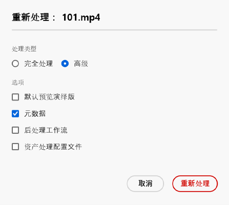
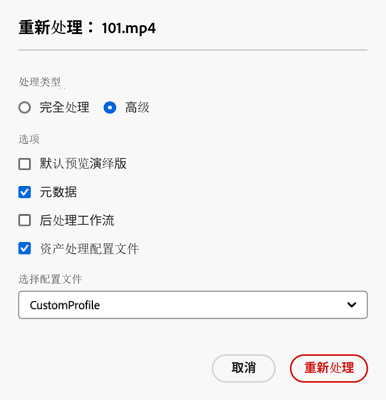

# 重新处理数字资产 {#reprocessing-digital-assets}

如果某个文件夹当前有一个元数据配置文件，且您后来更改了此配置文件，就可以重新处理该文件夹中的资产。 如果您希望将新编辑的预设重新应用于文件夹中的现有资产，就必须重新处理这个文件夹。 您可以根据需要重新处理任意多的资产。

如果您遇到以下两种场景之一，应重新处理文件夹中的资产：

* 您想在已上传资产的现有资产文件夹上运行一个批量预设集。
* 您稍后编辑之前应用于资产文件夹的现有批量预设集。

## 重新处理资产 {#reprocessing-steps}

要重新处理文件夹中的资产，请执行以下操作：

1. 在 [!DNL Assets Essentials] 中，在 Assets 页面中选择新添加的资产或您想重新处理的资产。
如果您选择文件夹：

   * 工作流会以循环方式考虑到所选文件夹中的所有文件。
   * 如果主要选定的文件夹中存在一个或多个有资产的子文件夹，工作流就会重新处理这个文件夹层级结构中的每个资产。
   * 作为最佳做法，应避免在包含超过 1000 个资产的文件夹层级结构上运行这样的工作流。

1. 选择&#x200B;**[!UICONTROL 重新处理资产]**。 从以下两个选项中进行选择：

   

   * **[!UICONTROL 完整流程]：**&#x200B;如果您想执行包括默认配置文件、自定义配置文件、动态处理（如果已配置）和后处理工作流在内的整个流程时，请选择此选项。
   * **[!UICONTROL 高级]：**&#x200B;选择此选项可进行高级重新处理。

     

     从以下高级选项中进行选择：

      * **[!UICONTROL 默认预览演绎版]：**&#x200B;如果您想重新处理在默认情况下预览的演绎版，请选择此选项。

      * **[!UICONTROL 元数据]：**&#x200B;如果您想提取所选资产的元数据信息和智能标记，请选择此选项。

      * **[!UICONTROL 处理配置文件]：**&#x200B;如果您想重新处理一个选定的配置文件，请选择此选项。 您可以选择&#x200B;**[!UICONTROL 完整流程]**选项，将文件夹级别上分配的默认处理和自定义配置文件包含进去。
        <!--When assets are uploaded to a folder, [!DNL Assets Essentials] checks the containing folder's properties for a processing profile. If none is applied, a parent folder in the hierarchy is checked for a processing profile to apply.-->

      * **[!UICONTROL 后处理工作流]：**&#x200B;需要对无法使用处理配置文件处理的资产进行额外处理时，请选择此选项。 可以在配置中添加额外的后处理工作流。 后处理允许您在使用资产微服务的可配置处理之外，添加完全自定义的处理。

请参阅[使用资产微服务和处理配置文件](https://experienceleague.adobe.com/docs/experience-manager-cloud-service/content/assets/manage/asset-microservices-configure-and-use.html?lang=zh-Hans)，了解有关处理配置文件和后处理工作流的详细信息。

选择适当的选项后，点击&#x200B;**[!UICONTROL 重新处理]**。 显示成功删除消息。

## 重新处理数字资产的场景 {#scenarios-reprocessing}

[!DNL Experience Manager] 允许重新处理以下组件的数字资产。

### 智能标记 {#reprocessing-smart-tags}

使用数字资产的组织越来越多地在资产元数据中使用分类控制的词汇。 总的来说，它包括一个员工、合作伙伴和客户通常用来引用和搜索特定类别的数字资产的关键词列表。 使用分类控制的词汇标记资产，可确保轻松地识别和检索资产。

与自然语言词汇相比，根据业务分类标记数字资产有助于使资产与公司的业务保持一致，确保在搜索中能找到最相关的资产。

阅读有关[视频资产的智能标记](https://experienceleague.adobe.com/docs/experience-manager-cloud-service/content/assets/manage/smart-tags-video-assets.html?lang=zh-Hans)的更多信息。

阅读有关[在 DAM 中为现有图像重新处理颜色标记](https://experienceleague.adobe.com/docs/experience-manager-cloud-service/content/assets/manage/color-tag-images.html?lang=zh-Hans#color-tags-existing-images)的详细信息。

### 智能裁剪 {#reprocessing-smart-crop}

了解有关 [Dynamic Media 智能裁剪](https://experienceleague.adobe.com/docs/experience-manager-cloud-service/content/assets/dynamicmedia/image-profiles.html?lang=zh-Hans)的更多信息，此功能允许您对上传的资产应用特定的裁剪（**[!UICONTROL 智能裁剪]**&#x200B;和像素裁剪）和锐化配置。

### 元数据 {#reprocessing-metadata}

[!DNL Adobe Experience Manager Assets] 保持每个资产的元数据。 它可以让用户更轻松地分类和组织资产，帮助用户查找特定的资产。 通过从上传到 Experience Manager Assets 的文件中提取元数据的功能，元数据管理与创意工作流集成。 通过保持和管理资产的元数据的功能，您可以根据资产的元数据自动组织和处理资产。

阅读有关[重新处理元数据配置文件](https://experienceleague.adobe.com/docs/experience-manager-cloud-service/content/assets/manage/metadata-profiles.html?lang=zh-Hans)的详细信息。

### 重新处理文件夹中的 Dynamic Media 资产 {#reprocessing-dynamic-media}

如果文件夹中当前有 Dynamic Media 图像配置文件或 Dynamic Media 视频配置文件，您对其进行了更改后，就可以重新处理该文件夹中的资产。 有关详细信息，请访问[重新处理文件夹中的 Dynamic Media 资产。](https://experienceleague.adobe.com/docs/experience-manager-cloud-service/content/assets/admin/about-image-video-profiles.html?lang=zh-Hans)

>[!NOTE]
>
>您需要在环境中配置 [!DNL Dynamic Media]，以启用 Dynamic Media 对话框。
>

### 工作流

阅读有关[处理配置文件和后处理工作流](https://experienceleague.adobe.com/docs/experience-manager-cloud-service/content/assets/manage/asset-microservices-configure-and-use.html?lang=zh-Hans)的更多信息。
