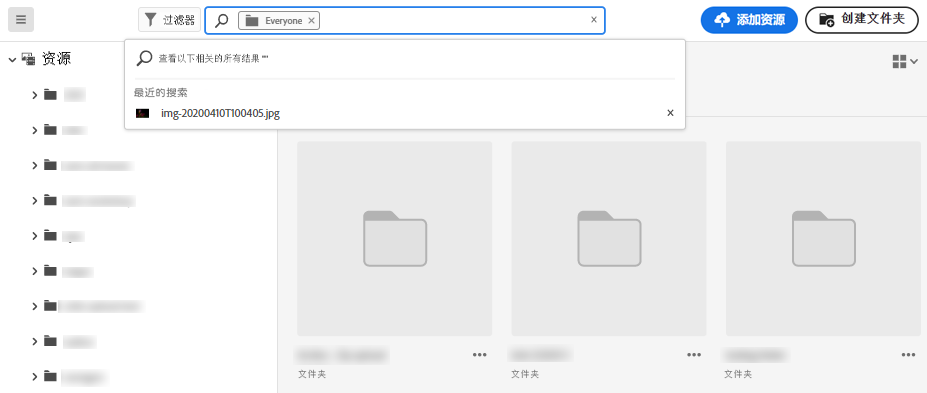
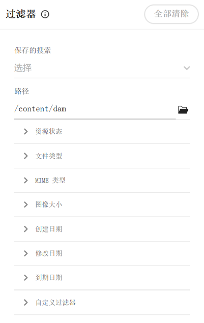
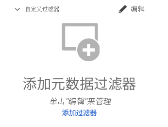
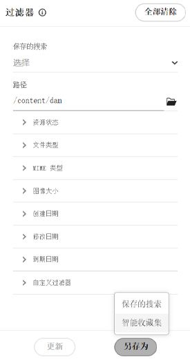

# 在 [!DNL Assets Essentials] 中搜索资源 {#search-assets}

>[!CONTEXTUALHELP]
>id="assets_search"
>title="搜索资源"
>abstract="搜索资源可通过在搜索栏中指定关键词，也可通过根据资源的状态、文件类型、MIME 类型、大小、创建日期、修改日期和到期日期筛选资源。除了标准筛选器，还可应用自定义筛选器。可将筛选出的结果另存为“保存的搜索”或“智能收藏集”。"
>additional-url="https://experienceleague.adobe.com/docs/experience-manager-assets-essentials/help/manage-collections.html?lang=zh-Hans#manage-smart-collection" text="创建智能收藏集"

[!DNL Assets Essentials] 提供了高效的搜索功能，只需按默认设置即可使用。该搜索执行全文搜索，因此非常全面。利用强大的搜索功能，您可以快速发现适用的资源，并帮助您提升内容速度。[!DNL Assets Essentials] 提供全文搜索，甚至可以对元数据进行搜索，例如智能标记、标题、创建日期和版权。

要搜索资源，

* 请单击页面顶部的搜索框。默认情况下，它会在您当前浏览的文件夹中进行搜索。执行下列操作之一：

  

   * 使用关键词搜索并可选择更改文件夹。按 Return。

   * 通过直接搜索资源，开始处理最近查看过的资源。单击搜索框，从建议中选择最近查看过的资源。

## 筛选搜索结果 {#refine-search-results}

您可以根据以下参数筛选搜索结果。

*图：根据各种参数筛选搜索出的资源。*

* 资源状态：使用`Approved`、`Rejected`或`No Status`资源状态筛选搜索结果。

* 文件类型：按照支持的文件类型筛选搜索结果，即 `Images`、`Documents` 和 `Videos`。
* MIME 类型：筛选一种或多种支持的文件格式。<!-- TBD:  [supported file formats](/help/using/supported-file-formats.md). -->
* 图像大小：提供一个或多个最小尺寸和最大尺寸来筛选图像。大小按照以像素为单位的尺寸提供，而不是图像的文件大小。
* 创建日期：在元数据中提供的创建资源的日期。使用的标准日期格式为 `yyyy-mm-dd`。
* 修改日期：资源的最后修改日期。使用的标准日期格式为 `yyyy-mm-dd`。

* 到期日期：根据 `Expired` 资源状态筛选搜索结果。此外，还可指定资源的到期日期范围以进一步筛选搜索结果。

* 自定义筛选器：[将自定义筛选器添加](#custom-filters)到 Assets Essentials 用户界面。与标准筛选器一起应用自定义筛选器以细化搜索结果。

可按 `Name`、`Relevancy`、`Size`、`Modified` 和 `Created` 的升序或降序为搜索到的资源排序。

## 管理自定义筛选条件 {#custom-filters}

**所需的权限：**`Can Edit`、`Owner` 或管理员。

Assets Essentials 还可让您向用户界面添加自定义筛选条件。除了[标准筛选条件](#refine-search-results)之外，您还可以应用这些自定义筛选条件来优化您的搜索结果。

Assets Essentials 提供了以下自定义筛选条件：

<table>
    <tbody>
     <tr>
      <th><strong>自定义筛选条件名称</strong></th>
      <th><strong>描述</strong></th>
     </tr>
     <tr>
      <td>标题</td>
      <td>使用资源标题筛选资源。您在区分大小写的搜索条件中指定的标题必须与要在结果中显示的资源的确切标题匹配。</td>
     </tr>
     <tr>
      <td>名称</td>
      <td>使用资源文件名筛选资源。您在区分大小写的搜索条件中指定的名称必须与要在结果中显示的资源的确切文件名匹配。</td>
     </tr>
     <tr>
      <td>资源大小</td>
      <td>对于要显示在结果中的资源，通过在该资源的搜索条件中定义大小范围（以字节为单位）来筛选资源。</td>
     </tr>
     <tr>
      <td>预测的标记</td>
      <td>使用资源智能标记筛选资源。您在区分大小写的搜索条件中指定的智能标记名称必须与要在结果中显示的资源的确切智能标记名称匹配。无法在搜索条件中指定多个智能标记。</td>
     </tr>    
    </tbody>
   </table>

<!--
   You can use a wildcard operator (*) to enable Assets Essentials to display assets in the results that partially match the search criteria. For example, if you define <b>ma*</b> as the search criteria, Assets Essentials displays assets with title, such as, market, marketing, man, manchester, and so on in the results.

   You can use a wildcard operator (*) to enable Assets Essentials to display assets in the results that partially match the search criteria.

   You can use a wildcard operator (*) to enable Assets Essentials to display assets in the results that partially match the search criteria. You can specify multiple smart tags separated by a comma in the search criteria.

   -->

### 添加自定义筛选条件 {#add-custom-filters}

要添加自定义筛选条件，请执行以下操作：

1. 单击&#x200B;**[!UICONTROL 筛选条件]**。

1. 在&#x200B;**[!UICONTROL 自定义筛选条件]**&#x200B;部分中，单击&#x200B;**[!UICONTROL 编辑]**&#x200B;或&#x200B;**[!UICONTROL 添加筛选条件]**。

   

1. 在&#x200B;**[!UICONTROL 自定义筛选条件管理]**&#x200B;对话框中，选择要添加到现有筛选条件列表中的筛选条件。选择&#x200B;**[!UICONTROL 自定义筛选条件]**&#x200B;以选择所有筛选条件。

1. 单击&#x200B;**[!UICONTROL 确认]**&#x200B;以将筛选条件添加到用户界面。

### 移除自定义筛选条件 {#remove-custom-filters}

要移除自定义筛选条件，请执行以下操作：

1. 单击&#x200B;**[!UICONTROL 筛选条件]**。

1. 在&#x200B;**[!UICONTROL 自定义筛选条件]**&#x200B;部分中，单击&#x200B;**[!UICONTROL 编辑]**。

1. 在&#x200B;**[!UICONTROL 自定义筛选条件管理]**&#x200B;对话框中，取消选择要从现有筛选条件列表中移除的筛选条件。

1. 单击&#x200B;**[!UICONTROL 确认]**&#x200B;以从用户界面中移除筛选条件。

## 保存的搜索 {#saved-search}

[!DNL Assets Essentials] 中的搜索功能非常易于使用。在搜索框中，您不仅可以输入关键词并按 Enter 来查看结果，而且只需一次单击即可快速重新搜索最近搜索过的关键词。

您还可以根据有关元数据和资源类型的特定标准来筛选搜索结果。对于经常使用的筛选条件，为了改进搜索体验，[!DNL Assets Essentials] 允许您保存搜索参数。以后，您可以选择保存的搜索来执行搜索，只需一次单击即可应用筛选条件。

要创建保存的搜索，请搜索一些资源，应用一个或多个筛选条件，然后在[!UICONTROL 筛选条件]面板中单击&#x200B;**[!UICONTROL 保存为]** > **[!UICONTROL 保存的搜索]**。还可单击&#x200B;**[!UICONTROL 另存为]**&#x200B;并选择&#x200B;**[!UICONTROL 智能收藏集]**&#x200B;以将结果另存为智能收藏集。有关详细信息，请参阅[创建智能收藏集](manage-collections.md#create-a-smart-collection)。

<!-- TBD: Search behavior. Full-text search. Ranking and rank boosts. Hidden assets.
Report poor UX that users can only save a filtered search and not a simple search.
.
Are other supported files fully indexed and support full-text search? Eg. audio/videos files can at best have metadata indexed.
Anything about ranking of assets displayed in search results?

What about temporarily hiding an asset (suspending search on it) from the search results? If an asset is undergoing review collaboration, should it be used by others? Should it be hidden in search?

When userA is searching and userB add an asset that matches search results, will the asset display in search as soon as userA refreshes the page? Assuming indexing is near real-time. May not be so for bulk uploads.
-->

## 使用搜索结果 {#work-with-search-results}

可选择在搜索结果中显示的资源并执行以下操作：

* **详细信息**：查看和编辑资源属性。

* **添加到收藏集**：将所选资源添加到收藏集。

* **下载**：下载资源。

* **删除**：删除资源。

* **复制**：将资源复制到不同的文件夹位置。

* **移动**：将资源移至不同的文件夹位置。

* **重命名**：重命名资源。

* **分配任务**：将任务分配给资源的用户。

* **共享链接**：与其他用户[共享某个资源的链接](share-links-for-assets.md)，以使其可访问和下载该资源。

* **监视**：[监视对资源执行的操作](manage-notifications.md)。

* **显示文件位置**：导航到资源文件夹位置。

* **固定到快速访问**：[固定资源](my-workspace.md)，以便在以后需要它时更快地访问。所有固定的项目都显示在“我的工作区”的&#x200B;**快速访问**&#x200B;部分中。

## 后续步骤 {#next-steps}

* [观看视频，了解如何在 Assets Essentials 中搜索资源](https://experienceleague.adobe.com/docs/experience-manager-learn/assets-essentials/basics/using.html?lang=zh-Hans)

* 利用 Assets Essentials 用户界面上的[!UICONTROL 反馈]选项提供产品反馈

* 通过右侧边栏中的[!UICONTROL 编辑此页面]或[!UICONTROL 记录问题]来提供文档反馈

* 联系[客户关怀团队](https://experienceleague.adobe.com/?support-solution=General#support)
